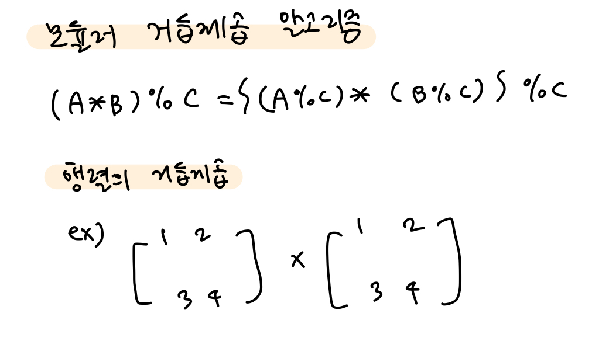

## Divide-and-Conquer


📌Divide-and-Conquer Approach(분할 정복)

: 문제를 풀 수 있을 때까지, 큰 덩어리를 계속해서 쪼개서 해결

=> Top-Down Approach(상위 instance에 대한 해답을, 하위의 작은 instance들의 해답을 가지고 구하는 방식)

<br>

**🔧problem ex1) - Binary Search(recursive)**

> **Description**
>
> 교재와 강의자료를 참고하여, Algorithm 2.1 이분 탐색 (재귀) 알고리즘을 구현하시오.
>
> 정렬되지 않은 채로 주어진 N개의 정수 리스트에서
>
> 해당 리스트를 정렬한 후에 M개의 정수를 탐색하여, 원소의 위치와 location() 함수의 호출 횟수를 출력하시오.
>
> **Input**
>
> 첫째 줄에 양의 정수 N과 M이 주어진다.
>
> 둘째 줄에 정렬되지 않은 양의 정수 N개가 주어진다.
>
> 셋째 줄에 리스트에서 탐색하고자 하는 양의 정수 M개가 주어진다.
>
> **Output**
>
> 첫째 줄부터 M개의 줄에 한 줄에 하나씩 이분 탐색 결과를 출력한다.
>
> 각 줄의 첫 번째 값은 이분 탐색 과정에서 location() 함수의 호출 횟수이다.
>
> 각 줄의 두 번째 값은 정렬된 리스트에서의 위치 인덱스이다. (location() 함수의 리턴값)

```cpp
#include <iostream>
#include <vector>
#include <algorithm>
using namespace std;

int cnt = 0;

int bin_search(vector<int> S, int start, int end, int find) {
    cnt++;
    if (start > end)
        return 0;
    else {
        int mid = (start + end) / 2;
        if (S[mid] == find)
            return mid;
        if (S[mid] < find)
            return bin_search(S, mid + 1, end, find);
        else
            return bin_search(S, start, mid - 1, find);
    }
}

int main() {
    int n, m;
    cin >> n >> m;

    vector<int> S(n+1);
    for (int i = 1; i <= n; i++)
        cin >> S[i];

    sort(S.begin()+1, S.end());

    for (int j = 1; j <= m; j++) {
        cnt = 0;
        int find;
        cin >> find;

        int index = bin_search(S, 1, n, find);
        cout << cnt << " " << index << endl;
    }
}
```

<br>

**🔧problem ex2) - Merge Sort 1**

> **Description**
>
> 교재와 강의자료를 참고하여 Algorithm 2.2/2.3 합병정렬 알고리즘을 구현하시오.
>
> N개의 원소를 가진 정렬되지 않은 양의 정수의 리스트 S를 합병정렬 알고리즘으로 오름차순으로 정렬하고,
>
> merge() 함수에서 추가적으로 사용하는 메모리 U, V의 크기의 총합을 출력하시오.
>
> 단, 인덱스로 인한 크기는 무시하며, 아래 코드 예시와 같이 h, m의 크기만 더한 총합을 구한다.
>
> ```
> void mergesort(int n, vector<int>& S) {
>     if (n > 1) {
>         int h = n / 2, m = n - h;
>         vector<int> U(h+1), V(m+1);
>         cnt += h + m; // 추가 메모리 크기 카운트. cnt는 전역 변수
>         for (int i = 1; i <= h; i++)
>             U[i] = S[i];
>         for (int i = h+1; i <= n; i++)
>             V[i - h] = S[i];
>         mergesort(h, U);
>         mergesort(m, V);
>         merge(h, m, U, V, S);
>     }
> }
> ```
>
> **Input**
>
> 첫째 줄에 리스트의 원소 개수 N이 주어진다.
>
> 둘째 줄에 정렬되지 않은 N개의 양의 정수가 주어진다.
>
> **Output**
>
> 첫째 줄에 주어진 리스트를 합병 정렬로 정렬하여 오름차순으로 출력한다.
>
> 둘째 줄에 merge() 함수에서 추가적으로 사용하는 메모리의 총합을 출력한다.

```cpp
//원소가 1개가 남을때까지 계속 쪼개다가
//정렬 후, 합병해나가는 방법

#include <iostream>
#include <vector>
#include <algorithm>
using namespace std;

int cnt = 0;

void merge(int h, int m, vector<int>& U, vector<int>& V, vector<int>& S) {
    int i = 1, j = 1, k = 1;

    while(i <= h && j <= m)
        S[k++] = (U[i] < V[j]) ? U[i++] : V[j++];
    
    if (i > h) {
        while(j <= m)
            S[k++] = V[j++];
    }
    else {
        while(i <= h)
            S[k++] = U[i++];
    }
}

void merge_sort(int n, vector<int>& S) {
    if(n > 1) {
        int h = n / 2, m = n - h;
        vector<int> U(h+1), V(m+1);
        cnt += h + m;

        for (int i = 1; i <= h; i++)
            U[i] = S[i];
        for (int i = h + 1; i <= n; i++)
            V[i - h] = S[i];

        merge_sort(h, U);
        merge_sort(m, V);
        merge(h, m, U, V, S);
    }

}

int main() {
    int n;
    cin >> n;

    vector<int> S(n+1);
    for (int i = 1; i <= n; i++)
        cin >> S[i];

    merge_sort(n, S);

    for (int i = 1; i < n; i++)
        cout << S[i] << " ";
    cout << S[n] << endl;

    cout << cnt << endl;
}
```

=> Quicksort보다 공간 복잡도가 훨씬 큼! U, V 배열을 계속해서 선언하기 때문에 메모리 공간을 차지함

<br>

**🔧problem ex3) - Merge Sort 2**

> **Description**
>
> 교재와 강의자료를 참고하여, Algorithm 2.4/2.5 합병 정렬 2 알고리즘을 구현하시오.
>
> N개의 원소를 가진 정렬되지 않은 양의 정수의 리스트 S를 합병정렬 2 알고리즘으로 오름차순으로 정렬하고,
>
> merge2() 함수에서 비교 연산의 총 횟수를 출력한다.
>
> 단, 인덱스끼리의 비교 연산은 무시하고, 아래 코드의 예시와 같이 리스트 S의 원소끼리의 비교 연산 횟수만 카운트한다.
>
> ```
> void merge2(int low, int mid, int high) {
>     int i, j, k;
>     vector<int> U(high - low + 1);
> 
>     i = low; j = mid+1; k = 0;
>     while (i <= mid && j <= high) {
>         U[k++] = (S[i] < S[j]) ? S[i++] : S[j++];
>         cnt++; // S의 원소끼리의 비교 연산 횟수 카운트. cnt는 전역 변수
>     }
> 
>     if (i > mid)
>         while (j <= high) U[k++] = S[j++];
>     else
>         while (i <= mid) U[k++] = S[i++];
>     
>     for (int t = low; t <= high; t++)
>         S[t] = U[t-low];
> }
> ```
>
> **Input**
>
> 첫째 줄에 리스트의 원소 개수 N이 주어진다.
>
> 둘째 줄에 정렬되지 않은 N개의 양의 정수가 주어진다.
>
> **Output**
>
> 첫째 줄에 주어진 리스트를 합병 정렬 2로 정렬하여 오름차순으로 출력한다.
>
> 둘째 줄에 merge2() 함수에서 비교 연산의 총 횟수를 출력한다.

```cpp
//하나의 리스트만을 사용

#include <iostream>
#include <vector>
#include <algorithm>
using namespace std;

int cnt = 0;

void merge(int start, int mid, int end, vector<int>& S) {
    int i = start, j = mid + 1, k = start;
    vector<int> U(end + 1);

    while (i <= mid && j <= end) {
        cnt++;
        U[k++] = (S[i] < S[j]) ? S[i++] : S[j++];
    }

    if (i > mid) {
        while (j <= end)
            U[k++] = S[j++];
    }
    else {
        while (i <= mid)
            U[k++] = S[i++];
    }

    for (int t = start; t <= end; t++)
        S[t] = U[t];
}

void merge_sort(int start, int end, vector<int>& S) {
    if (start < end) {
        int mid = (start + end) / 2;
        merge_sort(start, mid, S);
        merge_sort(mid + 1, end, S);
        merge(start, mid, end, S);
    }
}

int main() {
    int n;
    cin >> n;

    vector<int> S(n+1);
    for (int i = 1; i <= n; i++)
        cin >> S[i];

    merge_sort(1, n, S);

    for (int i = 1; i < n; i++)
        cout << S[i] << " ";
    cout << S[n] << endl;
    cout << cnt << endl;
}
```

<br>

**🔧problem ex4) - Quick Sort**

> **Description**
>
> 교재와 강의자료를 참고하여, Algorithm 2.6/2.7 퀵 정렬/분할 알고리즘을 구현하시오.
>
> N개의 원소를 가진 정렬되지 않은 양의 정수의 리스트 S를 퀵 정렬 알고리즘으로 오름차순으로 정렬하고,
>
> partition() 함수에서 swap 연산의 실행 횟수를 아래 코드의 예시와 같이 카운트하여 출력하시오.
>
> ```
> void partition(int low, int high, int& pivotpoint) {
>     int i, j, pivotitem;
> 
>     pivotitem = S[low];
>     j = low;
>     for (i = low+1; i <= high; i++) {
>         if (S[i] < pivotitem) {
>             j++;
>             swap(S[i], S[j]);
>             cnt++; // swap 연산의 실행 횟수 카운트
>         }
>     }
>     pivotpoint = j;
>     swap(S[low], S[pivotpoint]);
>     cnt++; // swap 연산의 실행 횟수 카운트
> }
> ```
>
> **Input**
>
> 첫째 줄에 리스트의 원소 개수 N이 주어진다.
>
> 둘째 줄에 정렬되지 않은 N개의 양의 정수가 주어진다.
>
> **Output**
>
> 첫째 줄에 주어진 리스트를 퀵 정렬로 정렬하여 오름차순으로 출력한다.
>
> 둘째 줄에 swap 연산의 총 실행 횟수를 출력한다.

```cpp
//mergesort는 space complexity가 크다.
//추가 공간을 없애기 위해 swap연산을 활용
//두개로 parition을 해서, pivot보다 적으면 왼쪽으로, 아니면 오른쪽으로
//첫번째 아이템을 pivot으로 둔다.

#include <iostream>
#include <vector>
#include <algorithm>
using namespace std;

int cnt = 0;

void partition(int start, int end, vector<int>& S, int& pivotpoint) {
    int pivotitem = S[start];
    pivotpoint = start;

    for (int i = start + 1; i <= end; i++) {
        if (S[i] < pivotitem) {
            pivotpoint++;
            cnt++;
            swap(S[i], S[pivotpoint]);
        }
    }
    cnt++;
    swap(S[start], S[pivotpoint]);
}

void quick_sort(int start, int end, vector<int>& S) {
    int pivotpoint;

    if (start < end) {
        partition(start, end, S, pivotpoint);
        quick_sort(start, pivotpoint - 1, S);
        quick_sort(pivotpoint + 1, end, S);
    }
}

int main() {
    int n;
    cin >> n;

    vector<int> S(n+1);
    for (int i = 1; i <= n; i++)
        cin >> S[i];

    quick_sort(1, n, S);

    for (int i = 1; i < n; i++)
        cout << S[i] << " ";
    cout << S[n] << endl;
    cout << cnt << endl;
}
```

<br>

**🔧problem ex5) - 행렬의 거듭제곱**

> **Description**
>
> N×N*N*×*N* 정방행렬 A와 양의 정수 b가 주어졌을 때, A 행렬의 b 거듭제곱인 정방행렬 Ab*A**b*을 출력하시오.
>
> 단, 행렬의 원소는 항상 1,000으로 나눈 나머지 값만을 가진다. (거듭제곱의 중간 과정을 포함하여)
>
> 
>
> Note:
>
> 이 문제는 분할정복을 이용한 모듈러 거듭제곱 알고리즘을 행렬에 적용하여 구현하는 문제이다.
>
> 두 정수 a, b에 대하여ab*a**b*을 구하는 문제를 생각해보자.
>
> 종료 조건은 b가 1일 때, a를 리턴하면 된다는 것은 명확하다.
>
> 재귀 조건은 다음과 같은 두 가지 경우로 나누어 생각해 볼 수 있다.
>
> 만약, b가 짝수라면, 다음 규칙이 성립한다.
>
> ab=ab2×ab2*a**b*=*a*2*b*×*a*2*b*
>
> 만약, b가 홀수라면, 다음 규칙이 성립한다.
>
> ab=a×a⌊b2⌋×a⌊b2⌋*a**b*=*a*×*a*⌊2*b*⌋×*a*⌊2*b*⌋
>
> 위의 재귀적 관계에서 모듈러 곱셈 연산의 다음 성질을 이용할 수 있다.
>
> ab % N = {(a % N)××(b % N)} % N
>
> 
>
> 이렇게 종료 조건과 재귀 조건을 모두 파악했다면
>
> 기존의 과제에서 풀었던 행렬 곱셈 알고리즘을 위의 재귀 관계에 대입하면 이 문제를 풀 수 있다.
>
> 단순한 행렬 곱셈으로는 O(b) 번의 곱셈을 해야 하므로 시간 초과가 발생할 것이고,
>
> 분할 정복을 이용하여 O(log b) 번의 곱셈으로 거듭제곱을 할 수 있어야 시간 초과를 면할 수 있다.
>
> 또한, 모듈러 연산을 통해 중간 과정에서 오버플로우가 발생하지 않도록 주의해야 한다.
>
> **Input**
>
> 첫째 줄에 행렬의 크기 N과 거듭제곱의 크기 b가 주어진다.
>
> 둘째 줄부터 N개의 줄에 행렬의 각 원소가 N개씩 주어진다.
>
> 행렬의 각 원소는 1,000보다 작은 음이 아닌 정수이다.
>
> **Output**
>
> 첫째 줄부터 행렬 A를 b번 거듭제곱한 정방행렬Ab*A**b* 를 출력한다.
>
> 행렬의 곱셈 과정에서 모든 원소는 1,000으로 나눈 나머지 값을 가진다.

```cpp
#include <iostream>
#include <vector>
#include <algorithm>
using namespace std;

int n, b;
typedef vector<vector<int>> matrix_t;

matrix_t multiMatrix(matrix_t& A, matrix_t& B) {
    matrix_t tmp(n+1, vector<int>(n+1));

    for (int i = 1; i <= n; i++) {
        for (int j = 1; j <= n; j++) {
            tmp[i][j] = 0;
            for (int k = 1; k <= n; k++) {
              //모듈러 곱셈 연산을 사용
                tmp[i][j] += (A[i][k] % 1000) * (B[k][j] % 1000);
            }
            tmp[i][j] %= 1000;
        }
    }
    return tmp;
}

//재귀조건
matrix_t matrix_pow(matrix_t& S, int b) {
  //1인 경우는 거듭제곱을 할 필요가 없다.
    if (b == 1)
        return S;
    matrix_t tmp = matrix_pow(S, b / 2);
  //짝수라면, b/2의 제곱을 두개 곱해주면 된다.
    if (b % 2 == 0)
        return multiMatrix(tmp, tmp);
  //홀수라면, b/2의 제곱 두개와 원래 배열 하나, 총 세개를 곱해주면 된다.
    else {
        matrix_t tmpp = multiMatrix(tmp, tmp);
        return multiMatrix(tmpp, S);
    }
}

//이중 배열 받기
void matrix_read(matrix_t& S) {
    for (int i = 1; i <= n; i++) {
        for (int j = 1; j <= n; j++)
            cin >> S[i][j];
    }
}

int main() {
    cin >> n >> b;

    matrix_t S(n + 1, vector<int>(n+1));
    matrix_read(S);

    matrix_t res(n + 1, vector<int>(n+1));
    res = matrix_pow(S, b);

    for (int i = 1; i <= n; i++) {
        for (int j = 1; j <= n; j++) {
            if (j == n)
                cout << res[i][j] << endl;
            else
                cout << res[i][j] << " ";
        }
    }
}
```



