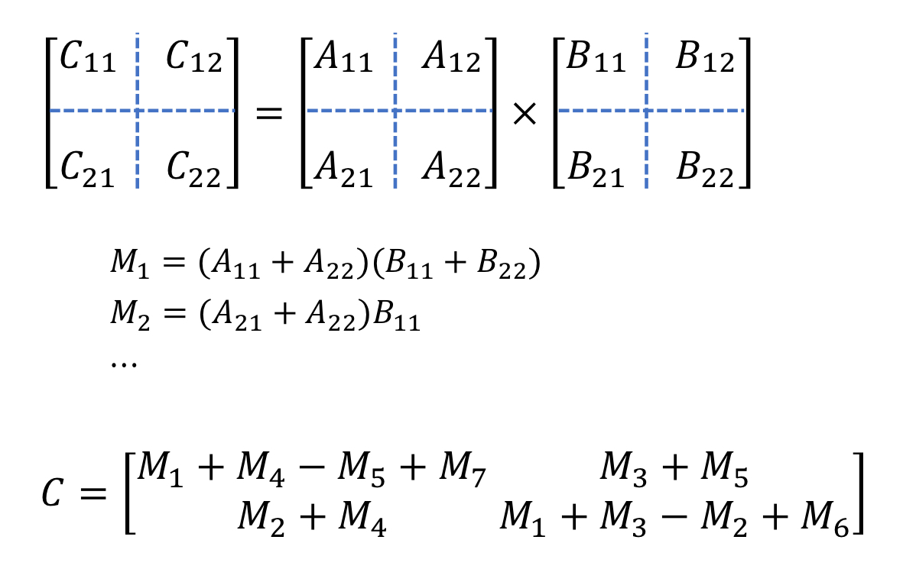
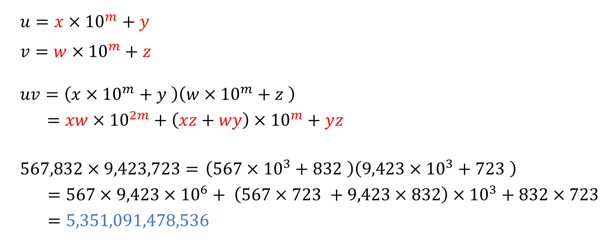

## Divide-and-Conquer 2

<br>

#### 🔧problem ex1) - Strassen's Matrix Multiplication Algorithm

> **Description**
>
> 교재와 강의자료를 참고하여 Algorithm 2.8 쉬트라센 행렬곱셈 알고리즘을 구현하시오.
>
> 이 문제의 입력으로 n, threshold 값이 주어지고, n×n 정방행렬 두 개가 입력으로 주어진다.
>
> Algorithm 2.8을 구현하여 적용했을 때, strassen() 함수의 호출 횟수와 두 정방행렬의 곱 A×B*A*×*B*를 출력한다.
>
> 단, n의 값이 2의 거듭제곱 수가 아닐 때에는 n보다 큰 2의 거듭제곱 수를 n으로 재정의해야 한다.
>
> 예를 들어, n보다 큰 2의 거듭제곱 수 k를 찾고자 할 때 다음과 같은 코드 조각을 이용할 수 있다.
>
> ```
> int k = 1;
> while (k < n) k *= 2;
> ```
>
> 또한, 위와 같은 2의 거듭제곱 수 k를 찾았다면, n×n크기의 행렬을 k×k크기의 행렬로 바꿔야 한다. (빈 원소의 값은 0으로 초기화)
>
> **Input**
>
> 첫째 줄에 n 과 threshold가 주어진다.
>
> 둘째 줄부터n×n 행렬 두 개가 한 줄에 한 행씩 주어진다.
>
> **Output**
>
> 첫째 줄에 strassen() 함수의 호출 횟수를 출력한다.
>
> 둘째 줄부터 두 행렬의 곱을 한 줄에 한 행씩 출력한다.
>
> \* 주의: 행렬 출력시에 각 행의 끝에 줄끝 공백을 출력하지 않도록 주의한다.

```cpp
#include <iostream>
#include <vector>
#include <algorithm>
using namespace std;

typedef vector<vector<int>> matrix_t;

int cnt;
int n, threshold;

void resize(int n, matrix_t& mat) {
    mat.resize(n, vector<int>(n, 0));
}

void madd(int n, matrix_t A, matrix_t B, matrix_t& C) {
    for(int i = 0; i < n; i++) {
        for(int j = 0; j < n; j++)
            C[i][j] = A[i][j] + B[i][j];
    }
}

void msub(int n, matrix_t A, matrix_t B, matrix_t& C) {
    for(int i = 0; i < n; i++) {
        for(int j = 0; j < n; j++)
            C[i][j] = A[i][j] - B[i][j];
    }
}

void mmult(int n, matrix_t A, matrix_t B, matrix_t& C) {
    for(int i = 0; i < n; i++) {
        for(int j = 0; j < n; j++) {
            for(int k = 0; k < n; k++)
                C[i][j] += A[i][k] * B[k][j];
        }
    }
}

void partition(int m, matrix_t M, matrix_t& M11, matrix_t& M12, matrix_t& M21, matrix_t& M22) {
    for(int i = 0; i < m; i++) {
        for(int j = 0; j < m; j++) {
            M11[i][j] = M[i][j];
            M12[i][j] = M[i][j+m];
            M21[i][j] = M[i+m][j];
            M22[i][j] = M[i+m][j+m];
        }
    }
}

void combine(int m, matrix_t& M, matrix_t M11, matrix_t M12, matrix_t M21, matrix_t M22) {
    for(int i = 0; i < m; i++) {
        for(int j = 0; j < m; j++) {
            M[i][j] = M11[i][j];
            M[i][j+m] = M12[i][j];
            M[i+m][j] = M21[i][j];
            M[i+m][j+m] = M22[i][j];
        }
    }
}

void strassen(int n, matrix_t A, matrix_t B, matrix_t& C) {
    cnt++;
    int m;
    matrix_t A11, A12, A21, A22, B11, B12, B21, B22, C11, C12, C21, C22, L, R, M1, M2, M3, M4, M5, M6, M7;

    if(n <= threshold) {
        mmult(n, A, B, C);
    }
    else {
        m = n / 2;
        resize(m, A11); resize(m, A12); resize(m, A21); resize(m, A22);
        resize(m, B11); resize(m, B12); resize(m, B21); resize(m, B22);
        resize(m, C11); resize(m, C12); resize(m, C21); resize(m, C22);
        resize(m, M1); resize(m, M2); resize(m, M3); resize(m, M4); resize(m, M5); resize(m, M6); resize(m, M7); resize(m, L); resize(m, R);

        partition(m, A, A11, A12, A21, A22);
        partition(m, B, B11, B12, B21, B22);

        //M1
        madd(m, A11, A22, L);
        madd(m, B11, B22, R);
        strassen(m, L, R, M1);

        //M2
        madd(m, A21, A22, L);
        strassen(m, L, B11, M2);

        //M3
        msub(m, B12, B22, R);
        strassen(m, A11, R, M3);

        //M4
        msub(m, B21, B11, R);
        strassen(m, A22, R, M4);

        //M5
        madd(m, A11, A12, L);
        strassen(m, L, B22, M5);

        //M6
        msub(m, A21, A11, L);
        madd(m, B11, B12, R);
        strassen(m, L, R, M6);

        // M7
        msub(m, A12, A22, L);
        madd(m, B21, B22, R);
        strassen(m, L, R, M7);

        // C11
        madd(m, M1, M4, L);
        msub(m, L, M5, R);
        madd(m, R, M7, C11);

        // C12
        madd(m, M3, M5, C12);

        // C21
        madd(m, M2, M4, C21);

        // C22
        madd(m, M1, M3, L);
        msub(m, L, M2, R);
        madd(m, R, M6, C22);

        combine(m, C, C11, C12, C21, C22);

    }
}

int main() {
    cin >> n >> threshold;

    //k값 정하기
    //n이 2의 거듭제곱이라면, n & (n-1) 을 했을 때, 0이 나오게됨.
    int k = 1;
    if ((n & (n-1)) != 0) {
        while(k < n)
            k *= 2;
    }
    else
        k = n;

    //n * n 크기의 행렬을 k * k 크기의 행렬로 바꾸어야함.
    matrix_t A(k, vector<int>(k, 0));
    matrix_t B(k, vector<int>(k, 0));
    matrix_t C(k, vector<int>(k, 0));

    //matrix A 값 입력받기
    for(int i = 0; i < n; i++) {
        for(int j = 0; j < n; j++)
            cin >> A[i][j];
    }

    //matrix B 값 입력받기
    for(int i = 0; i < n; i++) {
        for(int j = 0; j < n; j++)
            cin >> B[i][j];
    }

    //strassen 알고리즘
    strassen(k, A, B, C);

    //결과 출력
    cout << cnt << endl;
    for(int i = 0; i < n; i++) {
        for(int j = 0; j < n; j++) {
            if(j == n-1)
                cout << C[i][j] << endl;
            else
                cout << C[i][j] << " ";
        }
    }
}
```



=> 두 행렬을 곱할 때의 time complexity = O(n^3) 이다. Strassen 알고리즘은 큰 행렬을 작은 네개의 submatrics들로 쪼개고 쪼개서 일정의 규칙(M1 ~ M7)을 적용하는 알고리즘이다.

- basic operation: elementary addition or subtraction
- input size: 배열의 열과 행(n)
  - n = 1 -> **T(1) = 0**
  - n > 1 -> **T(n) = 7T(n/2) + C** => 수를 나누기 때문에 시간은 절반으로 줄어들고, 재귀호출을 총 7번 함
  - 마스터 정리를 사용하면, **T(n) = θ(n^2.81)** 이다. (a = 7, b = 2, k = 0)

<br>

#### 🔧problem ex2) - 카라츠바 정수곱셈 알고리즘

> **Description**
>
> 교재와 강의자료를 참고하여 Algorithm 2.9 큰 정수의 곱셈 문제를 구현하시오. (Algorithm 2.10이 아님에 주의)
>
> 이 알고리즘에서 두 개의 큰 정수와 threshold 값이 주어질 때, prod() 함수의 호출 횟수와 두 정수의 곱을 출력한다.
>
> 단, 알고리즘 호출의 중간 과정에서 leading zero(앞부분 0)를 제거해야 함에 주의할 것.
>
> ```
> void remove_leading_zeros(LargeInteger& v) {
>     while (v.size() != 0 && v.back()==0)
>         v.pop_back();
> }
> ```
>
> 또한, 두 정수를 곱할 때 두 정수의 자릿수가 서로 큰 차이가 날 수도 있음에 주의할 것.
>
> 예) 1000000000000000001 * 111 =111000000000000000111
>
> **Input**
>
> 첫째 줄에 threshold의 값이 주어진다.
>
> 둘째 줄에 정수 A가 주어진다.
>
> 셋째 줄에 정수 B가 주어진다.
>
> **Output**
>
> 첫째 줄에 prod() 함수의 호출 횟수를 출력한다.
>
> 둘째 줄에 A와 B의 곱 C를 출력한다.

```cpp
#include <iostream>
#include <vector>
using namespace std;

typedef vector<int> large_integer;
int threshold;
int cnt = 0;

//0제거
void remove_leading_zeros(large_integer& v) {
    while (v.size() > 0 && v.back() == 0) {
        v.pop_back();
    }
}

//올림수 계산
void roundup_carry(large_integer& v) {
    int carry = 0;
    for (int i = 0; i < v.size(); i++) {
        v[i] += carry;
        carry = v[i] / 10;
        v[i] %= 10;
    }
    if (carry != 0) {
        v.push_back(carry);
    }
}

//두 수를 더하는 것
void ladd(large_integer a, large_integer b, large_integer& c) {
    c.resize(max(a.size(), b.size()));
    fill(c.begin(), c.end(), 0);
    for (int i = 0; i < c.size(); i++) {
        if (i < a.size()) {
            c[i] += a[i];
        }
        if (i < b.size()) {
            c[i] += b[i];
        }
    }
    roundup_carry(c);
}

//두 수를 곱하는 것
void lmult(large_integer a, large_integer b, large_integer& c) {
    c.resize(a.size() + b.size() - 1);
    fill(c.begin(), c.end(), 0);
    for (int i = 0; i < a.size(); i++) {
        for (int j = 0; j < b.size(); j++) {
            c[i + j] += a[i] * b[j];
        }
    }
    roundup_carry(c);
}

//곱하기 10제곱
void pow_by_exp(large_integer u, int m, large_integer &v) {
    if (u.size() == 0)
        v.resize(0);
    else {
        v.resize(u.size() + m);
        fill(v.begin(), v.end(), 0);
        copy(u.begin(), u.end(), v.begin() + m);
    }
}

//나누기 10제곱
void div_by_exp(large_integer u, int m, large_integer &v) {
    if (u.size() == 0)
        v.resize(0);
    else {
        int k = u.size() - m;
        if (k <= 0)
            v.resize(0);
        else {
            v.resize(k);
            copy(u.begin() + m, u.end(), v.begin());
        }
    }
}

//10으로 나눴을 때 나머지
void rem_by_exp(large_integer u, int m, large_integer &v) {
    if (u.size() == 0)
        v.resize(0);
    else {
        int k = m < u.size() ? m : u.size();
        v.resize(k);
        copy(u.begin(), u.begin() + k, v.begin());
        remove_leading_zeros(v);
    }
}

//카라츠바 알고리즘
void karatsba(large_integer u, large_integer v, large_integer& r) {
    cnt++;
    large_integer x, y, w, z;
	large_integer t1, t2, t3, t4, t5, t6, t7, t8;
	int n = max(u.size(), v.size());
	if (u.size() == 0 || v.size() == 0)
		r.resize(0);
	else if (n <= threshold)
		lmult(u, v, r);
	else
	{
		int m = n / 2;
		div_by_exp(u, m, x); rem_by_exp(u, m, y);
		div_by_exp(v, m, w); rem_by_exp(v, m, z);
		karatsba(x, w, t1); pow_by_exp(t1, 2 * m, t2);
		karatsba(x, z, t3); karatsba(w, y, t4); ladd(t3, t4, t5); pow_by_exp(t5, m, t6);
		karatsba(y, z, t7); ladd(t2, t6, t8); ladd(t8, t7, r);
	}
}

int main() {
    cin >> threshold;
    string a_str, b_str;
    cin >> a_str >> b_str;

    large_integer A(a_str.rbegin(), a_str.rend());
    large_integer B(b_str.rbegin(), b_str.rend());
    large_integer C;

  //배열을 돌면서 숫자로 변환 해주기
    for (int& digit : A) {
        digit -= '0';
    }
    for (int& digit : B) {
        digit -= '0';
    }

    karatsba(A, B, C);

    cout << cnt << endl;
    for(int i = C.size()-1; i >= 0; i--)
        cout << C[i];

    return 0;
}
```



=> 두 개의 정수를 배열에 나누어 저장하고, 얘네를 카라츠바 알고리즘에 의하여 작은 수들로 쪼개서 더하고 빼고 나누기를 수행한다.

- addition, subtraction, powered, divide, rem 모두 **O(n)** 의 time complexity 안에서 수행되고
- multiplication은 **O(n^2)**의 time complexity를 가진다.
- basic operation: 하나의 digit에 연산을 수행하는 것
- input size: digit의 개수(n)
- n을 2의 거듭제곱 수라고 가정했을 때,
  - **W(s) = 0**
  - **W(n) = 4(n/2) + cn** => 수를 나누기 때문에 시간은 절반으로 줄어들고, karatsba 함수내에서 karatsba 함수를 총 4번 호출함. cn은 더하기 빼기 등의 연산을 수행하는 횟수이다.
  - 마스터 정리를 사용하면, **W(n) = θ(n^2)** 이다. (a = 4, b = 2, k = 1)

<br>

#### 🔧problem ex3) - 트로미노 퍼즐

> **Description**
>
> 교재의 연습문제 Chapter 2. Exercise 42 (p.94) 트로미노 퍼즐 문제를 분할정복으로 풀어보시오.
>
> 이 문제는 부분문제를 4분할하는 분할정복의 대표적인 문제로, 트로미노 타일링 문제로 잘 알려져있다.
>
> 단, 이 실습과제에서 트로미토 타일의 번호는 트로미노를 놓은 순서로 정한다.
>
> 예를 들어, 다음과 같은 트로미노 퍼즐은 아래와 같은 순서로 트로미노를 놓는다.
>
> 
>
> **Input**
>
> 첫째 줄에 n, row, col 이 주어진다.
>
> n은 n×n 트로미노 퍼즐의 보드 크기이다. (단, n은 2의 거듭제곱 수만 주어진다.)
>
> row, col 은 구멍의 행과 열이다. 0 ≤ row, col ≤ n−1
>
> **Output**
>
> 트로미노를 놓은 순서대로 타일에 번호를 부여한 보드를 출력한다.
>
> 구멍 타일의 번호는 0으로 한다.
>
> \* 주의: 보드를 출력할 때 각 행의 줄끝 공백을 출력하지 않도록 주의할 것.

```cpp
#include <iostream>
#include <vector>
#include <algorithm>
using namespace std;

vector<vector<int>> board;
int num = 1;

void print_board(int n) {
    for(int i = 0; i < n; i++) {
        for(int j = 0; j < n; j++) {
            if(j == n-1)
                cout << board[i][j] << endl;
            else
                cout << board[i][j] << " ";
        }
    }
}

//구멍이 몇 사분면 위에 있는지 알려주는 함수
//srow, scol : 시작 위치, row, col : 구멍 위치
int whereis(int n, int srow, int scol, int row, int col) {
    int p = n / 2;
    if(row - srow < p) {
        if(col - scol < p)
            return 1;
        else
            return 2;
    }
    else {
        if(col - scol < p)
            return 3;
        else
            return 4;
    }
}

//네 조각에서 구멍이 없는 곳을 숫자로 채우는 함수
void fill(int srow, int scol, int where) {
    if(where != 1)
        board[srow][scol] = num;
    if(where != 2)
        board[srow][scol+1] = num;
    if(where != 3)
        board[srow+1][scol] = num;
    if(where != 4)
        board[srow+1][scol+1] = num;
    num++;
}

//특정 위치를 빈칸으로 만드는 함수
//part: 현재 위치가 속한 4분면
//where: 빈칸을 만들 위치가 속한 4분면
//n: 현재 위치가 속한 2차원 배열의 크기
//srow, scol: 현재 위치가 속한 배열의 시작 위치
//row, col: 현재 위치
//a, b : 빈칸이 만들어질 행과 열 위치
void hole(int part, int where, int n, int srow, int scol, int row, int col, int& a, int& b) {
    int m = n / 2;
    if(part != where) {
        row = srow + m - 1;
        col = scol + m - 1;
        if(part == 2 || part == 4)
            col += 1;
        if(part == 3 || part == 4)
            row += 1;
    }
    a = row;
    b = col;
}

//트로미노 알고리즘
//n==2이면 빈곳을 빼고 다 채우면 되고
//n!=2이면 분할해서 구멍을 만들고 트로미노를 반복한다.
void tromino(int n, int srow, int scol, int row, int col) {
    int where = whereis(n, srow, scol, row, col);
    if(n == 2)
        fill(srow, scol, where);
    else {
        int m = n / 2;
        fill(srow + m - 1, scol + m - 1, where);
        int hrow, hcol;
        hole(1, where, n, srow, scol, row, col, hrow, hcol);
        tromino(m, srow, scol, hrow, hcol);
        hole(2, where, n, srow, scol, row, col, hrow, hcol);
        tromino(m, srow, scol+m, hrow, hcol);
        hole(3, where, n, srow, scol, row, col, hrow, hcol);
        tromino(m, srow+m, scol, hrow, hcol);
        hole(4, where, n, srow, scol, row, col, hrow, hcol);
        tromino(m, srow+m, scol+m, hrow, hcol);
    }
}

int main() {
    int n, row, col;
    cin >> n >> row >> col;

    vector<int> S;
    for(int i = 0; i < n; i++) {
        S.resize(n);
        board.push_back(S);
    }

    tromino(n, 0, 0, row, col);

    print_board(n);
}
```

- n의 크기가 2일 때는
  - hole을 뺀 위치에 tromino를 놓는다.
- n의 크기가 2가 아닐때는
  - hole을 가진 사분면을 제외하고, 나머지는 숫자를 채운다.
  - 그리고 남은 공간들에 다시 hole을 만들고 tromino를 호출한다.