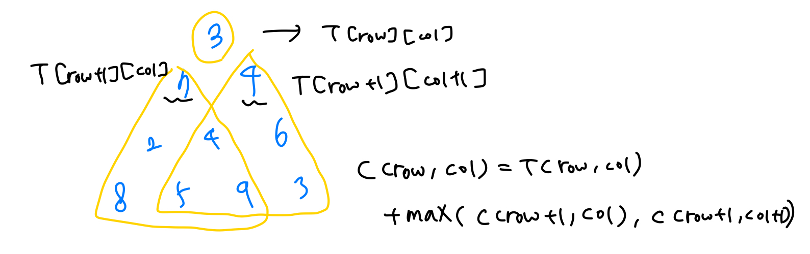

## Dynamic Programming

분할 정복은 재귀호출을 시행하면서 중복되는 문제가 발생할 수도 있다. 이를 해결하기 위해서, 다른 배열이나 테이블에 값을 저장해두고 그것을 찾아쓰는 dynamic programming이 등장하였다. 즉, dp는 재귀적 구조는 그대로 두고 테이블만 추가해서 중복 계산을 걷어낸다.

이때, Memoization은 top-down 방식이고, Tabulation은 bottom-up 방식이다.

<br>

#### 이항계수 문제

이항식을 이항정리로 전개 하였을 때의 각 항의 계수를 말한다. 이때의 규칙은 파스칼의 삼각형을 닮았으며, 조합을 활용해 풀 수 있다. 이항계수의 값(n, k)가 주어졌을 때, nCk = n-1Ck + n-1Ck-1의 형태를 띈다.

<br>

#### 🔧problem ex1) - 이항계수1: 메모이제이션

> **Description**
>
> 교재와 강의자료를 참고하여 이항계수를 구하는 재귀를 이용한 메모이제이션 알고리즘을 구현해 보자.
>
> 이항계수의 값이 너무 커질 수 있으므로, 이항계수를 다음과 같이 10,007로 나눈 나머지로 정의한다.
>
> bin(n, k) = 1,if k==0 or k==n
>
> bin(n, k) = (bin(n−1, k)+bin(n−1, k−1))mod10,007,otherwise
>
> 이 문제에서는 이항계수의 재귀적 관계를 이용한 메모이제이션을 아래와 같이 적용한다.
>
> ```
> int bin(int n, int k)
> {
>     cnt++; // 함수 호출 횟수 카운트
>     if (exit condition)
>         DP[n][k] = 1;
>     else if (DP[n][k] is not evaluated)
>         DP[n][k] = (bin(n-1, k) + bin(n-1, k-1)) % 10007; // memoize using recursive call
>     
>     return DP[n][k]; // return memoized value
> }
> ```
>
> **Input**
>
> 첫째 줄에 이항계수의 n과 k가 주어진다.
>
> 0 ≤ k ≤ n ≤ 1,0000
>
> **Output**
>
> 첫째 줄에 이항계수의 값 bin(n, k)를 출력한다.
>
> 이 때 bin(n, k)는 10,007보다 작은 양의 정수임에 유의한다.
>
> 둘째 줄에 메모이제이션을 적용한 이항계수 함수의 호출 횟수를 출력한다.

```cpp
#include <iostream>
#include <vector>
#include <algorithm>
using namespace std;

int cnt = 0;
vector<vector<int>> DP(1001, vector<int>(1001, -1));

int bin(int n, int k) {
    cnt++;
    if(k == 0 || n == k)
        DP[n][k] = 1;
    //DP를 -1로 초기화 했기 때문
  	//-1이 아닌 다른 값이 들어있으면, 이미 계산 된 것이기 때문에 중복 계산을 해 줄 필요가 없음
    else if(DP[n][k] == -1)
        DP[n][k] = (bin(n-1, k) + bin(n-1, k-1)) % 10007;
    return DP[n][k];
}

int main() {
    int n, k;
    cin >> n >> k;

    cout << bin(n, k) << endl;
    cout << cnt << endl;
}
```

- Time Complexity = **O(nk)**

<br>

#### 🔧problem ex2) - 이항계수2: 태뷸레이션

> **Description**
>
> 교재와 강의자료를 참고하여 이항계수를 구하는 동적계획법 알고리즘을 구현해 보자.
>
> 이항계수의 값이 너무 커질 수 있으므로, 이항계수를 다음과 같이 10,007로 나눈 나머지로 정의한다.
>
> bin(n, k) =. 1, if k==0 or k==n
>
> bin(n, k) = (bin(n−1, k)+bin(n−1, k−1))mod10,007,otherwise
>
> 이 문제에서는 태뷸레이션을 이용하는 Algorithm 3.2 를 개선하여,
>
> 교재와 수업시간에 다룬 공간 복잡도가 O(n)*O*(*n*)인 동적계획법 알고리즘으로 구현해야
>
> 시간 초과(Time Limit Error) 또는 메모리 초과(Memory Limit Exceeded)를 피할 수 있을 것이다.
>
> **Input**
>
> 첫째 줄에 이항계수의 n과 k가 주어진다.
>
> 0 ≤ k ≤ n ≤ 50,0000
>
> **Output**
>
> 첫째 줄에 이항계수의 값 bin(n, k)를 출력한다.
>
> 이 때 bin(n, k)는 10,007보다 작은 양의 정수임에 유의한다.

```cpp
#include <iostream>
#include <vector>
#include <algorithm>
using namespace std;

vector<int> DP(10001, 0);

void bin(int n, int k) {
    DP[0] = 1;
    for(int i = 1; i <= n; i++) {
      //이항계수의 성질에 따라 i와 k가 더 작은 것을 선택해서 불필요한 계산을 줄임
      //for(int j = k; j > 0; j--) 로 해도 되지만, 이 식은 불필요한 계산도 하게됨
        for(int j = min(i, k); j > 0; j--)
            DP[j] = (DP[j] + DP[j-1]) % 10007;
    }
}

int main() {
    int n, k;
    cin >> n >> k;

    bin(n, k);
    cout << DP[k] << endl;
}
```

=> 공간 복잡도가 커지니까, 이중배열이 아니라 하나의 배열을 사용하자! 공간복잡도가 O(n)이 된다.

<br>

#### 🔧problem ex3) - 플로이드 알고리즘

> **Description**
>
> 교재와 강의자료를 참고하여 Algorithm 3.4/3.5 Floyd2 알고리즘의 구현을 완성하시오.
>
> 이 문제에서는 주어진 가중치가 있는 방향 그래프에서 모든 쌍 최단경로를 찾는 플로이드 알고리즘을 수행하고,
>
> 알고리즘의 결과물인 D 테이블과 P 테이블을 출력한다.
>
> 또한, 주어진 D의 출발 정점과 도착 정점에 대해서 최단 경로를 출력한다.
>
> D 테이블에서 경로가 없는 정점에 대해서는 INF = 999 를 출력하도록 한다.
>
> ```
> #define INF 999
> ```
>
> 경로를 출력할 때는 출발 정점과 도착 정점도 함께 표시해야 하고,
>
> 경로가 존재하지 않는 두 정점에 대해서는 NONE 이라고 표시하도록 한다.
>
> 출발 정점과 도착 정점이 같은 경우에는 출발 정점과 도착 정점을 따로 표시하면 된다.
>
> **Input**
>
> 첫 번째 줄에 정점의 개수 N과 간선의 개수 M이 주어진다.
>
> 정점의 번호는 1번부터 N번까지로 정한다.
>
> 두 번째 줄부터 M개의 간선의 정보가 주어진다.
>
> 각 간선의 정보 u v w는 각각 간선의 출발 정점 u, 도착 정점 v, 해당 간선의 가중치 w로 주어진다.
>
> 모든 간선의 정보가 주어진 후에 다음 줄에 출발/도착 정점의 쌍의 개수 T가 주어진다.
>
> 그 다음 줄부터 T개의 출발/도착 정점의 쌍이 주어진다.
>
> **Output**
>
> 먼저, N * N 행렬 D를 출력한다.
>
> 다음에 N * N 행렬 P를 출력한다.
>
> D와 P는 floyd2() 함수의 결과값이다.
>
> D와 P 행렬의 출력 이후로 T 개의 최단 경로를 출력한다.
>
> 최단 경로는 출발 정점에서 시작하여 중간 정점을 모두 출력하고 도착 정점을 출력한다.
>
> 만약 출발 정점에서 도착 정점으로의 경로가 존재하지 않으면 NONE 이라고 출력한다.

```cpp
#include <iostream>
#include <vector>
#include <algorithm>
using namespace std;

#define INF 999
typedef vector<vector<int>> matrix_t;

void floyd2(int n, matrix_t& W, matrix_t& D, matrix_t& P) {

    //D는 간선의 가중치 값을 저장하는 배열
    //P는 노드 정보를 저장하는 배열

	for (int i = 1; i <= n; i++)
	{
		for (int j = 1; j <= n; j++)
		{
			D[i][j] = W[i][j];
			P[i][j] = 0;
		}
	}

	for (int k = 1; k <= n; k++)
	{
		for (int i = 1; i <= n; i++)
		{
			for (int j = 1; j <= n; j++)
			{

        //중간 노드를 거쳐거 가는 값이 한 번에 가는 값보다 적다면,
				if (D[i][j] > D[i][k] + D[k][j])
				{
					D[i][j] = D[i][k] + D[k][j];
					P[i][j] = k;
				}
			}
		}
	}
}

//최단 경로를 출력(출발노드 - 거쳐가는 노드 - 도착 노드)
void path(matrix_t& P, int u, int v, vector<int>& p)
{
	int k = P[u][v];
	if (k != 0)
	{
		path(P, u, k, p);
		p.push_back(k);
		path(P, k, v, p);
	}
}

int main() {
    int n, m;
    cin >> n >> m;

    matrix_t W(n+1, vector<int>(n+1, INF));
    matrix_t D(n+1, vector<int>(n+1));
    matrix_t P(n+1, vector<int>(n+1, 0));

    for(int i = 0; i < m; i++) {
        int u, v, w;
        cin >> u >> v >> w;

        W[u][v] = w;
    }

    //자기자신은 가중치가 0
    for(int i = 1; i <= n; i++) {
        for(int j = 1; j <= n; j++) {
            if(i == j)
                W[i][j] = 0;
        }
    }

    floyd2(n, W, D, P);

    for(int i = 1; i <= n; i++) {
        for(int j = 1; j <= n; j++) {
            if(j == n)
                cout << D[i][j] << endl;
            else
                cout << D[i][j] << " ";
        }
    }

    for(int i = 1; i <= n; i++) {
        for(int j = 1; j <= n; j++) {
            if(j == n)
                cout << P[i][j] << endl;
            else
                cout << P[i][j] << " ";
        }
    }

    int T;
    cin >> T;

    for(int i = 0; i < T; i++) {
        int u, v;
        cin >> u >> v;

        vector<int> p;
		if (u == v)
            cout << u << " " << v << endl;
		else {
			path(P, u, v, p);
			if (p.size() == 0 && D[u][v] == 999)
                cout << "NONE" << endl;
			else
			{
                cout << u << " ";
				for (int i = 0; i < p.size(); i++)
				{
                    cout << p[i] << " ";
				}
                cout << v << endl;
			}
		}

    }

}
```

=> 가중치가 있는 그래프의 최단경로를 모두 찾는 알고리즘

- 간선에 가중치가 있으면 가중치 값을 저장
- 바로 연결되는 간선이 없으면 INF
- 자기 자신으로 연결되는 경로는 0
- Time Complexity = **O(n^3)** => 노드의 개수 n개 O(n)  * 각 n에 대하여 n개로 가는 경로를 찾음 O(n^2)

<br>

#### 🔧problem ex4) - 삼각형 위의 최대 경로

> **Description**
>
> 파스칼의 삼각형처럼 생긴 삼각형에서 경로 위의 숫자들의 합이 최대가 되는 경로를 찾고자 한다.
>
> 예를 들어, 아래와 같이 높이가 4인 삼각형을 생각해 보자.
>
> ```
> 3
> 7 4
> 2 4 6
> 8 5 9 3
> ```
>
> 삼각형에서 경로 이동은 다음과 같이 두 가지만 가능하다.
>
> - 현재 위치에서 바로 아래로 이동
> - 현재 위치에서 바로 아래의 오른쪽으로 이동
>
> 출발점은 항상 최고층에서 출발한다고 할 때, 가장 아래 층으로 내려올 때까지 방문한 위치의 숫자의 합이 경로의 합이다.
>
> 위 삼각형에서 최대 경로는 [3, 7, 4, 9] 이고 경로의 합의 최대 23이다.
>
> 단, 최대 크기를 가진 경로가 여러 개일 경우에는 제일 오른쪽으로 치우친 경로를 출력한다.
>
> 예를 들어,
>
> ```
> 1
> 2 2
> 3 2 3
> 4 2 2 5
> 5 2 2 2 4
> ```
>
> 이처럼 두 개의 최대 경로 [1, 2, 3, 4, 5]와 [1, 2, 3, 5, 4]가 존재할 경우
>
> 오른쪽으로 가장 치우친[1, 2, 3, 5, 4]의 경로를 출력하면 된다.
>
> **Input**
>
> 첫 번째 줄에는 삼각형의 높이 n이 주어진다.
>
> 두 번째 줄부터 n개의 줄에 각각 삼각형의 숫자들이 주어진다.
>
> **Output**
>
> 첫 번째 줄에 최대 경로의 합을 출력한다.
>
> 두 번째 줄에 최대 경로를 출력한다.
>
> 단, 최대 경로가 여러 개일 경우에는 가장 오른쪽으로 치우친 경로를 출력한다.

```cpp
#include <iostream>
#include <vector>
#include <algorithm>
using namespace std;

typedef vector<vector<int>> matrix_t;

int maximumTotal(int n, matrix_t& C, matrix_t& P) {
    for(int i = n - 2; i >= 0; i--) {
        for(int j = n - 2; j >= 0; j--) {
            if(C[i + 1][j] > C[i + 1][j + 1]) {
                C[i][j] += C[i + 1][j];
            }
            else {
                C[i][j] += C[i + 1][j + 1];
                P[i][j] = 1;
            }
        }
    }
    return C[0][0];
}

int main() {
    int n;
    cin >> n;

    //C는 경로의 합 저장
    //P는 경로 저장
    matrix_t C(n, vector<int>(n));
    matrix_t T(n, vector<int>(n));
    matrix_t P(n, vector<int>(n));

    int cnt = 1, temp = 0;
    for(int i = 0; i < n; i++) {
        for(int j = 0; j < cnt; j++) {
            cin >> temp;
            C[i][j] = temp;
            T[i][j] = temp;
        }
        cnt++;
    }

  cout << maximumTotal(n, C, P) << endl;

  //P가 0이 아닌경우에 경로 출력
  cout << T[0][0] << " ";
  int q = 0;
	for (int i = 0; i < (n - 2); i++)
	{
		if (P[i][q] != 0)
            q++;
        //앞전에 [현재 i-1][현재 q-1] 값을 배열에 저장해주었으므로 +1씩 해주어야 한다.
        cout << T[i + 1][q] << " ";
	}
  if(P[n - 2][q] != 0)
      q++;
  cout << T[n - 1][q] << endl;

}
```


