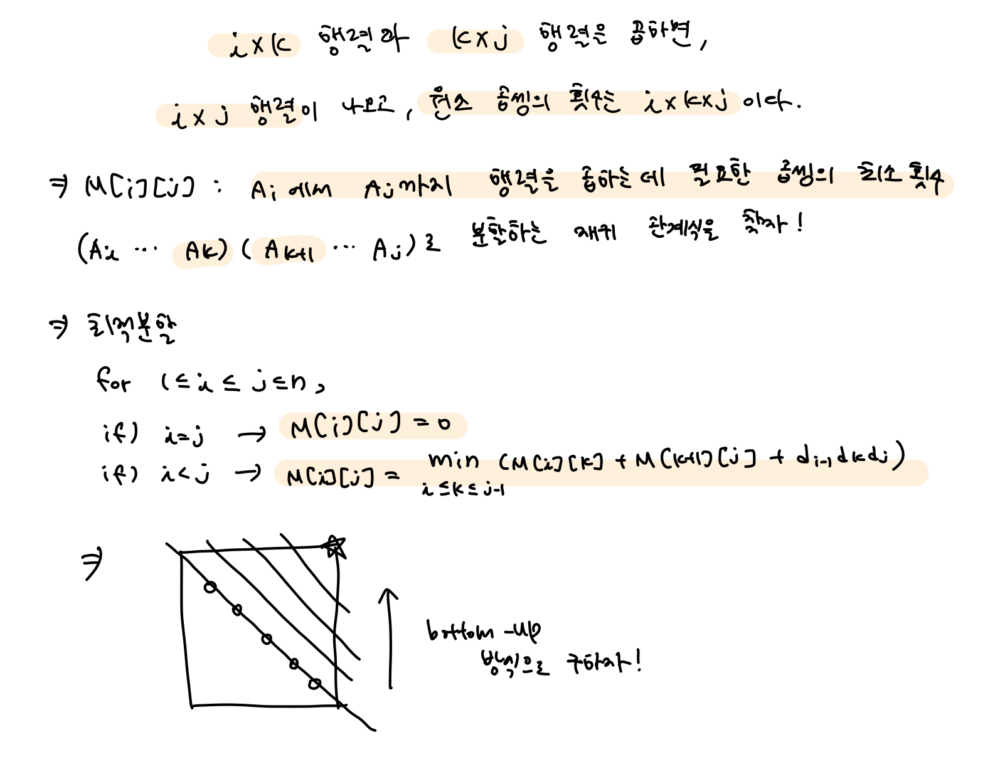
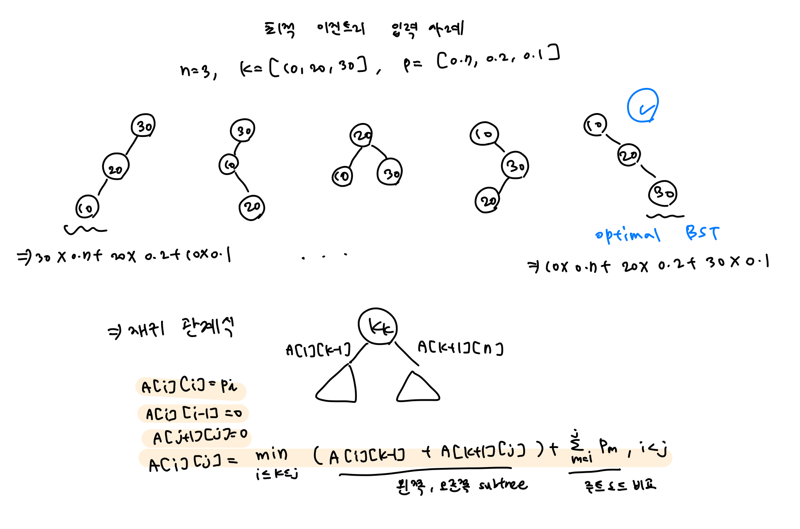
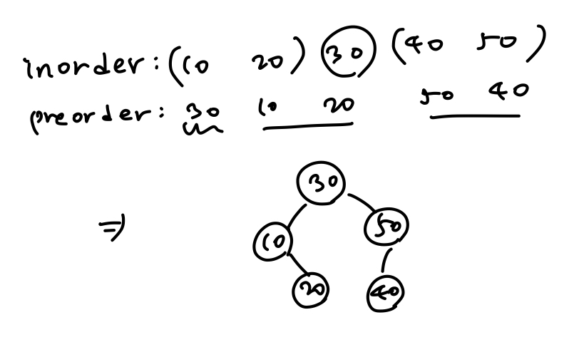

## Dynamic Programming - 2

<br>

#### 🔧problem ex1) - 연쇄 행렬 곱셈

> **Description**
>
> 교재와 강의자료를 참고하여, Algorithm 3.6/3.7 연쇄 행렬 곱셈 알고리즘의 구현을 완성하시오.
>
> 행렬의 개수 n과 각 행렬의 크기 값의 배열 d를 입력으로 받고
>
> M, P 행렬의 값을 구해서 출력하고,
>
> 단위 곱셈의 최적 횟수 및 괄호로 묶은 행렬 곱셈의 순서를 출력하시오.
>
> 단, 최적 횟수의 최댓값은 999999를 넘지 않는다.
>
> **Input**
>
> 첫째 줄에 행렬의 개수 n이 주어진다.
>
> 둘째 줄에 행렬의 크기 값의 배열 d가 차례대로 주어진다. (배열의 크기는 n + 1 이다.)
>
> **Output**
>
> 먼저 행렬 M의 윗 부분 삼각형을 출력한다. (0을 포함)
>
> 다음으로 행렬 P의 윗 부분 삼각형을 출력한다. (0을 포함)
>
> M과 P를 출력한 후에 행렬 곱셈 횟수의 최적값을 출력한다.
>
> 다음 줄에 행렬 곱셈의 순서를 괄호로 묶어 출력한다.
>
> 모든 단위 행렬에도 괄호가 포함되어야 하고,행렬 이름은 A1, A2, .... , An 으로 표기한다.

```cpp
#define _CRT_SECURE_NO_WARNINGS
#include <iostream>
#include <vector>
#include <algorithm>
using namespace std;

#define INF 0xffff

typedef vector<vector<int>> matrix_t;

int minimum(int i, int j, int& mink, vector<int>& d, matrix_t& M)
{
	int minValue = INF, value;
	for (int k = i; k <= j - 1; k++)
	{
		value = M[i][k] + M[k + 1][j] + d[i - 1] * d[k] * d[j];
		if (minValue > value)
		{
			minValue = value;
			mink = k;
		}
	}
	return minValue;
}

void minmult(int n, vector<int>& d, matrix_t& M, matrix_t& P)
{
	for (int i = 1; i <= n; i++)
		M[i][i] = 0;
	for (int diagonal = 1; diagonal <= n - 1; diagonal++)
	{
		for (int i = 1; i <= n - diagonal; i++)
		{
			int j = i + diagonal, k;
			M[i][j] = minimum(i, j, k, d, M);
			P[i][j] = k;
		}
	}
}

void order(int i, int j, matrix_t& P, string& s) {
    if(i == j)
        s += "(A" + to_string(i) + ")";
    else {
        int k = P[i][j];
        s += string("(");
        order(i, k, P, s);
        order(k + 1, j, P, s);
        s += string(")");
    }
}

int main() {
    int n;
    cin >> n;

    vector<int> d(n+1);
    for(int i = 0; i <= n; i++)
        cin >> d[i];
    
    matrix_t array(n+1, vector<int>(n + 1, 0));
    matrix_t path(n+1, vector<int>(n + 1, 0));
    minmult(n, d, array, path);

    //행렬 array
    for(int i = 1; i <= n; i++) {
        for(int j = i; j <= n; j++) {
            if(j == n)
                cout << array[i][j] << endl;
            else
                cout << array[i][j] << " ";
        }
    }

    //행렬 path(k값)
    for(int i = 1; i <= n; i++) {
        for(int j = i; j <= n; j++) {
            if(j == n)
                cout << path[i][j] << endl;
            else
                cout << path[i][j] << " ";
        }
    }

    //최적값: 1행의 젤 오른쪽
    cout << array[1][n] << endl;

    //행렬 곱셈의 순서
    string s;
    order(1, n, path, s);
    cout << s;
    
}
```



<br>

#### 🔧problem ex2) - 최적 이진탐색트리

> **Description**
>
> 교재와 강의자료를 참고하여 Algorithm 3.9/3.10의 구현을 완성하시오.
>
> 원소의 개수 n, 키의 값 K, 원소의 탐색 빈도값의 배열 p가 주어질 때
>
> A, R 행렬의 값을 구해서 출력하고,
>
> R 행렬을 이용하여 구축할 수 있는 이진탐색트리의
>
> preorder, inorder 순회 탐색 결과를 출력하시오.
>
> **Input**
>
> 첫째 줄에 key의 개수 n이 주어진다.
>
> 둘째 줄에 n 개의 key 값이 주어진다. (key 값은 정렬되어 있다고 가정해도 된다.)
>
> 셋째 줄에 n 개의 빈도값 p가 주어진다. (p[i] 값은 양의 정수값으로 주어진다.)
>
> **Output**
>
> 먼저 행렬 A의 윗 부분 삼각형을 출력한다. (0을 포함)
>
> 다음으로 행렬 R의 윗 부분 삼각형을 출력한다. (0을 포함)
>
> A와 R을 출력한 후에 최적 이진탐색트리에서 평균검색시간의 최적값을 출력한다.
>
> 다음 줄에 최적 이진탐색트리의 preorder 순회 탐색 결과를 출력한다.
>
> 다음 줄에 최적 이진탐색트릴의 inorder 순회 탐색 결과를 출력한다.

```cpp
#define _CRT_SECURE_NO_WARNINGS
#define INF 0xffff
#include <iostream>
#include <vector>

using namespace std;
typedef vector<vector<int>> matrix_t;

struct node
{
	int key;
	node* left;
	node* right;
};

typedef node* node_ptr;

void optsearchtree(int n, vector<int>& p, matrix_t& A, matrix_t& R);
int minimum(int i, int j, int& mink, vector<int>& d, matrix_t& M);
node_ptr tree(int i, int j, vector<int>& keys, matrix_t& R);
node_ptr create_node(int key);
void preorder(node_ptr node, int n);
void inorder(node_ptr node, int n);
int cnt = 0;

int main(void)
{
	int n, a;
	scanf("%d", &n);
	vector <int> p;
	p.push_back(0);
	vector <int> q;
	q.push_back(0);
	for (int i = 0; i < n; i++)
	{
		scanf("%d", &a);
		p.push_back(a);
	}
	for (int i = 0; i < n; i++)
	{
		scanf("%d", &a);
		q.push_back(a);
	}
	matrix_t A(n + 2, vector<int>(n + 1, 0));
	matrix_t R(n + 2, vector<int>(n + 1, 0));

	optsearchtree(n, q, A, R);
	node_ptr root = tree(1, n, p, R);

	for (int i = 1; i <= n + 1; i++)
	{
		for (int j = i - 1; j < n; j++)
		{
			cout << A[i][j] << " ";
		}
		cout << A[i][n] << "\n";
	}

	for (int i = 1; i <= n + 1; i++)
	{
		for (int j = i - 1; j < n; j++)
		{
			cout << R[i][j] << " ";
		}
		cout << R[i][n] << "\n";
	}
	cout << A[1][n] << "\n";
	preorder(root, n);
	cout << "\n";
	cnt = 0;
	inorder(root, n);

	return 0;
}

void optsearchtree(int n, vector<int> & p, matrix_t & A, matrix_t &R)
{
	for (int i = 1; i <= n; i++)
	{
		A[i][i] = p[i]; A[i][i - 1] = 0;
		R[i][i] = i; R[i][i - 1] = 0;
	}
	A[n + 1][n] = 0;
	R[n + 1][n] = 0;
	for (int diagonal = 1; diagonal <= n - 1; diagonal++)
	{
		for (int i = 1; i <= n - diagonal; i++)
		{
			int j = i + diagonal;
			int k = i;
			A[i][j] = minimum(i, j, k, p, A);
			R[i][j] = k;
		}
	}
}

int minimum(int i, int j, int& mink, vector<int>& d, matrix_t& M)
{
	int minValue = INF, value;
	for (int k = i; k <= j ; k++)
	{
		value = M[i][k - 1] + M[k + 1][j];
		for (int m = i; m <= j; m++)
		{
			value += d[m];
		}
		if (minValue > value)
		{
			minValue = value;
			mink = k;
		}
	}
	return minValue;
}

node_ptr tree(int i, int j, vector<int>& keys, matrix_t& R)
{
	int k = R[i][j];
	if (k == 0)
		return NULL;
	else
	{
		node_ptr node = create_node(keys[k]);
		node->left = tree(i, k - 1, keys, R);
		node->right = tree(k + 1, j, keys, R);
		return node;
	}
}

node_ptr create_node(int key)
{
	node_ptr new_node = new node;
	new_node->key = key;
	new_node->left = NULL;
	new_node->right = NULL;
	return new_node;
}

void preorder(node_ptr node, int n)
{
	if (node != NULL)
	{
		
			cout << node->key;
			cnt++;
			if (cnt < n)
			{
				cout << " ";
			}
			preorder(node->left, n);
			preorder(node->right, n);
		}
}

void inorder(node_ptr node, int n)
{
	if (node != NULL)
	{
			inorder(node->left, n);
			cout << node->key;
			cnt++;
			if (cnt < n)
			{
				cout << " ";
			}
			inorder(node->right, n);
	
	}
}
```



