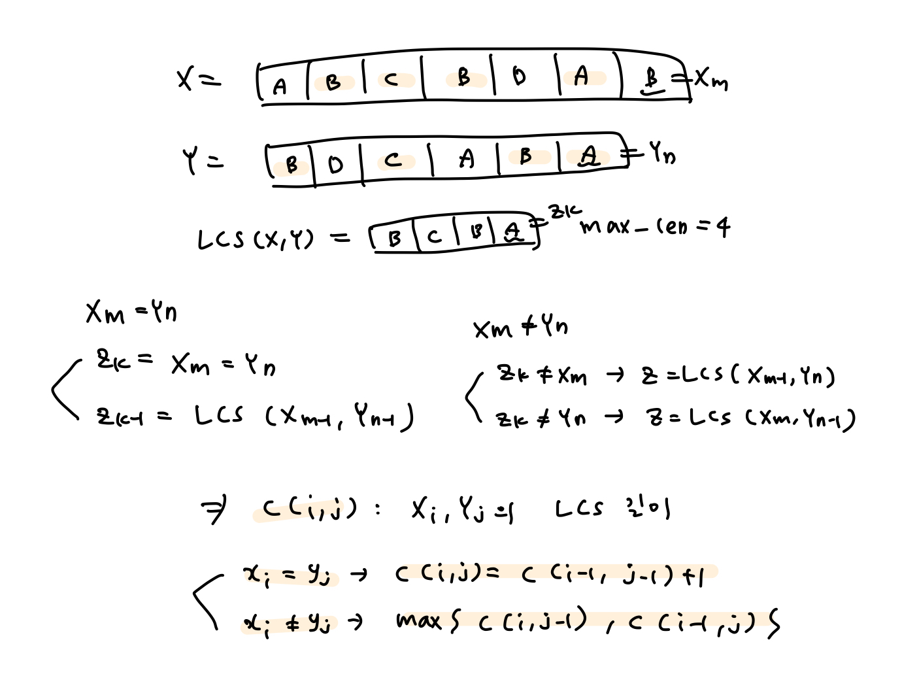

## Dynamic Programming - 2

<br>

#### 🔧problem ex1) - 연쇄 행렬 곱셈

> **Description**
>
> 교재와 강의자료를 참고하여, Algorithm 3.6/3.7 연쇄 행렬 곱셈 알고리즘의 구현을 완성하시오.
>
> 행렬의 개수 n과 각 행렬의 크기 값의 배열 d를 입력으로 받고
>
> M, P 행렬의 값을 구해서 출력하고,
>
> 단위 곱셈의 최적 횟수 및 괄호로 묶은 행렬 곱셈의 순서를 출력하시오.
>
> 단, 최적 횟수의 최댓값은 999999를 넘지 않는다.
>
> **Input**
>
> 첫째 줄에 행렬의 개수 n이 주어진다.
>
> 둘째 줄에 행렬의 크기 값의 배열 d가 차례대로 주어진다. (배열의 크기는 n + 1 이다.)
>
> **Output**
>
> 먼저 행렬 M의 윗 부분 삼각형을 출력한다. (0을 포함)
>
> 다음으로 행렬 P의 윗 부분 삼각형을 출력한다. (0을 포함)
>
> M과 P를 출력한 후에 행렬 곱셈 횟수의 최적값을 출력한다.
>
> 다음 줄에 행렬 곱셈의 순서를 괄호로 묶어 출력한다.
>
> 모든 단위 행렬에도 괄호가 포함되어야 하고,행렬 이름은 A1, A2, .... , An 으로 표기한다.

```cpp
#define _CRT_SECURE_NO_WARNINGS
#include <iostream>
#include <vector>
#include <algorithm>
using namespace std;

#define INF 0xffff

typedef vector<vector<int>> matrix_t;

int minimum(int i, int j, int& mink, vector<int>& d, matrix_t& M)
{
	int minValue = INF, value;
	for (int k = i; k <= j - 1; k++)
	{
		value = M[i][k] + M[k + 1][j] + d[i - 1] * d[k] * d[j];
		if (minValue > value)
		{
			minValue = value;
			mink = k;
		}
	}
	return minValue;
}

void minmult(int n, vector<int>& d, matrix_t& M, matrix_t& P)
{
	for (int i = 1; i <= n; i++)
		M[i][i] = 0;
	for (int diagonal = 1; diagonal <= n - 1; diagonal++)
	{
		for (int i = 1; i <= n - diagonal; i++)
		{
			int j = i + diagonal, k;
			M[i][j] = minimum(i, j, k, d, M);
			P[i][j] = k;
		}
	}
}

void order(int i, int j, matrix_t& P, string& s) {
    if(i == j)
        s += "(A" + to_string(i) + ")";
    else {
        int k = P[i][j];
        s += string("(");
        order(i, k, P, s);
        order(k + 1, j, P, s);
        s += string(")");
    }
}

int main() {
    int n;
    cin >> n;

    vector<int> d(n+1);
    for(int i = 0; i <= n; i++)
        cin >> d[i];
    
    matrix_t array(n+1, vector<int>(n + 1, 0));
    matrix_t path(n+1, vector<int>(n + 1, 0));
    minmult(n, d, array, path);

    //행렬 array
    for(int i = 1; i <= n; i++) {
        for(int j = i; j <= n; j++) {
            if(j == n)
                cout << array[i][j] << endl;
            else
                cout << array[i][j] << " ";
        }
    }

    //행렬 path(k값)
    for(int i = 1; i <= n; i++) {
        for(int j = i; j <= n; j++) {
            if(j == n)
                cout << path[i][j] << endl;
            else
                cout << path[i][j] << " ";
        }
    }

    //최적값: 1행의 젤 오른쪽
    cout << array[1][n] << endl;

    //행렬 곱셈의 순서
    string s;
    order(1, n, path, s);
    cout << s;
    
}
```


<br>

#### 🔧problem ex2) - 최적 이진탐색트리

> **Description**
>
> 교재와 강의자료를 참고하여 Algorithm 3.9/3.10의 구현을 완성하시오.
>
> 원소의 개수 n, 키의 값 K, 원소의 탐색 빈도값의 배열 p가 주어질 때
>
> A, R 행렬의 값을 구해서 출력하고,
>
> R 행렬을 이용하여 구축할 수 있는 이진탐색트리의
>
> preorder, inorder 순회 탐색 결과를 출력하시오.
>
> **Input**
>
> 첫째 줄에 key의 개수 n이 주어진다.
>
> 둘째 줄에 n 개의 key 값이 주어진다. (key 값은 정렬되어 있다고 가정해도 된다.)
>
> 셋째 줄에 n 개의 빈도값 p가 주어진다. (p[i] 값은 양의 정수값으로 주어진다.)
>
> **Output**
>
> 먼저 행렬 A의 윗 부분 삼각형을 출력한다. (0을 포함)
>
> 다음으로 행렬 R의 윗 부분 삼각형을 출력한다. (0을 포함)
>
> A와 R을 출력한 후에 최적 이진탐색트리에서 평균검색시간의 최적값을 출력한다.
>
> 다음 줄에 최적 이진탐색트리의 preorder 순회 탐색 결과를 출력한다.
>
> 다음 줄에 최적 이진탐색트릴의 inorder 순회 탐색 결과를 출력한다.

```cpp
#define _CRT_SECURE_NO_WARNINGS
#define INF 0xffff
#include <iostream>
#include <vector>

using namespace std;
typedef vector<vector<int>> matrix_t;

struct node
{
	int key;
	node* left;
	node* right;
};

typedef node* node_ptr;

void optsearchtree(int n, vector<int>& p, matrix_t& A, matrix_t& R);
int minimum(int i, int j, int& mink, vector<int>& d, matrix_t& M);
node_ptr tree(int i, int j, vector<int>& keys, matrix_t& R);
node_ptr create_node(int key);
void preorder(node_ptr node, int n);
void inorder(node_ptr node, int n);
int cnt = 0;

int main(void)
{
	int n, a;
	scanf("%d", &n);
	vector <int> p;
	p.push_back(0);
	vector <int> q;
	q.push_back(0);
	for (int i = 0; i < n; i++)
	{
		scanf("%d", &a);
		p.push_back(a);
	}
	for (int i = 0; i < n; i++)
	{
		scanf("%d", &a);
		q.push_back(a);
	}
	matrix_t A(n + 2, vector<int>(n + 1, 0));
	matrix_t R(n + 2, vector<int>(n + 1, 0));

	optsearchtree(n, q, A, R);
	node_ptr root = tree(1, n, p, R);

	for (int i = 1; i <= n + 1; i++)
	{
		for (int j = i - 1; j < n; j++)
		{
			cout << A[i][j] << " ";
		}
		cout << A[i][n] << "\n";
	}

	for (int i = 1; i <= n + 1; i++)
	{
		for (int j = i - 1; j < n; j++)
		{
			cout << R[i][j] << " ";
		}
		cout << R[i][n] << "\n";
	}
	cout << A[1][n] << "\n";
	preorder(root, n);
	cout << "\n";
	cnt = 0;
	inorder(root, n);

	return 0;
}

void optsearchtree(int n, vector<int> & p, matrix_t & A, matrix_t &R)
{
	for (int i = 1; i <= n; i++)
	{
		A[i][i] = p[i]; A[i][i - 1] = 0;
		R[i][i] = i; R[i][i - 1] = 0;
	}
	A[n + 1][n] = 0;
	R[n + 1][n] = 0;
	for (int diagonal = 1; diagonal <= n - 1; diagonal++)
	{
		for (int i = 1; i <= n - diagonal; i++)
		{
			int j = i + diagonal;
			int k = i;
			A[i][j] = minimum(i, j, k, p, A);
			R[i][j] = k;
		}
	}
}

int minimum(int i, int j, int& mink, vector<int>& d, matrix_t& M)
{
	int minValue = INF, value;
	for (int k = i; k <= j ; k++)
	{
		value = M[i][k - 1] + M[k + 1][j];
		for (int m = i; m <= j; m++)
		{
			value += d[m];
		}
		if (minValue > value)
		{
			minValue = value;
			mink = k;
		}
	}
	return minValue;
}

node_ptr tree(int i, int j, vector<int>& keys, matrix_t& R)
{
	int k = R[i][j];
	if (k == 0)
		return NULL;
	else
	{
		node_ptr node = create_node(keys[k]);
		node->left = tree(i, k - 1, keys, R);
		node->right = tree(k + 1, j, keys, R);
		return node;
	}
}

node_ptr create_node(int key)
{
	node_ptr new_node = new node;
	new_node->key = key;
	new_node->left = NULL;
	new_node->right = NULL;
	return new_node;
}

void preorder(node_ptr node, int n)
{
	if (node != NULL)
	{
		
			cout << node->key;
			cnt++;
			if (cnt < n)
			{
				cout << " ";
			}
			preorder(node->left, n);
			preorder(node->right, n);
		}
}

void inorder(node_ptr node, int n)
{
	if (node != NULL)
	{
			inorder(node->left, n);
			cout << node->key;
			cnt++;
			if (cnt < n)
			{
				cout << " ";
			}
			inorder(node->right, n);
	
	}
}
```


<br>

#### 🔧problem ex3) - 최장 공통 부분서열

> **Description**
>
> 두 개의 문자열이 주어질 때, 최장공통부분서열(LCS, Longest Common Subsequence)을 찾아라.
>
> 예를 들어, 두 개의 문자열 X = "ABCBDAB", Y = "BDCABA"에 대해서
>
> 공통부분서열의 최대값은 4이고, 해당하는 부분서열은 BCBA이다.
>
> 최장공통부분서열 문제는 대표적인 동적계획법 알고리즘으로,
>
> 다음과 같은 파이썬 코드로 구현된 알고리즘을 참조할 수 있다.
>
> ```
> def lcs(x, y):
>     x, y = [' '] + x, [' '] + y
>     m, n = len(x), len(y)
>     c = [[0 for _ in range(n)] for _ in range(m)]
>     b = [[0 for _ in range(n)] for _ in range(m)]
>     for i in range(1, m):
>         for j in range(1, n):
>             if x[i] == y[j]:
>                 c[i][j] = c[i - 1][j - 1] + 1
>                 b[i][j] = 1
>             else:
>                 c[i][j] = max(c[i][j - 1], c[i - 1][j])
>                 b[i][j] = 2 if (c[i][j - 1] > c[i - 1][j]) else 3
>     return c, b
> ```
>
> 공통부분서열의 재구축은 다음과 같은 파이썬 코드로 구현된 알고리즘을 참조할 수 있다.
>
> ```
> def get_lcs(i, j, b, x):
>     if i == 0 or j == 0:
>         return ""
>     else:
>         if b[i][j] == 1:
>             return get_lcs(i - 1, j - 1, b, x) + x[i]
>         elif b[i][j] == 2:
>             return get_lcs(i, j - 1, b, x)
>         elif b[i][j] == 3:
>             return get_lcs(i - 1, j, b, x)
> ```
>
> 위 파이썬 참조 구현에 대한 해설은 유튜브 동영상을 참고할 수 있다.
>
> https://youtu.be/z8KVLz9BFIo
>
> 단, 파이썬 참조 구현이 제공되므로, 이 과제에서는 파이썬 언어는 선택할 수 없음에 유의하라.
>
> **Input**
>
> 첫 번째 줄에 문자열 X가 주어진다.
>
> 두 번째 줄에 문자열 Y가 주어진다.
>
> X, Y 문자열에는 영문 알파벳 대문자만 포함되어 있다. (A..Z)
>
> **Output**
>
> 첫 번째 줄에 최장공통부분서열의 길이를 출력한다.
>
> 두 번째 줄에 위 파이썬 참조 코드에서 사용한 방법대로 적용했을 때의 최장공통부분서열을 출력한다.
>
> 단, 공통부분서열이 없으면 두 번째 줄은 출력하지 않는다.

```cpp
#define _CRT_SECURE_NO_WARNINGS
#include <iostream>
#include <vector>
#include <string>

using namespace std;
typedef vector<vector<int>> matrix_t;
void lcs(string x, string y, int m, int n, matrix_t& c, matrix_t& b);
string get_lcs(int i, int j, matrix_t& b, string& x);
int cnt = 0;

int main(void)
{
	string str;
	cin >> str;
	string str2;
	cin >> str2;
	str = ' ' + str;
	str2 = ' ' + str2;
	int m = str.length();
	int n = str2.length();
	matrix_t c(m, vector<int>(n, 0));
	matrix_t b(m, vector<int>(n, 0));
	lcs(str, str2, m, n, c, b);

	string lcs = get_lcs(m - 1, n - 1, b, str);
	cout << cnt << "\n";
	cout << lcs;
	return 0;
}

void lcs(string x, string y, int m, int n, matrix_t &c, matrix_t &b)
{
	for (int i = 1; i < m; i++)
	{
		for (int j = 1; j < n; j++)
		{
			if (x[i] == y[j])
			{
				c[i][j] = c[i - 1][j - 1] + 1;
				b[i][j] = 1;
			}
			else
			{
				c[i][j] = max(c[i][j - 1], c[i - 1][j]);
				b[i][j] = (c[i][j - 1] > c[i - 1][j]) ? 2 : 3;
			}
		}
	}

}

string get_lcs(int i, int j, matrix_t& b, string& x)
{
	if (i == 0 || j == 0)
	{
		return "";
	}
	else
	{
		if (b[i][j] == 1)
		{
			cnt++;
			return get_lcs(i - 1, j - 1, b, x) + x[i];
		}
		else if (b[i][j] == 2)
		{
			return get_lcs(i, j - 1, b, x);
		}
		else if (b[i][j] == 3)
		{
			return get_lcs(i - 1, j, b, x);
		}
	}
    return 0;
}
```

