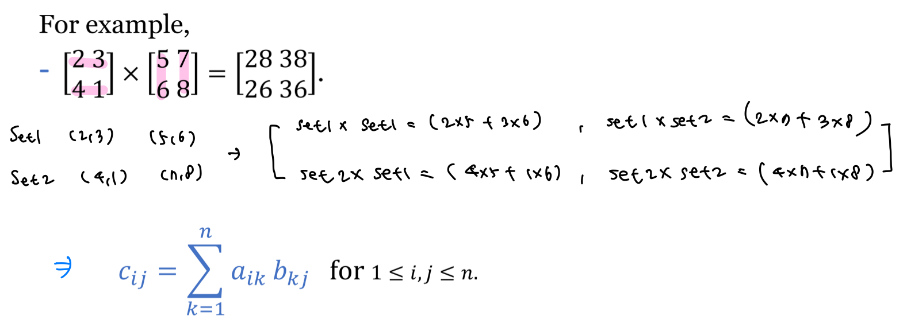

## Algorithms: Efficiency, Analysis, and Order


#### 📌Algorithms

<br>

algorithm

> 문제를 풀기 위한 step-by-step 절차이다.

<br>

computer algorithm

> 컴퓨터를 사용해서 문제를 해결하는 명령어(instructions)의 유한집합(finite sequence)이다.

<br>

problem

> 답을 찾고자 하는 문제이다.

<br>

instance

> problem은 parameter라고 하는 변수(variable)을 가진다. 이 parameter들에 특정 값이 부여되면 이를 problem에 대한 instance라 한다. 그래서 instance는 특정 객체가 어떤 클래스의 객체인지, 관계 위주로 설명할 때 사용한다.
>
> 알고리즘 문제는 instance 집합과 output이 가져야하는 속성들이 주어지면 명시된다. 

<br>

**problem ex1) - Sequential Search**

> **Input**
>
> 첫째 줄에 양의 정수 N과 M이 주어진다.
>
> 둘째 줄에 N개의 양의 정수가 주어진다.
>
> 셋째 줄에 M개의 양의 정수가 주어진다.
>
> 
>
> **Output**
>
> 첫째 줄부터 한 줄에 하나씩, 입력의 셋째 줄에 주어진 양의 정수 x에 대해 아래와 같은 형식으로 위치를 출력한다.
>
> x is in location.
>
> 만약 x가 주어진 입력에 존재하지 않으면 다음과 같이 출력한다.
>
> x is not in S.

```cpp
#include <stdio.h>
#include <iostream>
#include <vector>
#include <algorithm>
using namespace std;

void seqsearch(int n, vector<int> S, int x, int& location) {
    location = 0;

    for (int i = 1; i <= n; i++)
        if (S[i] == x)
            location = i;
            return;
}

int main() {
    int n, m;
    scanf("%d %d", &n, &m);

    vector<int> S(n+1);
    for (int i = 1; i <= n; i++)
        scanf("%d", &S[i]);

    while (m--) {
        int x, location;
        scanf("%d", &x);

        seqsearch(n, S, x, location);

        if (location > 0)
            printf("%d is in %d.\n", x, location);
        else
            printf("%d is not in S.\n", x);
    }
}
```

<br>

**problem ex2) - Adding Array Members**

> **Input**
>
> 첫째 줄에 양의 정수 N이 주어진다.
>
> 둘째 줄에 N개의 배열 원소가 주어진다.
>
> 
>
> **Output**
>
> 첫째 줄에 배열 원소의 합 S를 출력한다.

```cpp
#include <stdio.h>
#include <iostream>
#include <vector>
#include <algorithm>
using namespace std;

int sum(int n, vector<int> S) {
    int sum = 0;

    for (int i = 1; i <= n; i++)
        sum += S[i];

    return sum;
}

int main() {
    int n;
    scanf("%d", &n);

    vector<int> S(n+1);
    for (int i = 1; i <= n; i++)
        scanf("%d", &S[i]);

    printf("%d", sum(n, S));
}
```

<br>

**problem ex3) - Exchange Sort**

> **Input**
>
> 첫째 줄에 양의 정수 N이 주어진다.
>
> 둘째 줄에 N개의 양의 정수가 주어진다.
>
> 
>
> **Output**
>
> 첫째 줄에 주어진 배열 S를 오름차순으로 정렬하여 출력한다.

```cpp
#include <stdio.h>
#include <iostream>
#include <vector>
#include <algorithm>
using namespace std;

void exchange(int n, vector<int>& S) {
    int temp;
    for (int i = 1; i < n; i++)
        for (int j = i+1; j <= n; j++)
            if (S[i] > S[j]) {
                temp = S[i];
                S[i] = S[j];
                S[j] = temp;
            }
}

int main() {
    int n;
    scanf("%d", &n);

    vector<int> S(n+1);
    for (int i = 1; i <= n; i++)
        scanf("%d", &S[i]);

    exchange(n, S);

    for (int i = 1; i <= n; i++)
        printf("%d ", S[i]);
}
```

<br>

**problem ex4) - Matrix Multiplication**

> **Input**
>
> 첫째 줄에 양의 정수 N이 주어진다.
>
> 다음 줄부터 N개의 줄에 첫 번째 N*N 행렬의 원소가 한 줄에 한 행씩 차례대로 주어진다.
>
> 
>
> **Output**
>
> 두 행렬의 곱셈 결과를 N개의 줄에 한 줄에 한 행씩 차례대로 출력한다.



```cpp
#include <stdio.h>
#include <iostream>
#include <vector>
#include <algorithm>
using namespace std;

typedef vector<vector<int>> matrix_t;

void multiMatrix(int n, matrix_t A, matrix_t B, matrix_t& C) {
    for (int i = 1; i <= n; i++)
        for (int j = 1; j <= n; j++)
            for (int k = 1; k <= n; k++)
                C[i][j] += A[i][k] * B[k][j];
}

void matrixRead(int n, matrix_t& M) {
    for (int i = 1; i <= n; i++)
        for (int j = 1; j <= n; j++)
            scanf("%d", &M[i][j]);
}

int main() {
    int n;
    scanf("%d", &n);

    matrix_t A(n+1, vector<int>(n+1));
    matrix_t B(n+1, vector<int>(n+1));
    matrixRead(n, A);
    matrixRead(n, B);

    matrix_t C(n+1, vector<int>(n+1));
    multiMatrix(n, A, B, C);

    for (int i = 1; i <= n; i++)
        for (int j = 1; j <= n; j++)
            if (j == n)
                printf("%d\n", C[i][j]);
            else
                printf("%d ", C[i][j]);

}
```

<br>

#### 📌Five Properties

<br>

1. 입력(input)

   : 0개 이상의 외부 입력 데이터가 존재해야 한다.

2. 출력(output)

   : 하나 이상의 결과가 나와야 한다.

3. 명확성(unambiguity)

   : 모든 명령들은 모호하지 않고 단순 명확해야 한다.

4. 유한성(finiteness)

   : 한정된 수의 단계 후에 반드시 종료해야 한다.

5. 유효성(feasibility)

   : 모든 명령은 실행 가능해야 한다.

<br>

**problem ex5) - Binary Search**

> **Input**
>
> 첫째 줄에 양의 정수 N과 M이 주어진다.
>
> 둘째 줄에 N개의 양의 정수가 주어진다.
>
> 셋째 줄에 M개의 양의 정수가 주어진다.
>
> 
>
> **Output**
>
> 첫째 줄부터 한 줄에 하나씩, 입력의 셋째 줄에 주어진 양의 정수 x에 대해 아래와 같은 형식으로 위치를 출력한다.
>
> x is in location.
>
> 만약 x*x*가 주어진 입력에 존재하지 않으면 다음과 같이 출력한다.
>
> x is not in S.

```cpp
#include <stdio.h>
#include <iostream>
#include <vector>
#include <algorithm>
using namespace std;

//이진탐색
//정렬된 array에서 해당 변수의 위치를 출력하는 알고리즘

void binsearch(int N, int x, vector<int> S, int& location) {
    int start = 1;
    int end = N;
    location = 0;

    while (start <= end) {
        int mid = (start + end) / 2;

        if (x == S[mid]) {
           location = mid;
           return; 
        }
        else if (x < S[mid])
            end = mid - 1;
        else
            start = mid + 1;

    }
}

int main() {
    int N, M;
    scanf("%d %d", &N, &M);

    vector<int> S(N+1);
    for (int i = 1; i <= N; i++)
        scanf("%d", &S[i]);

    //sort 함수
    //기본적으로 오름차순으로 정리
    //배열의 시작 주소와 마지막 주소 +1을 적으면 됨
    sort(S.begin()+1, S.end());

    for (int j = 1; j <= M; j++) {
        int x, location;
        scanf("%d", &x);
        binsearch(N, x, S, location);

        if (location == 0)
            printf("%d is not in S.\n", x);
        else
            printf("%d is in %d.\n", x, location);
    }

}
```

<br>

#### 📌Sequential Search vs Binary Search

- 최악의 경우(array에 찾고자 하는 값이 들어가있지 않은 경우), 각각의 시간 복잡도
  - sequential search : "n" comparisons
    - 처음부터 n까지 차례차례 비교해나가야 함
  - binary search : "log2(n) + 1" comparisons
    - 반띵 해나가면서 비교하기 때문에 log2(n) 만큼의 비교가 일어나고, 배열의 길이가 1만 남았을 때 남아있는 원소와 찾고자 하는 원소가 일치하는지 1 만큼의 비교 연산을 함
- array가 32개의 아이템을 가질 때, 각각의 시간 복잡도
  - sequential search : 32 comparisons
  - binary search : 6 comparisons
