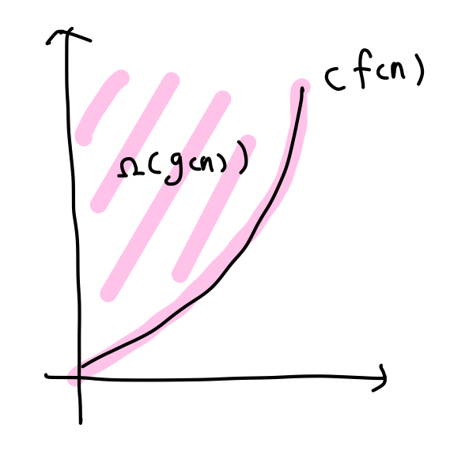

## Algorithms: Efficiency, Analysis, and Order - part2

#### 📌Algorithm Analysis

알고리즘 분석에는 두가지 방법이 있다.

- The correctness of an algorithm

  - 알고리즘이 수행해야 하는 일을 수행한다는 proof를 develop하면서 분석
  - 문제의 모든 경우에 항상 옳은 해결책을 찾는지 분석

  <br>

- The efficiency of an algorithm

  - 시간이나 공간적 측면에서 알고리즘이 효율적으로 문제를 해결하는지 분석
  - 효율성을 측정하는 방법
    - **특정 컴퓨터와 무관해야 한다.**
    - **특정 프로그래밍 언어와 무관해야 한다.**
    - **알고리즘의 복잡한 디테일과 무관해야 한다.**
  - **"Complexity Analysis(복잡도 분석) = 입력의 크기(input size)에 따른 단위 연산(basic operation)의 수행 횟수"**

<br>

#### 📌Complexity Analysis

알고리즘의 효율성을 증명하기 위한 전형적인 기법으로, 입력의 크기(input size)에 따른 단위 연산(basic operation)의 수행 횟수를 계산한다.

이때, 단위 연산은 합리적이게 정해야 한다. **알고리즘에 의해 수행된 작업은, basic operation의 연산 횟수에 대략적으로 비례해야 한다.**

<br>

Ex) Exchange Sort의 Complexity


- input size 는 n이다.

- 단위 연산의 후보로는 비교연산과 swap연산이 있는데, 이 중 더 합리적인 연산은 비교연산이다. swap 연산은 리스트에 따라 수행 횟수가 다른데, 비교연산은 n의 크기에 종속적으로 변하기 때문이다.
- 가장 바깥 for문의 i가 1~n까지 변하므로, 
  - i가 1일 때, 비교연산의 수행횟수는 n-1
  - i가 2일 때, 비교연산의 수행횟수는 n-2
  - ...
  - i가 n일 때, 배교연산의 수행횟수는 1 로,
- exchange sort의 complexity = (n-1) + (n-2) + ... + 1 = 1/2(n)(n-1) 이 된다.

<br>

#### 📌Time Complexity Analysis

- **T(n)** : 시간에 대한 복잡도로, 각 input size n에 대해 얼마나 많은 수의 단위 연산을 수행했는지 계산한다. 입력 값이 아닌, 입력의 크기와만 상관있다.
- 그러나, 입력 크기 뿐 아니라 입력 값에 따라 time complexity가 달라지는 경우가 있다. 이런 경우에는 3가지 측정법이 있다.
  - **best-case time complexity**
  - **worst-case time complexity**
  - **average-case time complexity**
- Sequential search는 입력 값에 따라 시간 복잡도가 달라진다. 위의 세가지 경우로 계산해보겠다.
  - B(n) = 1. 입력 값이 배열의 제일 첫값이면 한번만 수행하면 된다.
  - W(n) = n. 입력 값이 배열에 없으면 n번 수행한다.
  - A(n) = 1/2(n+1). 입력 값이 배열에 있는 경우가 평균 경우가 된다. 배열의 1, 2, ..., 5번째 있는 경우를 모두 계산해주면 (1+2+3+4+5)/3 = 3이 된다. 따라서 A(n) = 1/2(n+1)이 된다.

<br>

#### 📌Order

1번 알고리즘의 T(n) = 100n 이고, 2번 알고리즘의 T(n) = 0.01n^2 이라고 한다면, 더 효율적인 알고리즘은 1번 알고리즘이다. n의 크기가 작을 때는 2번 알고리즘이 더 효율적이 겠지만, 수가 커지면 궁극적으로는 1번 알고리즘이 더 효율적이기 때문이다. 1번 알고리즘은 1차식으로 증가를 하고 2번 알고리즘은 2차식으로 증가하므로 2번 알고리즘의 증가율이 더 높다. **따라서, 알고리즘의 효율성을 비교하기 위해서는 앞의 계수보다는 식의 차수가 더 중요하다.**

<br>

- **Asymptotic Notations (점근적 표기법)**
  
  - O(빅오)
    
    
    
    - **g(n) <= c * f(n)**
    - O(g(n)) 은 c * f(n) 이라는 함수보다 증가율이 같거나 더 느린 함수들의 집합이다. 
    - 점근적인 상한을 정한다.
    - worst-case를 점근적으로 표기한 것 => O(f(n))이 아무리 느려도 궁극적으로는 cf(n)보다는 빠르다.
    
  - Ω(오메가)
  
    - 
    - **g(n) >= c * f(n)**
    - Ω(g(n))은 c * f(n) 이라는 함수보다 증가율이 같거나 더 빠른 함수들의 집합이다. 
    - 점근적인 하한을 정한다.
    - O(f(n))이 아무리 빨라도 궁극적으로는 cf(n)보다는 느리다.
  
  - θ(세타)
  
    - 
    - **g(n) = c * f(n)**
    - θ(g(n))은 c * f(n) 이라는 함수와 증가율이 같은 함수들의 집합이다. 
    - 함수의 차수를 결정한다.
  
  - 빅오, 세타, 오메가의 관계
  
    

<br>

- **자주 쓰이는 복잡도 종류**
  
  
  
  - θ(1): constant time complexity / 상수 시간 복잡도
  - θ(lg n): logarithmic time complexity / 로그 시간 복잡도
  - θ(n): linear time complexity / 선형 시간 복잡도
  - θ(n lg n): linear logarithmic time complexity / 선형 로그 시간 복잡도
  - θ(n^k): exponential time complexity / 다항 시간 복잡도
    - θ(n^2): quadratic time complexity
    - θ(n^3): cubic time complexity
  - θ(k^n): exponential time complexity / 지수 시간 복잡도
    - θ(2^n)
  - polynomial-time complexity는 효율적인 알고리즘으로, exponential-time complexity는 비효율적인 알고리즘으로 여겨진다.

<br>

**🔧problem ex1)**

```cpp
void algorithm1(int n) {
  for (int i = 1; i < 2*n; i++)
    cout << "Basic Operation";
  for (int i = n/2; i >= 1; i--)
    cout << "Basic Operation";
}
```

위쪽 for문이 (2n-1), 아래쪽 for문이 (n/2)로 둘을 합하면, 5n/2 - 1 이 된다. 이는 O(n)에 속한다. 이는 선형 알고리즘에 해당된다.

<br>

**🔧problem ex2)**

```cpp
void algorithm2(int n) {
  for (int i = 1; i < 2*n; i++)
    for (int j = n/2; j >= 1; j--)
      cout << "Basic Operation";
}
```

바깥쪽 for문이 (2n-1), 안쪽 for문이 (n/2)로 둘을 곱하면, (n^2)-(n/2)이 된다. 이는 O(n^2)에 속하고, 이는 quadratic 알고리즘이다.

<br>

**🔧problem ex3)**

```cpp
void algorithm3(int n) {
  for (int i = 1; i <= n; i *= 2)
    for (int j = n; j >= 1; j /= 2)
      cout << "Basic Operation";
}
```


바깥쪽 for문이 (lgn+1)이고, 안쪽 for문도 (lgn+1)이므로, 이 둘을 곱하면, (lgn^2 + 2lgn + 2)가 된다. 이는 O(lgn^2)에 속한다.

<br>

**🔧problem ex4)**

```cpp
void algorithm4(int n, int m) {
  for (int i = 1; i < 2*n; i++)
    cout << "Basic Operation";
  for (int i = 1; i < m/2; i++) {
    cout << "Basic Operation";
  }
}
```

위쪽 for문은 (2n-1)이고, 아래쪽 for문은 (m/2-1)이므로, 이 둘을 더하면 (2n + m/2 - 2)이다. 이는 O(n) + O(m) = O(n+m)이 된다.

<br>

**🔧problem ex5)**

```cpp
void algorithm5(int n) {
  algorithm1(n);
  for (int i = 1; i < n; i++) {
    algorithm2(n);
    for (int j = 1; i < n; j++)
      algorithm3(n);
  }
}
```

전체적인 구조를 보면, algo1 + (n - 1)(algo2 + (n-1)algo3)이 된다. 이를 계산하면 O(n) + O(n^3)으로, 결국 O(n^3)이라는 값이 나온다. 이는 cubic 알고리즘에 해당된다.

<br>

**🔧problem ex6)**

```cpp
void algorithm6(int n) {
  if (n <= 1) {
    cout << "Basic Operation";
  }
  else {
    algorithm(n/2);
    algorithm(n/2);
    cout << "Basic Operation";
  }
}
```

!!basic operation의 총 수행 횟수를 구하면 됨!! 이때, 재귀호출은 반드시 종료조건을 가진다.


총 2^(lgn+1) 이 나온다.

<br>

**🔧problem ex7)**

```cpp
void algorithm7(int n) {
  if (n <= 1) {
    cout << "Basic Operation";
  } else {
    algorithm7(n/4);
    algorithm7(n/4);
    algorithm7(n/4);
    cout << "Basic Operation";
  }
}
```


식을 정의하진 못했지만, algorithm7(1) = 3^0, algorithm7(4) = 3^0 + 3^1, algorithm7(8) = 3^0 + 3^1 + 3^2 와 같은 규칙이 있는 것을 발견하였다.
