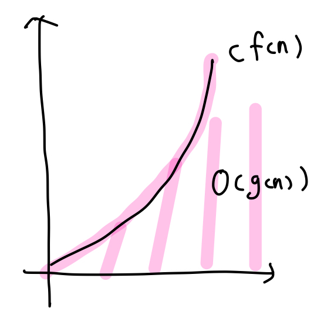

## Algorithms: Efficiency, Analysis, and Order - part2

#### 📌Algorithm Analysis

알고리즘 분석에는 두가지 방법이 있다.

- The correctness of an algorithm

  - 알고리즘이 수행해야 하는 일을 수행한다는 proof를 develop하면서 분석
  - 문제의 모든 경우에 항상 옳은 해결책을 찾는지 분석

  <br>

- The efficiency of an algorithm

  - 시간이나 공간적 측면에서 알고리즘이 효율적으로 문제를 해결하는지 분석
  - 효율성을 측정하는 방법
    - **특정 컴퓨터와 무관해야 한다.**
    - **특정 프로그래밍 언어와 무관해야 한다.**
    - **알고리즘의 복잡한 디테일과 무관해야 한다.**
  - **"Complexity Analysis(복잡도 분석) = 입력의 크기(input size)에 따른 단위 연산(basic operation)의 수행 횟수"**

<br>

#### 📌Complexity Analysis

알고리즘의 효율성을 증명하기 위한 전형적인 기법으로, 입력의 크기(input size)에 따른 단위 연산(basic operation)의 수행 횟수를 계산한다.

이때, 단위 연산은 합리적이게 정해야 한다. **알고리즘에 의해 수행된 작업은, basic operation의 연산 횟수에 대략적으로 비례해야 한다.**

<br>

Ex) Exchange Sort의 Complexity


- input size 는 n이다.

- 단위 연산의 후보로는 비교연산과 swap연산이 있는데, 이 중 더 합리적인 연산은 비교연산이다. swap 연산은 리스트에 따라 수행 횟수가 다른데, 비교연산은 n의 크기에 종속적으로 변하기 때문이다.
- 가장 바깥 for문의 i가 1~n까지 변하므로, 
  - i가 1일 때, 비교연산의 수행횟수는 n-1
  - i가 2일 때, 비교연산의 수행횟수는 n-2
  - ...
  - i가 n일 때, 배교연산의 수행횟수는 1 로,
- exchange sort의 complexity = (n-1) + (n-2) + ... + 1 = 1/2(n)(n-1) 이 된다.

<br>

#### 📌Time Complexity Analysis

- **T(n)** : 시간에 대한 복잡도로, 각 input size n에 대해 얼마나 많은 수의 단위 연산을 수행했는지 계산한다. 입력 값이 아닌, 입력의 크기와만 상관있다.
- 그러나, 입력 크기 뿐 아니라 입력 값에 따라 time complexity가 달라지는 경우가 있다. 이런 경우에는 3가지 측정법이 있다.
  - **best-case time complexity**
  - **worst-case time complexity**
  - **average-case time complexity**
- Sequential search는 입력 값에 따라 시간 복잡도가 달라진다. 위의 세가지 경우로 계산해보겠다.
  - B(n) = 1. 입력 값이 배열의 제일 첫값이면 한번만 수행하면 된다.
  - W(n) = n. 입력 값이 배열에 없으면 n번 수행한다.
  - A(n) = 1/2(n+1). 입력 값이 배열에 있는 경우가 평균 경우가 된다. 배열의 1, 2, ..., 5번째 있는 경우를 모두 계산해주면 (1+2+3+4+5)/3 = 3이 된다. 따라서 A(n) = 1/2(n+1)이 된다.

<br>

#### 📌Order

1번 알고리즘의 T(n) = 100n 이고, 2번 알고리즘의 T(n) = 0.01n^2 이라고 한다면, 더 효율적인 알고리즘은 1번 알고리즘이다. n의 크기가 작을 때는 2번 알고리즘이 더 효율적이 겠지만, 수가 커지면 궁극적으로는 1번 알고리즘이 더 효율적이기 때문이다. 1번 알고리즘은 1차식으로 증가를 하고 2번 알고리즘은 2차식으로 증가하므로 2번 알고리즘의 증가율이 더 높다. **따라서, 알고리즘의 효율성을 비교하기 위해서는 앞의 계수보다는 식의 차수가 더 중요하다.**

<br>

- **Asymptotic Notations (점근적 표기법)**
  
  - O(빅오)
    
    
    
    - **g(n) <= c * f(n)**
    - O(g(n)) 은 c * f(n) 이라는 함수보다 증가율이 같거나 더 느린 함수들의 집합이다. 
    - 점근적인 상한을 정한다.
    - worst-case를 점근적으로 표기한 것 => O(f(n))이 아무리 느려도 궁극적으로는 cf(n)보다는 빠르다.
    
  - Ω(오메가)
  
    - 
    - **g(n) >= c * f(n)**
    - Ω(g(n))은 c * f(n) 이라는 함수보다 증가율이 같거나 더 빠른 함수들의 집합이다. 
    - 점근적인 하한을 정한다.
    - O(f(n))이 아무리 빨라도 궁극적으로는 cf(n)보다는 느리다.
  
  - θ(세타)
  
    - 
    - **g(n) = c * f(n)**
    - θ(g(n))은 c * f(n) 이라는 함수와 증가율이 같은 함수들의 집합이다. 
    - 함수의 차수를 결정한다.
  
  - 빅오, 세타, 오메가의 관계
  
    

<br>

- **자주 쓰이는 복잡도 종류**
  
  
  
  - θ(1): constant time complexity / 상수 시간 복잡도
  - θ(lg n): logarithmic time complexity / 로그 시간 복잡도
  - θ(n): linear time complexity / 선형 시간 복잡도
  - θ(n lg n): linear logarithmic time complexity / 선형 로그 시간 복잡도
  - θ(n^k): exponential time complexity / 다항 시간 복잡도
    - θ(n^2): quadratic time complexity
    - θ(n^3): cubic time complexity
  - θ(k^n): exponential time complexity / 지수 시간 복잡도
    - θ(2^n)
  - polynomial-time complexity는 효율적인 알고리즘으로, exponential-time complexity는 비효율적인 알고리즘으로 여겨진다.

<br>

**🔧practice ex1)**

```cpp
void algorithm1(int n) {
  for (int i = 1; i < 2*n; i++)
    cout << "Basic Operation";
  for (int i = n/2; i >= 1; i--)
    cout << "Basic Operation";
}
```

위쪽 for문이 (2n-1), 아래쪽 for문이 (n/2)로 둘을 합하면, 5n/2 - 1 이 된다. 이는 O(n)에 속한다. 이는 선형 알고리즘에 해당된다.

<br>

**🔧practice ex2)**

```cpp
void algorithm2(int n) {
  for (int i = 1; i < 2*n; i++)
    for (int j = n/2; j >= 1; j--)
      cout << "Basic Operation";
}
```

바깥쪽 for문이 (2n-1), 안쪽 for문이 (n/2)로 둘을 곱하면, (n^2)-(n/2)이 된다. 이는 O(n^2)에 속하고, 이는 quadratic 알고리즘이다.

<br>

**🔧practice ex3)**

```cpp
void algorithm3(int n) {
  for (int i = 1; i <= n; i *= 2)
    for (int j = n; j >= 1; j /= 2)
      cout << "Basic Operation";
}
```


바깥쪽 for문이 (log2(n)+1)이고, 안쪽 for문도 (log2(n)+1)이므로, 이 둘을 곱하면, ((log2(n))^2 + 2log2(n) + 2)가 된다. 이는 O((log2(n))^2)에 속한다.

<br>

**🔧practice ex4)**

```cpp
void algorithm4(int n, int m) {
  for (int i = 1; i < 2*n; i++)
    cout << "Basic Operation";
  for (int i = 1; i < m/2; i++) {
    cout << "Basic Operation";
  }
}
```

위쪽 for문은 (2n-1)이고, 아래쪽 for문은 (m/2-1)이므로, 이 둘을 더하면 (2n + m/2 - 2)이다. 이는 O(n) + O(m) = O(n+m)이 된다.

<br>

**🔧practice ex5)**

```cpp
void algorithm5(int n) {
  algorithm1(n);
  for (int i = 1; i < n; i++) {
    algorithm2(n);
    for (int j = 1; i < n; j++)
      algorithm3(n);
  }
}
```

전체적인 구조를 보면, algo1 + (n - 1)(algo2 + (n-1)algo3)이 된다. 이를 계산하면 O(n) + O(n^3)으로, 결국 O(n^3)이라는 값이 나온다. 이는 cubic 알고리즘에 해당된다.

<br>

**🔧practice ex6)**

```cpp
void algorithm6(int n) {
  if (n <= 1) {
    cout << "Basic Operation";
  }
  else {
    algorithm(n/2);
    algorithm(n/2);
    cout << "Basic Operation";
  }
}
```

!!basic operation의 총 수행 횟수를 구하면 됨!! 이때, 재귀호출은 반드시 종료조건을 가진다.


총 2^(log2(n)+1) 이 나온다. => 두개의 자식노드를 가지는 이진트리로, 높이가 log2(n) + 1이다.

<br>

**🔧practice ex7)**

```cpp
void algorithm7(int n) {
  if (n <= 1) {
    cout << "Basic Operation";
  } else {
    algorithm7(n/4);
    algorithm7(n/4);
    algorithm7(n/4);
    cout << "Basic Operation";
  }
}
```


식을 정의하진 못했지만, algorithm7(1) = 3^0, algorithm7(4) = 3^0 + 3^1, algorithm7(8) = 3^0 + 3^1 + 3^2 와 같은 규칙이 있는 것을 발견하였다.

<br>

**🔧problem ex1) - Time Complexity 1**

> **Description**
>
> 아래 프로그램을 분석하고, 입력값에 따른 출력값을 출력하시오.
> 단, 코드를 그대로 실행하면 시간 초과에 걸리게 되므로, fun() 함수의 시간 복잡도를 계산하여 바로 출력해야 한다.
>
> ```
> #include <bits/stdc++.h>
> using namespace std;
> 
> typedef long long long_t;
> 
> long_t fun(long_t n) {
>     long_t i, j, cnt = 0;
>     for (i=1; i<=4*n; i+=2)
>         for (j=n; j>=1; j--)
>             cnt++;
>     return cnt;
> }
> 
> int main() {
>     long_t n;
>     scanf("%lld", &n);
>     printf("%lld", fun(n));
> }
> ```
>
> **Input**
>
> 첫째 줄에 입력 매개변수 N의 값이 주어진다.
>
> **Output**
>
> 첫째 줄에 N의 값에 따른 출력값을 출력한다.

```cpp
#include <iostream>
using namespace std;

typedef long long long_t;

long_t fun(long_t n) {
  //바깥 시간 복잡도 2n과, 안쪽 시간 복잡도 n을 곱하면, 2*n*n이 전체 시간 복잡도가 된다.
	return 2*n*n;
}

int main() {
	long_t n;
	scanf("%lld", &n);
	printf("%lld", fun(n));
}
```

<br>

**🔧problem ex2) - Time Complexity 2**

> **Description**
>
> 1번 문제와 동일하다.
>
> ```
> #include <bits/stdc++.h>
> using namespace std;
> 
> typedef long long long_t;
> 
> long_t fun(long_t n, long_t m, long_t p) {
>     long_t i, j, k, cnt = 0;
>     for (i=1; i<=2*n; i+=4)
>         for (j=1; j<=2*m; j*=2)
>             for (k=4*p; k>=1; k/=2)
>                 cnt++;
>     return cnt;
> }
> 
> int main() {
>     long_t n, m, p;
>     scanf("%lld %lld %lld", &n, &m, &p);
>     printf("%lld", fun(n, m, p));
> }
> ```
>
> **Input**
>
> 첫째 줄에 입력값 N, M, P가 차례대로 주어진다.
>
> **Output**
>
> 첫째 줄에 위 프로그램의 출력값을 출력한다.

```cpp
#include <iostream>
#include <cmath>
using namespace std;

typedef long long long_t;

long_t fun(long_t n, long_t m, long_t p) {
  //n이 1일때만 바깥 루프의 시간복잡도가 다르니까 다르게 계산해준다.
	if (n == 1)
		return ((log2(2 * m) + 1) * (log2(4 * p) + 1));
  //삼중 루프의 시간 복잡도를 모두 구해준 후, 이를 모두 곱해준다.
	return ((n / 2) * (log2(2 * m) + 1) * (log2(4 * p) + 1));
}

int main() {
	long_t n, m, p;
	scanf("%lld %lld %lld", &n, &m, &p);
	printf("%lld", fun(n, m, p));
}
```

<br>

**🔧problem ex3) - Time Complexity 3**

> **Description**
>
> 1번 문제와 동일하다.
>
> ```
> #include <bits/stdc++.h>
> using namespace std;
> 
> typedef long long long_t;
> 
> long_t fun(long_t n) {
>     if (n == 0)
>         return 1;
>     else
>         return fun(n/2) + fun(n/2) + fun(n/2) + fun(n/2);
> }
> 
> int main() {
>     long_t n;
>     scanf("%lld", &n);
>     printf("%lld", fun(n));
> }
> ```
>
> **Input**
>
> 첫째 줄에 입력값이 주어진다.
>
> **Output**
>
> 첫째 줄에 출력값을 출력한다.

```cpp
#include <iostream>
#include <cmath>
using namespace std;

typedef long long long_t;

long_t fun(long_t n) {
  //4개의 자식노드를 가지는 이진트리로, 높이가 log2(n)+1이다.
    return pow(4, (int)log2(n)+1);
}

int main() {
    long_t n;
    scanf("%lld", &n);
    printf("%lld", fun(n));
}
```

<br>

**🔧problem ex4) - Time Complexity 4**

> **Description**
>
> 이전 문제와 동일하다.
>
> ```
> #include <bits/stdc++.h>
> using namespace std;
> 
> typedef long long long_t;
> 
> long_t fun(long_t n) {
>     if (n == 0)
>         return 1;
>     else {
>         long_t s = 0;
>         for (int i=1; i<=8; i++)
>             s += fun(n/4);
>         return s;
>     }
> }
> 
> int main() {
>     long_t n;
>     scanf("%lld", &n);
>     printf("%lld", fun(n));
> }
> ```
>
> **Input**
>
> 첫째 줄에 입력값이 주어진다.
>
> **Output**
>
> 첫째 줄에 출력값을 출력한다.

```cpp
#include <iostream>
#include <cmath>
using namespace std;

typedef long long long_t;

long_t fun(long_t n) {
  //재귀를 한번 돌때마다, 각 노드에 재귀를 8번씩 더하는 시간 복잡도가 추가된다.
  //즉, 자식노드가 8개씩 생기고, 높이는 log2(n) / 2 + 1 인 트리가 생성된다.
    return pow(8, (int)(log2(n) / 2 + 1));
}

int main() {
    long_t n;
    scanf("%lld", &n);
    printf("%lld", fun(n));
}
```

<br>

**🔧problem ex5) - 콜라츠 수열 출력하기**

> **Description**
>
> 1937년, 로타르 콜라츠가 제기한 콜라츠 추측(Collatz Conjecture)에 따르면,
>
> 모든 양의 정수 n에 대하여아래와 같은 연산을 반복하면 반드시 1로 수렴한다고 한다.
>
> - n이 짝수이면 n을 2로 나눈다.
> - n이 홀수이면 n에 3을 곱해서 1을 더한다.
>
> 콜라츠 추측은 유명한 수학사의 난제로 남아 있으며, 아직도 아무도 증명하지 못했다고 한다.
>
> 양의 정수 N에 대하여, N이 1로 수렴할 때까지 위의 연산을 반복할 때 나오는 수열을 콜라츠 수열이라고 하자.
>
> 임의의 양의 정수 N이 주어질 때 콜라츠 수열을 출력하시오.
>
> **Input**
>
> 첫째 줄에 양의 정수 N이 주어진다.
>
> **Output**
>
> 첫째 줄에 양의 정수 N에 대한 콜라츠 수열을 순서대로 출력한다.

```cpp
#include <iostream>
using namespace std;

void collatz(int n) {
    if (n == 1) {		//종료조건
        cout << n << endl;
        return;
    }
    else {
        cout << n << " ";
        if (n % 2 == 0)
            collatz(n / 2);
        else
            collatz(n * 3 + 1);
    }
}

int main() {
    int n;
    cin >> n;
    collatz(n);
}
```

<br>

**🔧problem ex6) - 가장 긴 콜라츠 수열**

> **Description**
>
> 임의의 양의 정수 N, M에 대하여,
>
> N보다 크거나 같고, M보다 작거나 같은 양의 정수 중에서
>
> 콜라츠 수열의 길이가 가장 긴 수 K를 찾아, K의 콜라츠 수열 길이와 해당하는 콜라츠 수열을 출력하시오.
>
> 단, 가장 긴 콜라츠 수열의 길이가 같은 수가 여러 개 있으면, 그 중 가장 큰 수를 K로 정한다.
>
> **Input**
>
> 첫째 줄에 양의 정수 N, M이 주어진다. (N <= M)
>
> **Output**
>
> 첫째 줄에 N보다 크거나 같고, M보다 작거나 같은 수 중에서 가장 긴 콜라츠 수열을 가진 수 K와 K의 콜라츠 수열 길이를 출력한다.
>
> 둘째 줄에 K의 콜라츠 수열을 출력한다.
>
> 단, 콜라츠 수열의 최장 길이가 같은 수가 여러 개 있으면, 그 중 가장 큰 수를 K로 정한다.

```cpp
#include <iostream>
using namespace std;

int cnt;
int idx = 0;
int max_len = 0;

//가장 긴 수열을 찾는 함수
void collatz_count(int n) {
    cnt ++;
    if (n == 1)
        return;
    else {
        if (n % 2 == 0)
            collatz_count(n / 2);
        else
            collatz_count(n * 3 + 1);
    }
}

//수열을 print 하는 함수
void collatz_print(int n) {
    if (n == 1) {
        cout << n << endl;
        return;
    }
    else {
        cout << n << " ";
        if (n % 2 == 0)
            collatz_print(n / 2);
        else
            collatz_print(n * 3 + 1);
    }
}

int main() {
    int n, m;
    cin >> n >> m;

    for (int i = n; i <= m; i++) {
        cnt = 0;
        collatz_count(i);

        if (cnt >= max_len) {
            idx = i;
            max_len = cnt;
        }
    }

    cout << idx << " " << max_len - 1 << endl;
    collatz_print(idx);
}
```

<br>

**🔧problem ex7) - 하노이의 탑**

>**Description**
>
>하노이의 탑에는 세 개의 기둥과 크기가 서로 다른 N개의 원반이 있다.
>
>세 개의 기둥을 각각 A, B, C라고 하고, 처음에 원반은 모두 A 기둥에 꽂혀 있다.
>
>하노이 탑의 수도승들은 A 기둥에 있는 원반을 모두 C 기둥으로 옮겨야 한다.
>
>원반을 옮기는 규칙은 다음과 같다.
>
>- 한 번에 하나의 원반만 움직일 수 있고, 각 기둥의 제일 위에 있는 원반을 옮겨야 한다.
>- 반드시 크기가 작은 원반이 크기가 큰 원반 위에 놓여야 한다.
>
>한 원반의 이동은 이동하려는 원반의 시작 기둥과 도착 기둥의 이름으로 표시한다.
>
>예를 들어, A 기둥에 있는 원반 하나를 C 기둥으로 옮기는 것을 다음과 같이 표시한다.
>
>```
>A -> B
>```
>
>주니온은 이 문제를 풀기 위해 아래와 같은 재귀 알고리즘을 이용한 프로그램을 작성했다.
>
>```
>#include <bits/stdc++.h>
>using namespace std;
>
>void hanoi(int n, char src, char via, char dst) {
>    if (n == 1) {
>        printf("%c -> %c\n", src, dst);
>    }
>    else {
>        hanoi(n-1, src, dst, via);
>        hanoi(1, src, via, dst);
>        hanoi(n-1, via, src, dst);
>    }
>}
>
>int main() {
>    int n;
>    cin >> n;
>    hanoi(n, 'A', 'B', 'C');
>}
>```
>
>원반의 개수 N가 이동 횟수 K가 주어졌을 때,
>
>위 알고리즘으로 N개의 원반을 이동할 때, K번째로 이동하는 원반의 시작 기둥와 도착 기둥을 출력하시오.
>
>**Input**
>
>첫째 줄에 원반의 개수 N가 이동 횟수 K가 주어진다.
>
>**Output**
>
>첫째 줄에 K번째 이동하는 원반의 시작 기둥과 도착 기둥을 출력한다.
>
>둘째 줄에 hanoi() 함수의 총 호출 횟수를 출력한다.

```cpp
#include <iostream>
using namespace std;

int total_cnt = 0;
int cnt = 0;
int k;

void hanoi(int n, char src, char via, char dst) {
    total_cnt++;
    if (n == 1) {
        cnt++;
        if (cnt == k)
            cout << src << " -> " << dst << endl;
    }
    else {
        hanoi(n - 1, src, dst, via);
        hanoi(1, src, via, dst);
        hanoi(n - 1, via, src, dst);
    }
}

int main() {
    int n;
    cin >> n >> k;

    hanoi(n, 'A', 'B', 'C');
    cout << total_cnt << endl;
}
```


