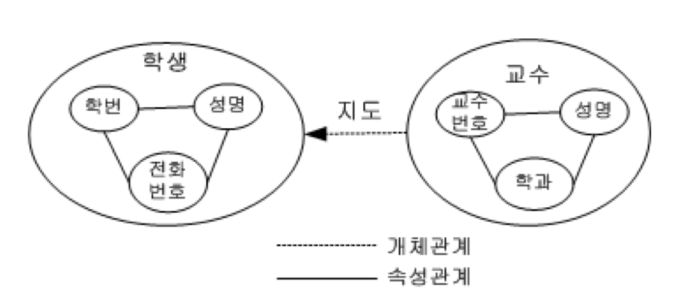
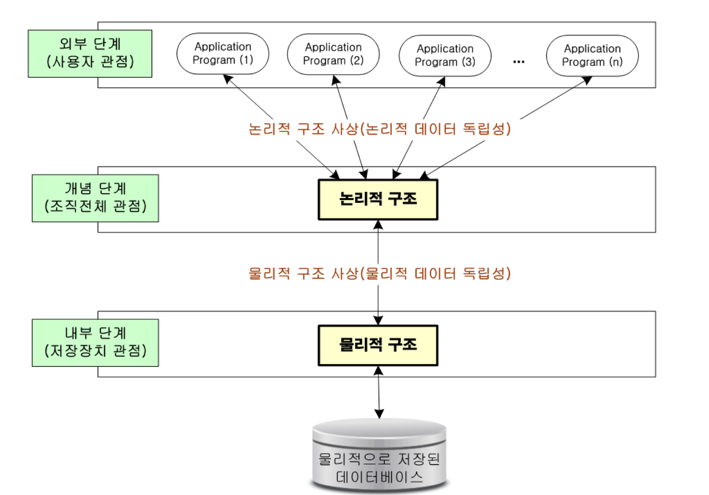

데이타베이스란?

- 어느 한 조직의 여러 응용 시스템들이 공용할 수 있도록 통합 및 저장된 운영 데이타의 집합
- 데이타베이스는 통합 데이타(integrated data)이다.
  - 원칙적으로는 중복(redundancy)을 배제
  - 통제된 중복(controlled redundancy)이 되어야
  - => 효율적인 이용을 위해 중복을 허용하는 경우도 있다.
- 데이타베이스는 저장 데이타(stored data)이다.
  - 저장 매체에 저장된 데이터를 말함
- 데이타베이스에 저장되어 있는 데이터는 운영 데이타(operational data)이다.
  - 조직의 기능을 수행하기 위해 반드시 유지해야 될 데이터
- 데이타베이스는 공용 데이타(shared data)이다.
  - 여러 응용 시스템들이 공동으로 이용하는 데이타

 

데이타베이스의 특성

1. 실시간 접근성(real-time accessibilities)
   - 비정형 질의어(query)에 대한 실시간 처리로 응답이 가능해야 한다.
2. 계속적인 변화(continuous evolution)
   - 동적이다. 삽입, 삭제, 갱신으로 내용이 변한다.
3. 동시 공용(concurrent sharing)
   - 여러 사용자가 동시에 접근한다.
   - => 상당히 복잡한 구조를 가진다.
4. 내용에 의한 참조(content reference)
   - 어디에 저장되어 있는지를 반환하는 게 아니라 내용을 검색할 수 있어야 한다.
   - => ex) 중간 성적이 85점 이상인 학생 검색

 

데이타베이스는 개념적으로 개체(entities)와 관계(relationships)로 구성되어 있다.

- 개체(entity)

  - 현실세계에 대해 사람이 생각하는 개념이나 정보의 단위
  - 반드시 하나 이상의 속성(attribute)로 구성
  - ex) 학교, 학생, 책상 .....
  - => 학생의 나이, 학번, 이름 ... 등이 속성에 해당한다.

- 속성(attribute)

  - 더 이상 쪼개질 수 없는 성질이나 상태
  - 속성들 그 자체로는 큰 의미 있는 정보를 제공해 주지 못하지만 각 속성들이 모여 개체를 구성하여 표현할 때는 상당한 의미를 제공

- 개체 인스턴스(entity instance), 개체 어커런스(entity occurrence)

  - => <20181234, 김철수, 010-4657-7654> 

- 개체 집합(entity set)

  - 개체 인스턴스들의 모딤

- 개체 타입(entity type)

  - 학번, 성명, 전화번호와 같은 속성 이름들로만 기술된 타이틀 레코드
  - => 개체 타입은 논리적인 형태를 말하고 개체 인스턴스들은 데이타베이스에 저장되는 구체적인 값들

- 관계(relationship)

  

  - 속성 관계: 속성들 간의 관계
  - 개체 관계: 개체 집합 간 관계
  - => 교수와 학생은 지도 관계 (관계는 명사로 쓰자.)
  - 데이타베이스에서는 일반적으로 개체 관계만 명시적으로 취급하고 속성 관계는 레이블 없이 묵시적으로 표시한다.
  - 관계는 정보를 추출하는 데 중요한 역할을 한다.
  - ex) '학번이 20181234인 학생의 전화번호를 검색하라.' -> 속성관계를 통해 정보 검색
  - ex) '학번이 20181234인 학생의 지도교수 성명을 검색하라.' -> '지도'라는 개체관계를 통해 정보 검색

 

과거에는 화일시스템을 사용했다.

- 데이터 종속성(data dependency)와 데이터 중복성(data redundancy)가 문제이다.
- => 종속성: 하나의 application program에 하나의 data file이 저장 -> 응용 프로그램은 데이터의 구성이나 접근 방법에 맞게 작성되어야 함. 
- => 중복성: 같은 내용의 데이터 일지라도 각 응용 프로그램마다 별도의 화일로 만들어 중복되는 경우가 많이 생김

 

데이타 중복성이 나쁜 이유

1. 일관성(consistency): 일관성이 없다. (데이타 간의 불일치)
2. 보안성(security): 같은 데이타에 대해 같은 수준의 보안 유지가 어렵다.
3. 경제성(economies): 추가적인 저장 공간, 비싼 갱신 비용
4. 무결성(integrity): 데이타의 정확성을 유지하기 어렵다.

 

DBMS란?

- 화일 시스템에서 야기되는 데이타 종속성, 중복성 문제를 해결하기 위해 제안된 시스템
- 응용 프로그램들이 데이타베이스를 이용하기 위해서는 DBMS를 통해서만 가능

 

DBMS의 필수 기능

1. 정의(definition) 기능 - DDL(Database Definition Language)
   - 데이타베이스 구조를 정의할 수 있는 기능
2. 조작(manipulation) 기능 - DML(Database Manipulation Language)
   - 데이타베이스를 접근하고 조작할 수 있는 기능
3. 제어(control) 기능 - DCL(Database Control Language)
   - 정확성과 안전성을 유지할 수 있는 기능

 

DBMS 장단점

- 장점
  - 데이타 중복의 최소화
  - 데이타의 공용
  - 데이타의 일관성 유지(중복을 줄임으로써 변경 시 불일치 최소화)
  - 데이타의 무결성 유지(정확성, 입력 시 에러 체크)
    - ex) 전화번호에서는 특수문자가 입력되지 못하도록 제한한다.
  - 데이타의 보안 보장
  - 표준화 용이
  - 데이타의 독립성 제공(구현상의 세부 사항을 사용자에게 숨김)
- 단점
  - 운영비의 증대(고가의 제품)
  - 자료 처리 방법이 복잡(상이한 데이터 타입, 고급 프로그래머 필요)
  - 백업과 회복 기법이 어렵다.(장애 발생 시 곤란)
  - 시스템의 취약성(일부 장애 -> 전체 시스템 마비)

 

데이타 독립성

- 데이타의 논리적인 구조나 물리적인 구조가 변경되더라도 응용 프로그램에는 영향을 주지 않는 것

  

- 논리적 데이타 독립성

  - 논리적 구조를 변경시키더라도 기존 응용 프로그램들에는 영향을 주지 않는 것

- 물리적 데이타 독립성

  - 저장 장치나 새로운 접근기법의 개발로 성능 개선을 위해 물리적 구조를 변경하더라도 이를 이용하는 응용 프로그램들에는 영향을 주지 않는 능력
  - 이는 하나의 논리적 구조로부터 여러가지 다양한 물리적 구조를 지원할 수 있는 사상(mapping) 능력이 있어야 가능

 

DBMS의 발전 과정

- 제 1세대 DBMS
  - IDS(Integrated Data Store)
    - 네트워크 데이타 모델의 기초
  - IMS(Information Management System)
    - 계층 데이타 모델의 기초
- 제 2세대 DBMS
  - 관계형 데이타 모델, SQL
  - 상용 RDBMS: Oracle, SQL-Server, MySql, DB2 ...
- 제 3세대 DBMS
  - 객체지향 DBMS (이미지... 등을 위해)
  - 객체 관계형 DBMS
- 큰 흐름: 네트워크 DB 모델 -> 계층 DB 모델 -> 관계형 DB 모델

 

실습

- 맥 MySql root 비밀번호 초기화
  - https://velog.io/@sorzzzzy/MySQL-Mac-MySQL-root-비밀번호-초기화하기
- Cmd 창에서 실행
  - `mysql.server start`
  - `mysql -u root -p`
  - pw: `root`