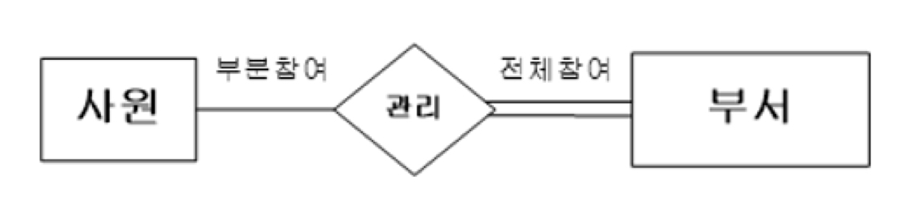

데이터베이스 시스템(DBMS)

- 데이터를 입력, 조작, 그리고 변경하여 어떤 목적을 달성하기 위해 이용하는 시스템
- 구성요소: 데이터베이스, DBMS, 데이터베이스 언어, 사용자, 데이터베이스 관리자, 하드웨어(컴퓨터) ...

 

스키마

- 개체, 속성, 관계에 대한 명세야 유지 조건 포함
- 외부 스키마: 사용자나 응용 프로그래머가 접근하는 데이타베이스의 논리적인 서브스키마 정의
- 개념 스키마: 조직 전체의 총괄적인 입장에서 본 데이터베이스 기술
- 내부 스키마: 개념 스키마에 대한 내부 물리적인 저장구조 기술

 

데이타베이스 언어

- 데이타 정의어(DDL)
  - 데이타베이스 스키마를 컴퓨터가 이해할 수 있게끔 기술하는 데 사용
- 데이타 조작어(DML)
  - 데이타 처리(검색, 삽입, 삭제, 변경)를 지원
  - 절차적 데이터 조작어(procedural DML)
    - 범용 프로그램 언어 속에 삽입된 형태로 사용
    - Ex) 모든 프로그램에 SQL이 삽입됨
  - 비절차적 데이터 조작어(non-procedural DML)
    - 일반 사용자가 대화식으로 사용
    - Ex) quit 써야 탈출
- 데이타 제어어(DCL)
  - 데이타 제어(보안, 무결성, 회복, 병행수행)를 정의하고 기술하는 언어
- => 현실적으로는 이들이 별도 언어로 존재하지 않고 하나의 표준화 언어(SQL) 안에서 통합되어 사용됨

 

사용자

- 일반 사용자(end user)
  - '비절차적' DML 언어를 통해 데이타베이스 접근
- 응용 프로그래며(application programmer)
  - 범용 프로그래밍 언어와 '절차적' DML 언어를 사용하여 DB를 접근하고 개발하는 사람
- 데이타베이스 관리자(DBA)
  - DDL과 DCL을 통해 DB를 정의하고 제어하는 사람

 

데이타 모델링

- 현실 세계(인간이 감각 기능을 통해 감지할 수 있는 실체로 되어 있는 세계)의 데이터를 컴퓨터 세계(현실 세계를 컴퓨터가 처리할 수 있는 데이타로 변환한 단계)의 데이타베이스로 옮기는 변환 과정

 

- 개념세계: 현실 세계의 실체를 개념으로 표현한 단계
- 개념적 데이터 모델링: 현실 세계의 실체를 추상적 개념을 통해 개념 세계로 표현하는 과정
- 개념적 데이터 구조: 개념적 데이터 모델링으로부터 얻은 결과
  - 개체 타입(현실 세계의 개체들을 추상화 시킨 것 - 학생, 교수, 과목 ..)
  - 속성(개체 타입에 속하는 개체들의 공통적인 속성 - 학번, 성명, 전화번호 ..)
  - 인스턴스(각 개체의 값 - "20181234, 김철수, 010-1234-5678")
- 개념세계의 개념적 데이터 구조는 컴퓨터가 직접 이해할 수 없기 때문에 컴퓨터 세계의 환경에 맞도록 변환

 

- 논리적 데이터 모델링
  - 개념적 데이터 구조로부터 논리적 개념을 이용하여 논리적 데이터 구조, 즉 데이터 모델로 표현하는 것 (테이블, 표로 정리 ..)

 

- 물리적 데이터 모델링
  - 논리적 데이터 구조를 컴퓨터가 접근할 수 있는 물리적 데이타 구조로 변환시키는 것(MySql..)

 

관계(relationship)

- 개체들 사이에 존재하는 연관성이나 연결로서, 두 개 이상의 개체 타입들 간의 사상(mapping)을 말한다.

- ex) 학생, 교수 개체 집합만으로는 별 의미를 나타내지 못하고, "교수가 학생을 지도한다."라는 관계를 정의해야 유용한 의미를 표현

  

- 일대일 ex) 신랑, 신부 / 주민등록증

- 일대다 ex) 학생, 지도교수

- 다대다 ex) 학생, 과목

 

E-R 모델(entity - relationship)

- 개체 타입: 네모
- 관계: 다이아몬드
- 속성: 타원

 

개체 타입

- 강한 개체 타입
  - 독자적으로 존재하며, 개체 타입 내에서 자신의 속성들을 사용하여 '고유하게' 개체들을 식별할 수 있는 타입
- 약한 개체 타입
  - 키를 형성하기에 충분한 속성들을 갖지 못한 개체 타입

 

속성

- 단순 속성

  - 더 이상 다른 속성으로 나눌 수 없는 속성

    

- 복합 속성

  - 두 개 이상의 속성들로 이루어진 속성

    

- 다치 속성

  - 각 개체마다 여러 개의 값을 가질 수 있는 속성

    

- 유도된 속성

  - 다른 속성의 값으로부터 얻어진 속성

    

    => 나이를 일일히 저장하면 매년 바꿔줘야 함. 주민번호에서 계산 ..

 

약한 개체 타입

- 개체들이 자체적으로 갖고 있는 속성들의 값에 의해서 고유하게 식별이 안 될 때가 있다.

- Ex) 회사의 어떤 사원의 부양가족 이름은 다른 사원의 부양가족 이름과 같을 수 있다. 그렇기 때문에 '사원번호 + 부양가족 이름'으로 식별

  

  => 약한 개체 타입은 이중선 직사각형으로 표기

  => 강한 관계는 강한 개체들 사이의 관계이고, 강한 개체 타입과 약한 개체 타입을 연결하는 관계는 약한 관계임

 

참여 제약 조건

- 모든 객체들이 참여하면 전체 참여

- 일부 객체만 참여하면 부분 참여

  

  => 전체 참여는 이중 실선으로 표시

  => 약한 개체 타입은 항상 관계에 전체 참여

  => 관리를 하기 위해서는 부서장이 전체 참여

  => 사원의 일부만 부서장이 됨

 