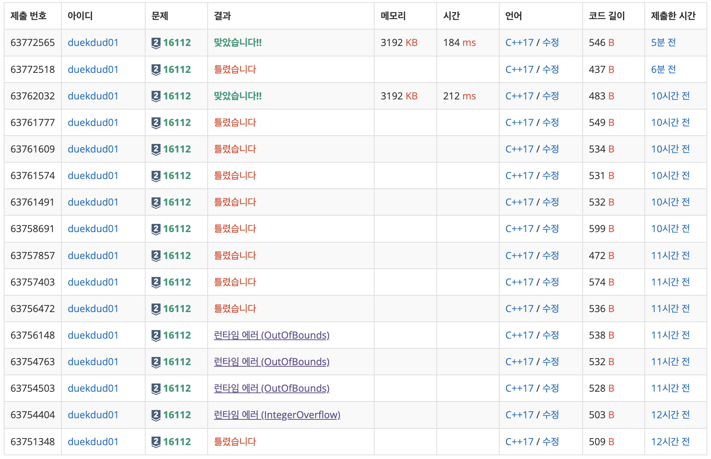

## [백준 / 16112] 5차 전직

> ## 문제
>
> 메이플스토리 뉴비 키파가 드디어 레벨 200을 달성하고 **5차 전직**이라는 시스템을 이용해 캐릭터를 더욱 강력하게 만들려고 합니다. 5차 전직을 하려면 먼저 퀘스트를 통해 **아케인스톤**이라는 아이템을 받아야 합니다. 아케인스톤을 활성화시키면 캐릭터가 얻는 경험치를 아케인스톤에 모을 수 있습니다. 5차 전직을 하기 위해서는 총 *n*개의 퀘스트를 진행해서 *n*개의 아케인스톤을 받아야 하며, 각각의 아케인스톤에 5억 이상의 경험치를 모으면 5차 전직을 진행할 수 있는 자격이 주어집니다.
>
> *i*번째 퀘스트를 진행하면 *ai*의 경험치와 *i*번째 아케인스톤이 주어집니다. 퀘스트로 얻는 경험치도 사냥으로 얻는 것과 똑같은 **경험치**이기 때문에, *i*번째 퀘스트의 보상 경험치를 받을 때 활성화되어 있던 아케인스톤에는 *ai*의 경험치가 추가됩니다.
>
> 
> **메이플월드의 아케인스톤**입니다. 멋지죠.
>
> 원래 메이플스토리에서는 한 번에 하나의 아케인스톤만 활성화시켜 놓을 수 있고, 각각의 아케인스톤에는 최대 5억의 경험치를 채울 수 있습니다. 그러나 해킹에는 자신이 있었던 메린이 키파는 서버를 해킹해 **아케인스톤의 최대 경험치 제한을 없애 버리고**, 최대 *k*개의 아케인스톤이 동시에 활성화되어 있을 수 있도록 바꿨습니다. 따라서 한 퀘스트의 보상 경험치가 여러 개의 아케인스톤에 추가될 수 있습니다. 예를 들어 1번째와 3번째 아케인스톤이 활성화되어 있는 상태에서 2번째 퀘스트를 진행해 100,000의 경험치와 2번째 아케인스톤을 획득하면, 1번째와 3번째 아케인스톤에 각각 100,000의 경험치가 추가되고 2번째 아케인스톤은 모인 경험치가 0인 상태로 받게 됩니다.
>
> 키파는 퀘스트를 원하는 순서대로 진행할 수 있지만, 같은 퀘스트를 두 번 이상 진행할 수는 없습니다. 키파는 퀘스트를 진행하면서 아케인스톤을 적절히 활성화 또는 비활성화시켜서 아케인스톤에 모인 경험치의 합을 최대화하고 싶습니다. 모인 경험치의 합이 커지면 어쨌든 기분이 좋으니까요. 키파를 대신해서 이 값을 구해 주세요!
>
> ## 입력
>
> 첫째 줄에 정수 *n*과 *k*(1 ≤ *k* ≤ *n* ≤ 3 · 105)가 주어집니다.
>
> 둘째 줄에 *n*개의 정수가 공백을 사이에 두고 주어집니다. *i*번째 정수는 *ai*이며 0보다 크고 108보다 작거나 같습니다.
>
> ## 출력
>
> 첫째 줄에 키파가 아케인스톤에 모을 수 있는 경험치의 합의 최댓값을 출력합니다.
>
> ## 예제 입력 1
>
> ```
> 3 2
> 100 300 200
> ```
>
> ## 예제 출력 1 
>
> ```
> 800
> ```
>
> ## 노트
>
> 먼저 첫 번째 퀘스트를 진행하고 첫 번째 아케인스톤을 받은 뒤 활성화시킵니다. 그 다음 세 번째 퀘스트를 진행하고 세 번째 아케인스톤을 받은 뒤 활성화시킵니다. 마지막으로 두 번째 퀘스트를 진행합니다.
>
> 이 경우 첫 번째 아케인스톤에 500, 세 번째 아케인스톤에 300의 경험치가 모여 합이 800이 되고, 이보다 모인 경험치의 합을 크게 할 수는 없습니다.

<br>

**풀이방법**

- 배열에 각 퀘스트의 경험치를 저장하고, 오름차순 정렬한다.
- 각 배열을 돌면서, 이를 0부터 1씩 증가하는 값(활성화되는 아케인스톤 수)과 곱하여, 전체 경험치에 더한다.
- 증가하는 값이 최대로 활성화할 수 있는 아케인스톤 갯수에 도달했다면, 해당 인덱스 값 증가를 멈추고, 나머지 배열을 돌면서 곱하여 전체 경험치에 더한다.

<br>

```cpp
//젤 처음 코드)
#include <iostream>
#include <vector>
#include <algorithm>
using namespace std;

int n, k;
int answer = 0;

int main() {
    cin >> n >> k;
    
    vector<int> stones(n);
    for(int i = 0; i < n; i++) {
        cin >> stones[i];
    }
    
    sort(stones.begin(), stones.end());
    
    //1. 초기 세팅
    //k개 오픈하는거까지를 해줌
    
    //2. 남은 애들 k개씩 곱해서 더해줌
    
    for(int i = 1; i <= k - 1; i++) {
        answer += (stones[i] * i);
    }
    
    for(int i = k; i <= n - 1; i++) {
        answer += (stones[i] * k);
    }

    cout << answer;
}

//두번째 코드)
#include <iostream>
#include <vector>
#include <algorithm>
using namespace std;

int n, k;
int answer = 0;
int rock = -1;

int main() {
    cin >> n >> k;
    
    vector<int> stones(n);
    for(int i = 0; i < n; i++) {
        cin >> stones[i];
    }
    
    sort(stones.begin(), stones.end());   
    
    for(int i = 0; i < n; i++) {
        rock ++;
        if(rock < k) {
            answer += (stones[i] * rock);
        }
        else if (rock >= k) {
            answer += (stones[i] * k);
        }
    }
    
    cout << answer << endl;
}

//최종코드
#include <iostream>
#include <vector>
#include <algorithm>
using namespace std;

int n, k;

int main() {
    cin >> n >> k;
    
    vector<int> stones(n);
    for(int i = 0; i < n; i++) {
        cin >> stones[i];
    }
    
    sort(stones.begin(), stones.end());
    
    long long int sum = 0;
    int i = 0;
    for(int j = 0; j < n; j++){
        sum += (long long int)stones.at(j) * (long long int)i;
        if(i < k)
            i++;
    }
    
    cout << sum << endl;
}

//4 2
//100 200 300 400

//100 * 0
//200 * 1
//300 * 2
//400 * 2
```

=> 메모리 초과 문제 때문에 고생함...

