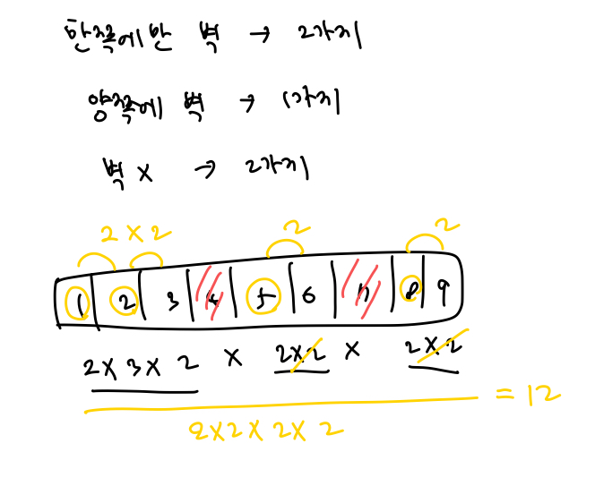

## [백준/2302] 극장 좌석

> ## 문제
>
> 어떤 극장의 좌석은 한 줄로 되어 있으며 왼쪽부터 차례대로 1번부터 N번까지 번호가 매겨져 있다. 공연을 보러 온 사람들은 자기의 입장권에 표시되어 있는 좌석에 앉아야 한다. 예를 들어서, 입장권에 5번이 쓰여 있으면 5번 좌석에 앉아야 한다. 단, 자기의 바로 왼쪽 좌석 또는 바로 오른쪽 좌석으로는 자리를 옮길 수 있다. 예를 들어서, 7번 입장권을 가진 사람은 7번 좌석은 물론이고, 6번 좌석이나 8번 좌석에도 앉을 수 있다. 그러나 5번 좌석이나 9번 좌석에는 앉을 수 없다.
>
> 그런데 이 극장에는 “VIP 회원”들이 있다. 이 사람들은 반드시 자기 좌석에만 앉아야 하며 옆 좌석으로 자리를 옮길 수 없다.
>
> 오늘 공연은 입장권이 매진되어 1번 좌석부터 N번 좌석까지 모든 좌석이 다 팔렸다. VIP 회원들의 좌석 번호들이 주어졌을 때, 사람들이 좌석에 앉는 서로 다른 방법의 가짓수를 구하는 프로그램을 작성하시오.
>
> 예를 들어서, 그림과 같이 좌석이 9개이고, 4번 좌석과 7번 좌석이 VIP석인 경우에 <123456789>는 물론 가능한 배치이다. 또한 <213465789> 와 <132465798> 도 가능한 배치이다. 그러나 <312456789> 와 <123546789> 는 허용되지 않는 배치 방법이다.
>
> 
>
> ## 입력
>
> 첫째 줄에는 좌석의 개수 N이 입력된다. N은 1 이상 40 이하이다. 둘째 줄에는 고정석의 개수 M이 입력된다. M은 0 이상 N 이하이다. 다음 M 개의 줄에는 고정석의 번호가 작은 수부터 큰 수의 순서로 한 줄에 하나씩 입력된다.
>
> ## 출력
>
> 주어진 조건을 만족하면서 사람들이 좌석에 앉을 수 있는 방법의 가짓수를 출력한다. 방법의 가짓수는 2,000,000,000을 넘지 않는다. (2,000,000,000 < 231-1)
>
> ## 예제 입력 1
>
> ```
> 9
> 2
> 4
> 7
> ```
>
> ## 예제 출력 1
>
> ```
> 12
> ```

<br>

**첫 번째 풀이**



경우의 수를 모두 곱한 후, 겹치는 부분이 있는 수만큼 나눠준다.

```cpp
//자기 자리나 바로 왼쪽 좌석 또는 바로 오른쪽 좌석
//vip 회원들은 자신의 좌석에만

//전 좌석이 팔리고, vip 회원들의 번호가 주어졌을 때,
//사람들이 좌석에 앉는 서로 다른 방법의 가짓수

#include <iostream>
#include <vector>
#include <cmath>
using namespace std;

int N, M;
int ans = 1;
int divn = 0;

int main() {
    cin >> N;
    cin >> M;
    
    vector<int> seats(N + 2, 0 );
    
    //양쪽 끝 벽
    seats[0] = 2;
    seats[N + 1] = 2;
    
    int vip;
    for(int i = 0; i < M; i++) {
        cin >> vip;
        seats[vip] = 1;
    }
    
    for(int i = 1; i <= N; i++) {
        if(seats[i] == 0) {
            if(seats[i - 1] == 0 && seats[i + 1] == 0) {
                ans *= 3;
                divn++;
            }
            else if(seats[i - 1] == 0) {
                ans *= 2;
            }
            else if(seats[i + 1] == 0) {
                ans *= 2;
                divn++;
            }
            else {
                ans *= 1;
            }
        }
    }
    
    cout << (ans / pow(2, divn)) << endl;
    
    
}
```

<br>

**두 번째 풀이**

위의 풀이는 3개가 붙어있는 경우까지만 고려한 것이라, 다른 경우들도 고려해 보았다.


f[n] = f[n - 1] + f[n - 2] 와 같은 규칙이 성립되었다.

```cpp
#include <iostream>
#include <vector>
using namespace std;

int N, M;
int ans = 1;
vector<int> dp(10001, 0);

int main() {
    cin >> N;
    cin >> M;
    
    vector<int> seats(N + 2, 0);
    seats[0] = 1;
    seats[N + 1] = 1;
    
    int tmp;
    while(M--) {
        cin >> tmp;
        seats[tmp] = 1;
    }
    
    dp[0] = 1;
    dp[1] = 1;
    dp[2] = 2;
    
    for(int i = 3; i <= N; i++) {
        dp[i] = dp[i - 1] + dp[i - 2];
    }
    
    tmp = 0;
    for(int i = 1; i <= N + 1; i++) {
        if(seats[i] == 1) {
            ans *= dp[tmp];
            tmp = 0;
        }
        else {
            tmp++;
        }
    }
    
    cout << ans << endl;
}
```

