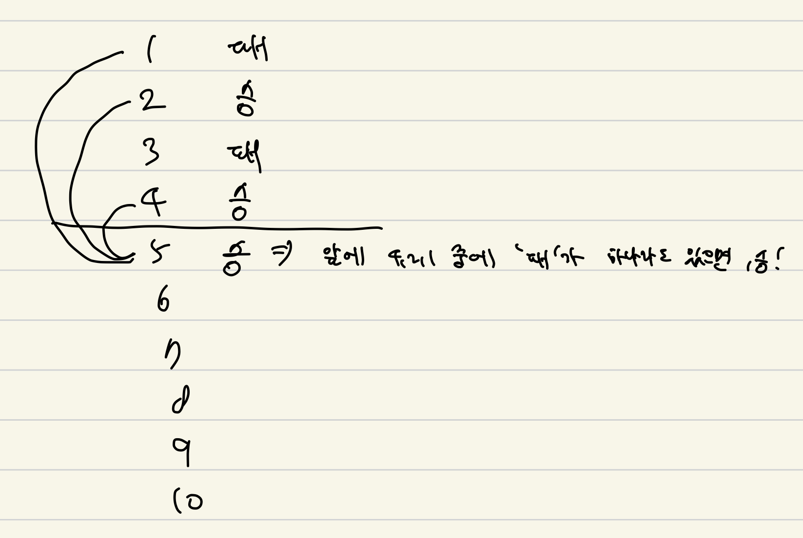

## [백준 / 9658] 돌 게임 4

> ## 문제
>
> 돌 게임은 두 명이서 즐기는 재밌는 게임이다.
>
> 탁자 위에 돌 N개가 있다. 상근이와 창영이는 턴을 번갈아가면서 돌을 가져가며, 돌은 1개, 3개 또는 4개 가져갈 수 있다. 마지막 돌을 가져가는 사람이 게임을 지게 된다.
>
> 두 사람이 완벽하게 게임을 했을 때, 이기는 사람을 구하는 프로그램을 작성하시오. 게임은 상근이가 먼저 시작한다.
>
> ## 입력
>
> 첫째 줄에 N이 주어진다. (1 ≤ N ≤ 1000)
>
> ## 출력
>
> 상근이가 게임을 이기면 SK를, 창영이가 게임을 이기면 CY을 출력한다.
>
> ## 예제 입력 1 
>
> ```
> 6
> ```
>
> ## 예제 출력 1 
>
> ```
> SK
> ```

<br>

**풀이방법**



- 돌이 4개까지 있으므로, 4개까지 패랑 승을 계산한다.
- 남은 돌의 개수에서 -1, -3, -4를 고려한다.
- 예를 들어, 5개가 남은 경우에 내가 1개의 돌을 가져오면, 4개가 남는데 4개는 승이므로, 상대방이 승을 하게 된다는 소리다. 그말은 내가 패한다는 소리이다.
- 그래서 남은 돌의 -1, -3, -4에서 하나의 패라도 있다면 (상대가 패하는 경우가 있다면), 내가 승 할 수 있다.

<br>

```cpp
#include <iostream>
#include <vector>

using namespace std;

int main () {
    int N;
    
    cin >> N;
    vector<int> ary(N + 1, 0);
    
    //패가 0, 승이 1 (상근 기준)
    ary[1] = 0;
    ary[2] = 1;
    ary[3] = 0;
    ary[4] = 1;
    
    for(int i = 5; i <= N; i++) {
        if(ary[i - 4] == 0 || ary[i - 3] == 0 || ary[i - 1] == 0) {
            ary[i] = 1;
        }
        else {
            ary[i] = 0;
        }
    }
    
    if(ary[N] == 0) {
        cout << "CY" << endl;
    }
    else {
        cout << "SK" << endl;
    }
}
```

