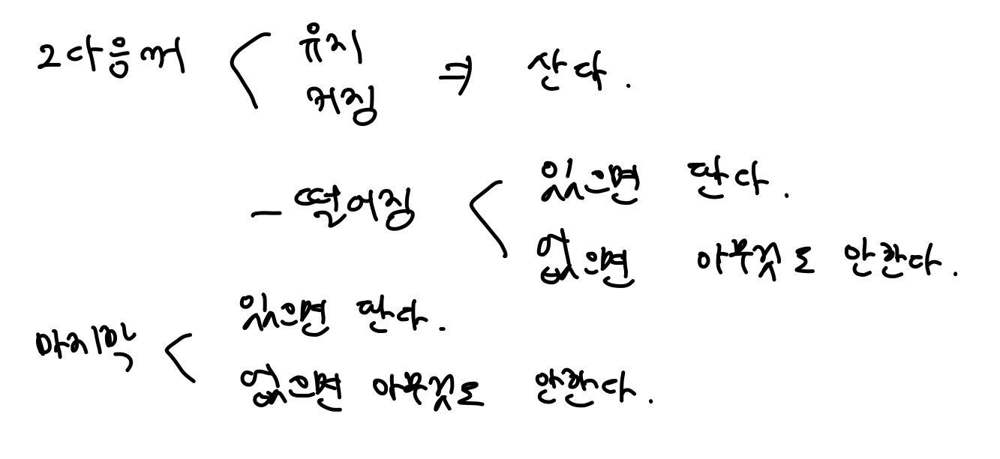

## [백준 / 11501] 주식

> ## 문제
>
> 홍준이는 요즘 주식에 빠져있다. 그는 미래를 내다보는 눈이 뛰어나, 날 별로 주가를 예상하고 언제나 그게 맞아떨어진다. 매일 그는 아래 세 가지 중 한 행동을 한다.
>
> 1. 주식 하나를 산다.
> 2. 원하는 만큼 가지고 있는 주식을 판다.
> 3. 아무것도 안한다.
>
> 홍준이는 미래를 예상하는 뛰어난 안목을 가졌지만, 어떻게 해야 자신이 최대 이익을 얻을 수 있는지 모른다. 따라서 당신에게 날 별로 주식의 가격을 알려주었을 때, 최대 이익이 얼마나 되는지 계산을 해달라고 부탁했다.
>
> 예를 들어 날 수가 3일이고 날 별로 주가가 10, 7, 6일 때, 주가가 계속 감소하므로 최대 이익은 0이 된다. 그러나 만약 날 별로 주가가 3, 5, 9일 때는 처음 두 날에 주식을 하나씩 사고, 마지막날 다 팔아 버리면 이익이 10이 된다.
>
> ## 입력
>
> 입력의 첫 줄에는 테스트케이스 수를 나타내는 자연수 T가 주어진다. 각 테스트케이스 별로 첫 줄에는 날의 수를 나타내는 자연수 N(2 ≤ N ≤ 1,000,000)이 주어지고, 둘째 줄에는 날 별 주가를 나타내는 N개의 자연수들이 공백으로 구분되어 순서대로 주어진다. 날 별 주가는 10,000이하다.
>
> ## 출력
>
> 각 테스트케이스 별로 최대 이익을 나타내는 정수 하나를 출력한다. 답은 부호있는 64bit 정수형으로 표현 가능하다.
>
> ## 예제 입력 1
>
> ```
> 3
> 3
> 10 7 6
> 3
> 3 5 9
> 5
> 1 1 3 1 2
> ```
>
> ## 예제 출력 1
>
> ```
> 0
> 10
> 5
> ```

<br>

**첫번째 풀이방법**



- 가격이 떨어지는 시점에, 이제껏 산 주식들의 수익을 계산해서 더해나간다.

```cpp
//매일 3가지 행동 중 하나
//1. 주식 하나를 산다.
//2. 원하는 만큼 가지고 있는 주식을 판다.
//3. 아무것도 안한다.

//날 별로 주식 가격을 알려주었을 때, 최대 이익을 계산

#include <iostream>
#include <vector>
using namespace std;

int T, N;
vector<int> price;
int start = 0; //start로 매수를 시작해야 할 곳을 알려준다.
int profit = 0;

int main() {
    cin >> T;
    
    while(T--) {
        start = 0;
        profit = 0;
      
        //날의 수와 날 별 주가 입력받기
        cin >> N;
        for(int i = 0; i < N; i++) {
            int tmp;
            cin >> tmp;
            price.push_back(tmp);
        }
        
        for(int i = 0; i < N; i++) {
          	//현재 인덱스가 마지막이라면,
            if(i == N - 1) {
              	//매수한 주식이 있다면,
                if(start != N - 1) {
                    for(int j = start; j <= N - 2; j++) {
                        profit += (price[N - 1] - price[j]);
                    }
                }
                price.clear();
                cout << profit << endl;
            }
          	//현재 인덱스가 마지막이 아니라면,
            else {
              	//가격이 하락할 예정이라면,
                if(price[i + 1] < price[i]) {
                  	//매수한 주식이 있다면,
                    if(start != i) {
                        for(int j = start; j < i; j++) {
                            profit += (price[i] - price[j]);
                        }
                    }
                    start = i + 1;
                }
            }
        }
    }
}
```

=> 반례를 발견했다. 나의 풀이대로라면 1 2 1 5 인 경우 수익은 5라고 나오는데, 최고 가격에 판매하는 경우 수익은 11이 나와야 한다.

<br>

**두번째 풀이방법**

- 뒤에서부터 진행하다가, 더 큰 수를 만나면 수익 계산

```cpp
//매일 3가지 행동 중 하나
//1. 주식 하나를 산다.
//2. 원하는 만큼 가지고 있는 주식을 판다.
//3. 아무것도 안한다.

//날 별로 주식 가격을 알려주었을 때, 최대 이익을 계산

#include <iostream>
#include <vector>
using namespace std;

typedef long long lld;

int T, N;
vector<lld> price;
int max_index = 0;
lld profit = 0;

int main() {
    cin >> T;
    
    while(T--) {
        //날의 수와 날 별 주가 입력받기
        cin >> N;
        for(int i = 0; i < N; i++) {
            int tmp;
            cin >> tmp;
            price.push_back(tmp);
        }
        
        //초기화
        max_index = N - 1;
        profit = 0;
        
        //뒤에서부터 체크하며,
        for(int i = N - 1; i >= 0; i--) {
            //만약 끝까지 도달했다면,
            if(i == 0) {
                //매수해야 하는 주식이 있다면,
                if(max_index > 1) {
                    for(int j = max_index - 1; j >= 0; j--) {
                        profit += (price[max_index] - price[j]);
                    }
                }
            }
            //아직 끝이 아니라면,
            else {
                //매수해야 하는 주식이 있다면,
                if(price[i] > price[max_index]) {
                    //바로 옆의 주식이 아니라면,
                    if(max_index - i != 1) {
                        for(int j = max_index - 1; j > i; j--) {
                            profit += (price[max_index] - price[j]);
                        }
                    }
                    max_index = i;
                }
            }
        }
        
        //price를 초기화하고 profit 출력
        price.clear();
        cout << profit << endl;
    }
}
```

=> 이것도 계속 오류 떠서, int를 long long으로 바꿔주니 해결....

