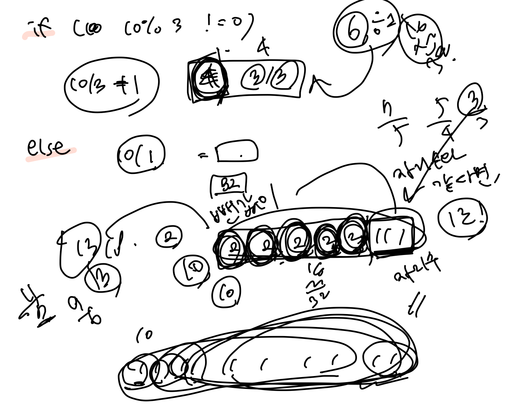
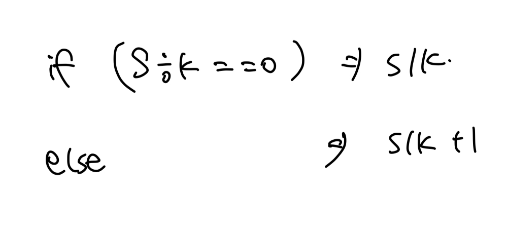

## [백준 / 1500] 최대 곱

> ## 문제
>
> 세준이는 정수 S와 K가 주어졌을 때, 합이 S인 K개의 양의 정수를 찾으려고 한다. 만약 여러개일 경우 그 곱을 가능한 최대로 하려고 한다.
>
> 가능한 최대의 곱을 출력한다.
>
> 만약 S=10, K=3이면, 3,3,4는 곱이 36으로 최대이다.
>
> ## 입력
>
> 첫째 줄에 두 수 S와 K가 주어진다. K는 20보다 작거나 같고, S는 100보다 작거나 같으며 K보다 크거나 같다.
>
> ## 출력
>
> 첫째 줄에 정답을 출력한다. 답은 9223372036854775807보다 작다.
>
> ## 예제 입력 1
>
> ```
> 10 3
> ```
>
> ## 예제 출력 1
>
> ```
> 36
> ```

<br>

**풀이방법**



혼자서 계속 풀어보다가

- 남은 합을 남은 자리수로 나누어
  - 딱 나누어 떨어지면, 나누어 떨어지는 몫으로 자리를 채우고
  - 딱 나누어 떨어지지 않으면, 나누어 떨어지는 몫 + 1로 자리를 채워주었다.



- 내가 한 풀이를 간략히 정리해보았다.

<br>

```cpp
//합이 S인 K개의 양의 정수
//만약 여러개일 경우, 그 곱을 가능한 최대로 하려 함

#include <iostream>
using namespace std;

//처음에 바로 실패 뜨길래 뭐지 했는데, int를 long long int로 바꿔주니 해결됨
long long int S, K;
long long int tmp;
long long int sum = 1;

int main() {
    cin >> S >> K;
    
		//남은 자리가 한 개 이상일 때까지,
    while(K >= 1) { 
				//남은 합 % 남은 자리 = 0이라면,
        if(S % K == 0) {
            tmp = S / K;
        }
				//남은 합 % 남은 자리 != 0이라면,
        else {
            tmp = S / K + 1;
        }
        sum *= tmp;
        S -= tmp;
        K--;
    }
    cout << sum << endl;
}
```

