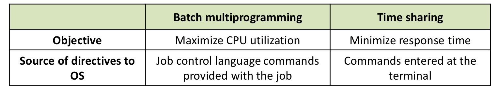

OS는 사용자와 하드웨어를 연결해주는 인터페이스의 역할을 한다. 

=> **Interface(Software layer) between user applications and computer hardware**

1. Resource Management
   - 제한적인 자원을 **효율적**으로 관리한다. (Efficiency)
   - => 효율적으로 관리해서 사용자에게 주고자 하는 무언가가 있다!
   - => 사용자가 가지고 있는 자원은 제한적이지만, 자원을 효율적으로 관리해서, 무한한 자원이 있는 것처럼 illusion을 제공한다. (virtualization)
2. Convenience
   - 사용하기에 편해야 한다.
   - Make the computer system **convenient** to use.

 

OS의 종류

1. How many users at the same time? (동시에 사용할 수 있는 user의 숫자)

   - Sigle user system
     - only one user at a time
     - ex) Windows, Mac OS ..
   - Multi user system
     - more than one user at a time
     - ex) Linux(single로 쓰일 수도 multi로 쓰일수도) ...
     - **complex**
     - => need to schedule different tasks
     - => need to manage the protection or authority of each users

2. How many tasks at the same time?

   - Single tasking system
     - only one program or application at a time
   - Multi tasking system
     - multiple applications and programs at once

3. Open source system vs Closed source system

   - Open source operating system (Linux)
     - free
     - provide ability to change the source code
     - source code can be open for hackers to practice on
   - Closed source operating system (Window)
     - paid
     - source code cannot be changed or viewed

4. Monolithic Kernel vs Micro Kernel

   

   - Monolithic Kernel
     - 운영체제가 구현하고자 하는 **모든 프로그램을 다 떼려넣어서 하나의 프로그램**으로 만듬. 사용자가 다 쓸 수 있음
     - 거의 다 monolithic으로 상용화됨
   - Micro Kernel
     - 모든 사용자가 필요로하는 **정말 핵심적인 기능만 제공**하고 나머지는 모듈로서 제공

 

OS의 역사

- 초기 컴퓨터

  

  1. **Serial processing** (Sequential Processing)
     - 하나하나 순서대로 수행 (Slow job-to-job transition)
     - Human overhead가 너무 크다. (Setup & Takedown)
     - => cpu utilization을 극대화하고 싶다!
     - => 사람이 개입하는 부분을 최소화하고 싶다!
     - => Make **efficient use** of the expensive hardware!!
  
  2. **(Single) Batch** processing
     - 동일한 operation을 하는 애들끼리 묶음의 형태(batch) 수행한다.
     - 처음에만 setup하고 바뀔 때만 takedown하고 다시 setup 해주면 된다.
     - => 인간이 개입해서 낭비하는 시간을 줄일 수 있다.
     - => Decrease the setup and takedown time -> **improve CPU utilization**
     - => memory에 올라간 일들만 처리된다.
     - => **montiror**라는 새로운 프로그램이 memory에 상주해서 **일을 분류하고 순서를 정해준다**. (monitor를 os의 시초로 볼 수도 있다.) / batch의 순서를 정해줘야 한다.
     - => **(OS는 메모리에 상주한다!)**
     - => 상주해 있는 것 자체도 하나의 비용
     - => 인간의 개입을 최소화했는데도 **데이터를 읽고 쓰는 작업(I/O)가 차지하는 시간이 너무 크다.** / 메모리에 접근해서 데이터를 가져와야 함. (**CPU utilization이 여전히 안 좋음**)
     - => 없앨 수 없을 때는 숨겨라!
  
  3. **Multiprogramming batch** processing
     - I/O가 실행되는 동안 다른 job 수행하여 CPU가 놀지 않도록 한다.
     - => (job1을 수행하다가 I/O를 수행할 때 job1은 수행하지 못하니까 잠깐 멈추고, I/O와 함께 그 다음의 job을 수행) => processor can switch between jobs.
     - CPU와 (상대적으로 긴 시간을 요구하는)I/O를 **overlapping** 해서 **cpu utilization을 극대화**한다.
     - => **Overlap of computation with asynchronous I/O**
     - => can hide slow(costly) I/O machines.
     - 그러나 !!
     - => multiprogramming을 수행하기 위해선 모든 task, process, program이 모두 메모리에 올라와 있어야 함. Single은 하나만 올라와 있어도 되었음. 그러나 multi를 위해선 모든 job이 올라와 있어야 함.
     - => 다 올라가지 못한 것들은 disk에 저장되는데, disk는 메모리보다 천배는 더 느림.
     - => 메모리의 어디에, 어느 위치에 job을 저장할 지도 결정해야함 / 메모리에 겹치지 않게끔 개별 job들을 올리고 관리해야 함.
     - => **memory protection**(서로 다른 job들이 겹치면 안됨) & **relocation**(같은 job이라도 올리고 내리면서 주소가 달라질 수 있음)이 필요 !!!
     - => **Buffering and interrupt handling**이 필요 !!! / multiprogramming에서는 수행되는 job을 끊을 수도 있어야 한다.
     - => **Concurrent Programming** become necessary
  
  4. **Time-sharing** processing
  
     - Hardware cheap, humans expensive
  
     - => CPU utilization 그만큼 안 중요해짐. 사용자가 중요!
  
     - => 컴퓨터라는 하드웨어가 중요한 게 아니라, 그걸 사용하는 사용자의 경험이 중요해짐.
  
     - => **multiple users can interact with each job while it is running** (Interactive Computing)
  
     - => **Minimize response time** (요청을 한 후로, 첫 번째 응답이 올 때까지 걸리는 시간)
  
     - => ex) Each user has at least one program executing in memory
  
     - => ex) response time < 1 sec.
  
     - => At each clock(time slice), the system regained control and assigned the processor to another job. 
  
     - => (Round-Robin)
  
     - => 마치 혼자 컴퓨터를 사용하는 듯한 illusion을 제공.
  
       
  
     - 그러나 !!
  
     - Job들의 상태를 저장하거나, 어떤 것을 먼저 실행할 지 등 스케줄링의 비용이 요구된다.
  
  5. OS with Internet
  
     - 다양한 형태의 OS 등장 (OS with built-in Internet Access)
     - provide connected **multimedia** services for users
     - => OS with built-in Internet Access
     - => OS with Multimedia Support
  
  6. New era
  
     - OS became software platform
  
  7. Real time system
  
     - **"meet the specified deadline"**
     - => 각 job들의 데드라인을 100% 만족시킬 수 있느냐
     - `<Hard real-time system>`
     - : Missing the deadline can cause disastrous consequences
     - `<Soft real-time system>`
     - : Missing the deadline have no disastrous consequences.
     - : can miss its deadline occasionally with some acceptably low probability

 

Basic Structure of Computer (Von Neumann 아키텍쳐)

- CPU(Central Processing Unit) => Computer has a processing unit.
  - Control Unit : 여러 부품/CPU 내부동작 control
  - Arithmetic/Logic Unit : 산술/논리 연산
  - Registers : 잠깐 data를 일시적으로 저장

- Memory => stores **data and instructions**
  - 명령어와 data는 메모리에만! 있다.
  - CPU는 메모리를 통해서만 명령어와 data를 받아서 연산을 수행할 수 있다.

- Input/Output Device
  - I/O 장치로 명령어와 데이터를 입력한다.

- 문제
  - 병목현상(bottleneck)
  - 메모리에 명령어랑 데이터를 모두 두면 모든 작업을 메모리를 통해 해야함.
  - 그러면 **CPU가 아무리 빨라도 메모리의 속도가 느리면 컴퓨터의 속도가 느림**.
  - => 컴퓨터의 성능을 메모리가 결정함.

 

I/O의 종류

- Synchronous I/O (동기화)
  - I/O가 끝날 때까지 CPU도 기다려야 함
  - => 항상 정해진 시간에 특정 event가 발생함
- Asynchronous I/O
  - I/O가 끝날 때까지 CPU가 기다릴 필요 없이 다른 일을 해도 됨
  - => **without waiting I/O completion**
  - 내부 clock과 상관 없이, 사용자에 의해/특정 event에 의해 
  - => 특정 시간에 특정 event가 발생하는 것을 보장할 수 없음

 

Memory Protection

- overlap 되면 안된다!
- => OS prevents a job from accessing memory regin owned by other jobs
- => **Relocation + base/bound registers**

 

Memory Relocation

- Job이 메모리에서 내려갔다가 다시 올라온다고 똑같은 주소가 보장되지 않는다.
- => memory protection을 위해

 

Base/bound registers

=> CPU가 주소변환을 위한 저장장치(register)를 제공한다.

- Base: 프로그램의 시작 메모리 주소
- Bound: 프로그램의 길이/ 크기
- => Base/bound를 계산해서 남아있는 memory를 넘지 않는다면, 해당 주소로 가서 저장한다.
- Ex) Base가 2500, Bound가 1500

  => 2500의 시작 주소로 가서, 남아 있는 메모리의 크기가 1500. (2500 + 1500) = 4000을 넘지 않는다면, 해당 메모리에 저장 가능
- => memory protection을 위해

 

Concurrency and synchronization

- (**Concurrency**) 공유되고 있다. 서로 다른 프로그램이 동시에 하나의 output 장치로
- (**Synchronization**) 서로 잘 구분되어야 함.
- OR lock을 걸어줘야 함.
