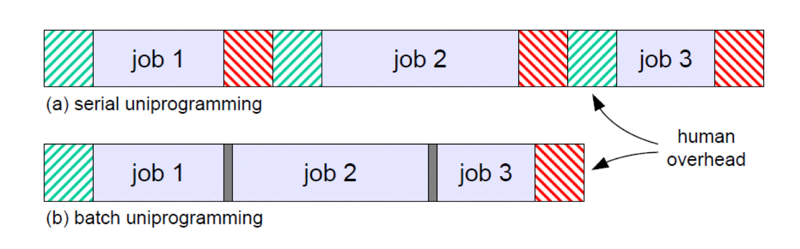

OS는 사용자와 하드웨어를 연결해주는 인터페이스의 역할을 한다. 

1. Resource Management
   - 제한적인 자원을 효율적으로 관리한다. (Efficiency)
   - 사용자가 가지고 있는 자원은 제한적이지만, 자원을 효율적으로 관리해서, 무한한 자원이 있는 것처럼 illusion을 제공한다. (virtualization)
2. Convenience
   - 사용하기에 편해야 한다.

 

OS의 종류

1. How many users at the same time?

   - Sigle user system
     - only one user at a time
   - Multi user system
     - more than one user at a time

2. How many tasks at the same time?

   - Single tasking system
     - only one program or application at a time
   - Multi tasking system
     - multiple applications and programs at once

3. Open source system vs Closed source system

   - Open source operating system (Linux)
     - free
     - provide ability to change the source code
   - Closed source operating system (Window)
     - paid
     - source code cannot be changed or viewed

4. Monolithic Kernel vs Micro Kernel

   

   - Monolithic Kernel
     - 다 떼려넣음. 사용자가 다 쓸 수 있음
     - 거의 다 monolithic으로 상용화됨
   - Micro Kernel
     - 모든 사용자가 필요로하는 정말 핵심적인 기능만 제공하고 나머지는 모듈로서 제공

 

OS의 역사

- 초기 컴퓨터

  

  1. Serial processing (Sequential Processing)
     - 하나하나 순서대로 수행 (Slow job-to-job transition)
     - Human overhead가 너무 크다. (Setup & Takedown)
     - => cpu utilization을 극대화하고 싶다!
     - => 사람이 개입하는 부분을 최소화하고 싶다!

  2. (Single) Batch processing
     - 동일한 operation을 하는 애들끼리 묶음의 형태(batch) 수행한다.
     - 처음에만 setup하고 바뀔 때만 takedown하고 다시 setup 해주면 된다.
     - => 인간이 개입해서 낭비하는 시간을 줄일 수 있다.
     - => memory에 올라간 일들만 처리된다.
     - => montiror라는 새로운 프로그램이 memory에 상주해서 일을 분류하고 순서를 정해준다. (monitor를 os의 시초로 볼 수도 있다.)
     - => 인간의 개입을 최소화했는데도 데이터를 읽고 쓰는 작업(I/O)가 차지하는 시간이 너무 크다.
  3. 