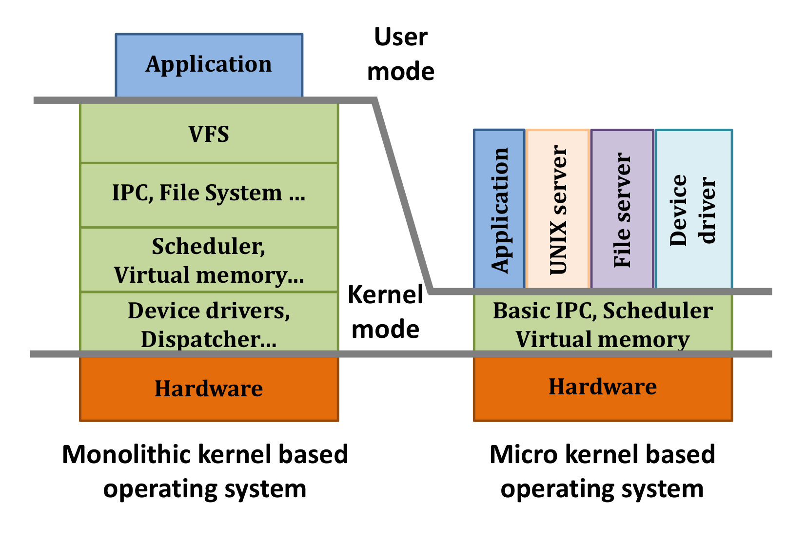
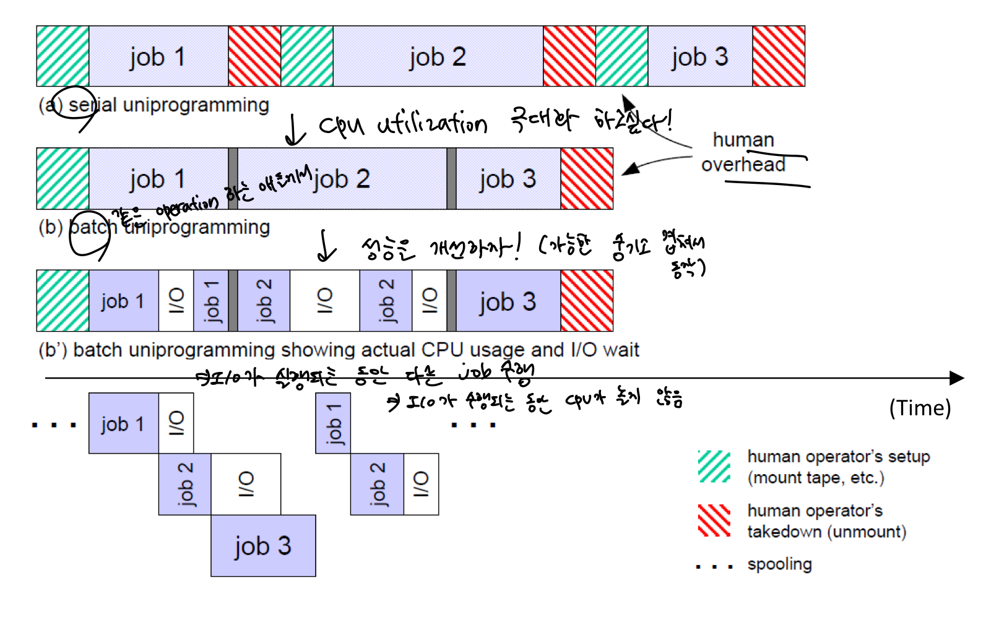
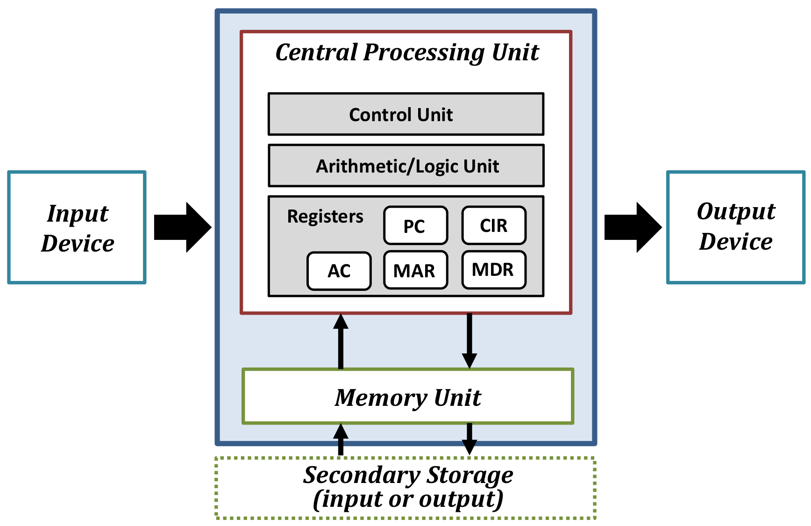
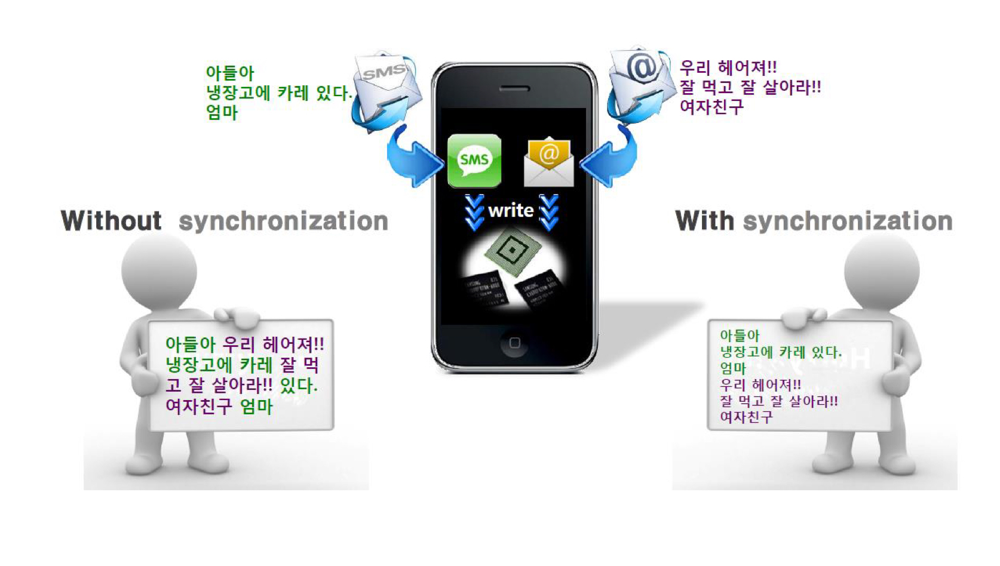

OS는 사용자와 하드웨어를 연결해주는 인터페이스의 역할을 한다. 

1. Resource Management
   - 제한적인 자원을 효율적으로 관리한다. (Efficiency)
   - 사용자가 가지고 있는 자원은 제한적이지만, 자원을 효율적으로 관리해서, 무한한 자원이 있는 것처럼 illusion을 제공한다. (virtualization)
2. Convenience
   - 사용하기에 편해야 한다.

 

OS의 종류

1. How many users at the same time?

   - Sigle user system
     - only one user at a time
   - Multi user system
     - more than one user at a time

2. How many tasks at the same time?

   - Single tasking system
     - only one program or application at a time
   - Multi tasking system
     - multiple applications and programs at once

3. Open source system vs Closed source system

   - Open source operating system (Linux)
     - free
     - provide ability to change the source code
   - Closed source operating system (Window)
     - paid
     - source code cannot be changed or viewed

4. Monolithic Kernel vs Micro Kernel

   

   - Monolithic Kernel
     - 다 떼려넣음. 사용자가 다 쓸 수 있음
     - 거의 다 monolithic으로 상용화됨
   - Micro Kernel
     - 모든 사용자가 필요로하는 정말 핵심적인 기능만 제공하고 나머지는 모듈로서 제공

 

OS의 역사

- 초기 컴퓨터

  

  1. Serial processing (Sequential Processing)
     - 하나하나 순서대로 수행 (Slow job-to-job transition)
     - Human overhead가 너무 크다. (Setup & Takedown)
     - => cpu utilization을 극대화하고 싶다!
     - => 사람이 개입하는 부분을 최소화하고 싶다!
  2. (Single) Batch processing
     - 동일한 operation을 하는 애들끼리 묶음의 형태(batch) 수행한다.
     - 처음에만 setup하고 바뀔 때만 takedown하고 다시 setup 해주면 된다.
     - => 인간이 개입해서 낭비하는 시간을 줄일 수 있다.
     - => memory에 올라간 일들만 처리된다.
     - => montiror라는 새로운 프로그램이 memory에 상주해서 일을 분류하고 순서를 정해준다. (monitor를 os의 시초로 볼 수도 있다.) / batch의 순서를 정해줘야 한다.
     - => 상주해 있는 것 자체도 하나의 비용
     - => 인간의 개입을 최소화했는데도 데이터를 읽고 쓰는 작업(I/O)가 차지하는 시간이 너무 크다. / 메모리에 접근해서 데이터를 가져와야 함.
  3. Multiprogramming batch processing
     - I/O가 실행되는 동안 다른 job 수행하여 CPU가 놀지 않도록 한다.
     - CPU와 I/O를 overlapping 해서 cpu utilization을 극대화한다.
     - => multiprogramming을 수행하기 위해선 모든 task, process, program이 모두 메모리에 올라와 있어야 함. Single은 하나만 올라와 있어도 되었음.
     - => 다 올라가지 못한 것들은 disk에 저장되는데, disk는 메모리보다 천배는 더 느림.
     - => 메모리의 어디에, 어느 위치에 job을 저장할 지도 결정해야함 / 메모리에 겹치지 않게끔 개별 job들을 올리고 관리해야 함.
     - => memory protection(서로 다른 job들이 겹치면 안됨) & relocation(같은 job이라도 올리고 내리면서 주소가 달라질 수 있음)이 필요 !!!
     - => interrupt handling이 필요 !!! / multiprogramming에서는 수행되는 job을 끊을 수도 있어야 한다.

 

Basic Structure of Computer (Von Neumann 아키텍쳐)

- => 메모리로만 명령어와 데이터를 가져올 수 있음.
- 문제
  - 병목현상
  - 메모리에 명령어랑 데이터를 모두 두면 모든 작업을 메모리를 통해 해야함.
  - 그러면 CPU가 아무리 빨라도 메모리의 속도가 느리면 컴퓨터의 속도가 느림.
  - => 컴퓨터의 성능을 메모리가 결정함.

 

**I/O의 종류**

- Synchronous I/O (동기화)
  - 끝날 때까지 CPU도 기다려야 함
  - 항상 정해진 특정 event가 발생함
- Asynchronous I/O
  - 끝날 때까지 CPU가 기다릴 필요 없이 다른 일을 해도 됨
  - 내부 clock과 상관 없이, 사용자에 의해/특정 event에 의해 
  - 특정 시간에 특정 event가 발생하는 것을 보장할 수 없음

 

Base/bound registers

- Base: 프로그램의 시작 메모리 주소
- Bound: 프로그램의 길이/ 크기
- => Base/bound를 계산해서 남아있는 memory를 넘지 않는다면, 해당 주소로 가서 저장한다.
- => memory protection을 위해

 

Concurrency and synchronization

- 공유되고 있기 때문에 서로 잘 구분되어야 함.
- 서로 다른 프로그램이 동시에 하나의 output 장치로
- => lock을 걸어줘야 함.

 