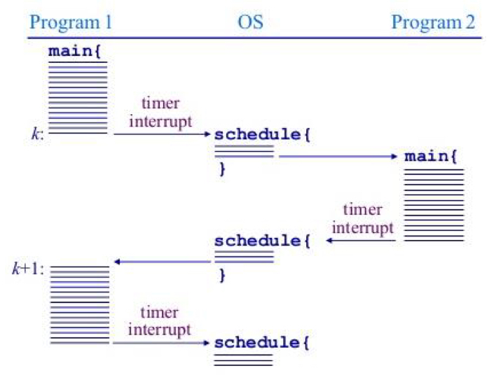
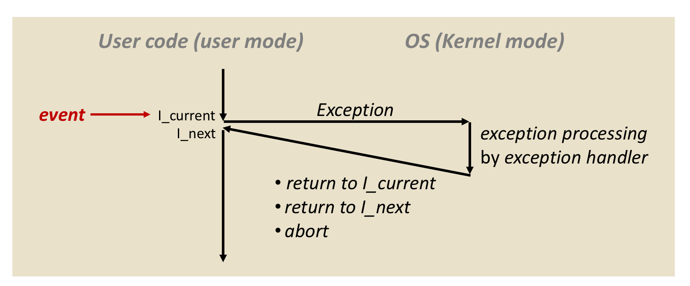
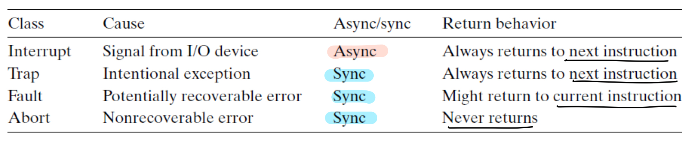

Computer System(1): Mode Bit

- Dual Mode
  - kernel mode: 운영체제가 cpu에 대한 권한을 갖는다.
  - user mode: 하드웨어에 대한 접근이 필요하거나 예상치 못한 문제를 해결하고자 할 때(OS의 도움을 필요로 할 때) => 커널모드로 => 유저 프로그램(응용 프로그램)이 cpu에 대한 권한을 갖는다.
  - => Protect 하기 위해 두 개의 모드로 나눔!
  - => Program Counter를 통해 둘을 구분할 수 있음 / 그러나 보통 레지스터를 둠

 

Computer System(2): Timer

- Timer

  

  - program1이 실행되며 user mode
  - 지정된 time이 끝나면 timer interrupt가 발생해서 kernel mode로 => 멈췄을 때의 상태를 OS가 관리
  - 다음 실행 프로그램에 CPU에 대한 권한을 넘겨주며 program2가 실행되는 user mode로

 

Computer System(3): I/O Device

- another type of small CPU (local buffer like memory)
- after finishing I/O processing, the device controller sends an interrupt signal to the CPU

 

Computer System(4): Exception (Interrupt)

- 예외가 발생해서 사용자 프로그램에서 처리가 불가한 상황

  

  - OS는 특정 예외에 대한 Solution을 가지고 있음(exception handler)
  - 예외 처리 후,
    - current로 돌아가거나
    - next로 가거나
    - abort 하는 경우

 

Exception의 종류

- Asynchronous Exceptoin
  - 반복하면 매번 동일한 시간에 exception 발생을 보장하지 못한다. 외부 장치에 의해 발생하므로.
  - interrupt: 외부 장치에 의해서 발생하는 예외(CPU가 멈춤) ex) I/O device, timer
  - => 명령어가 끝날 때마다 interrupt line을 체크함
  - interrupt를 처리후 next instruction 처리

- Synchrounous Exception

  - 프로그램을 돌리면 항상 같은 line에서 exception 발생. 내부에서 발생하므로. (triggered by CPU itself)

    1. Traps: "intentional" (사용자가 의도함. 내가 필요한 데이터를 받고 싶어서.. 할당하고 싶어서.. malloc ...) => ex) system calls => "next" instruction으로 넘어감

    2. Faults: "Unintentional" (사용자가 의도하지 않음.) => ex) divide by 0, page fault(메모리에 원하는 데이터/명령어가 없음)
    3. Aborts