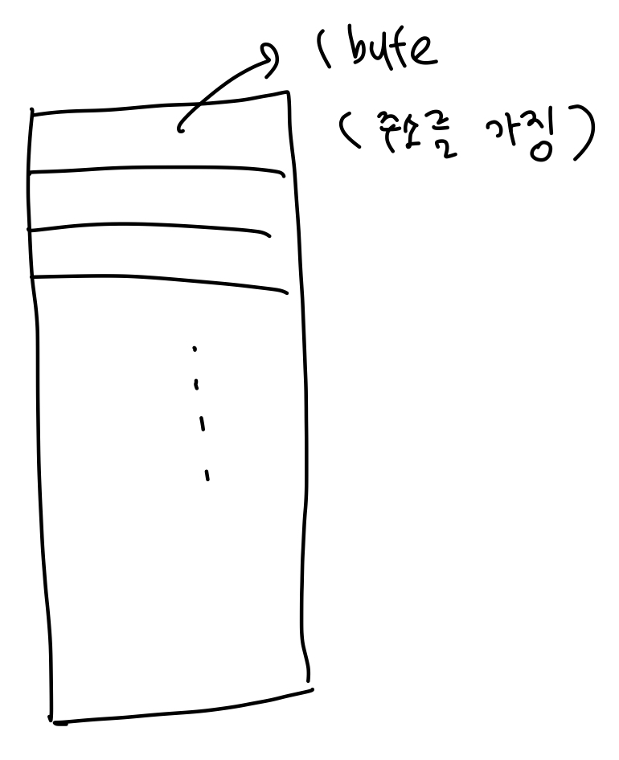
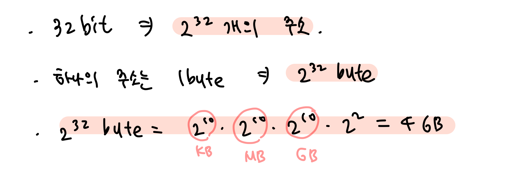
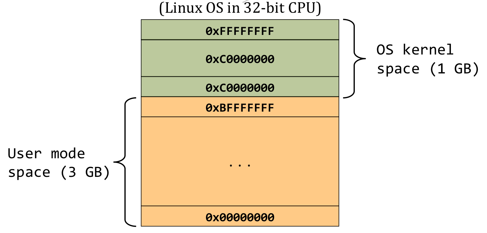
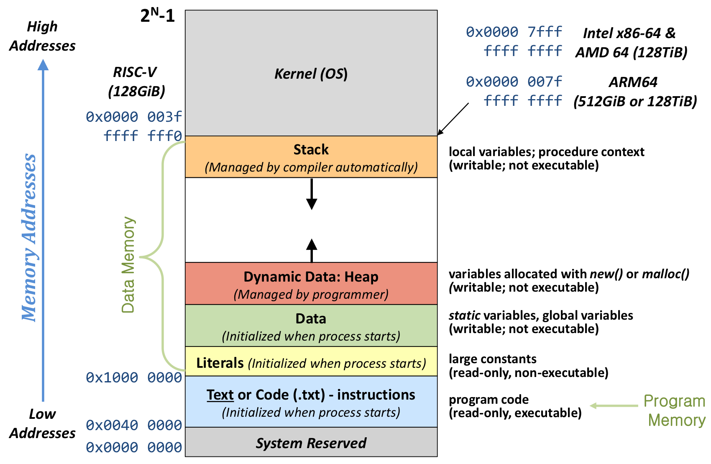
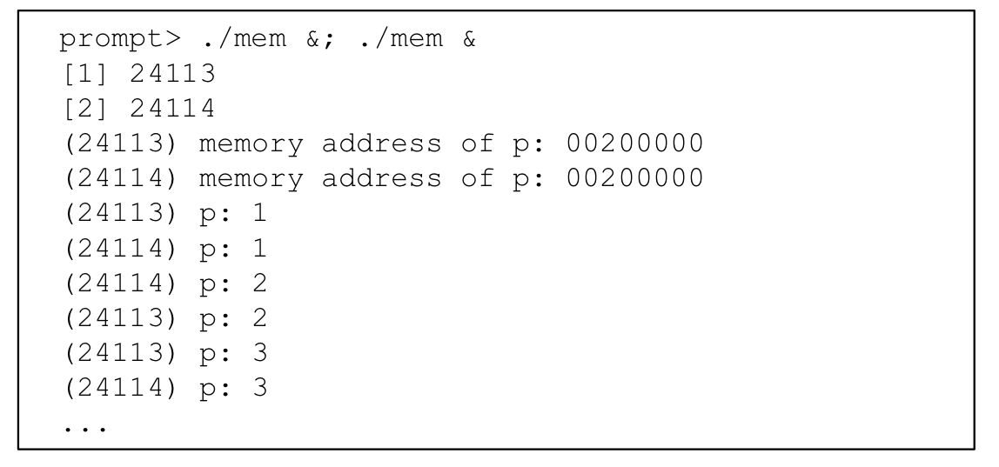
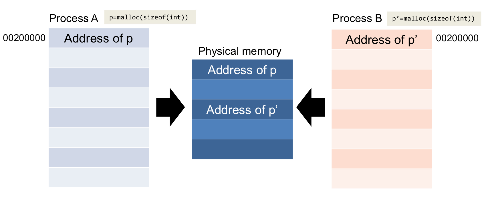
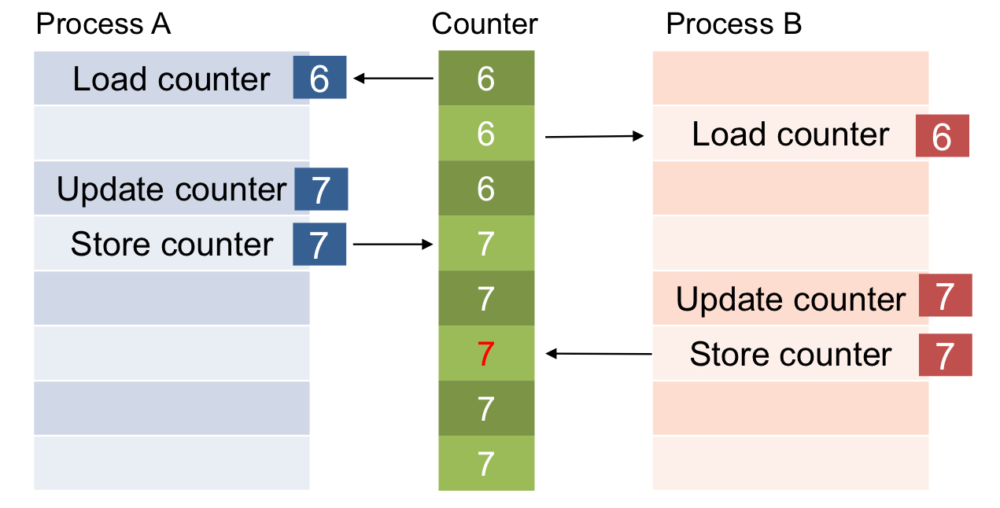
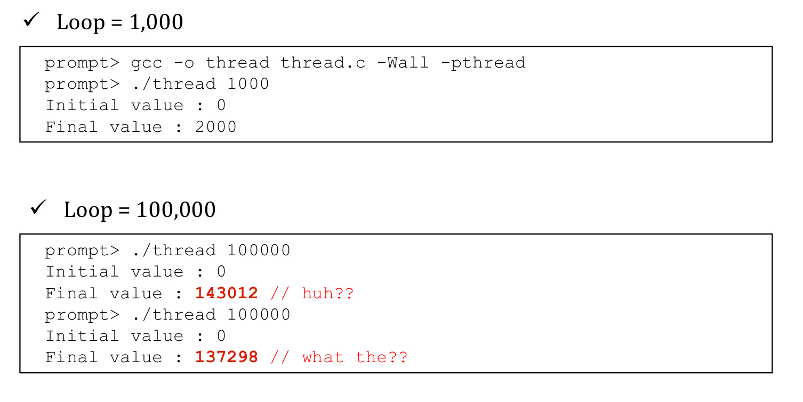

The Main Features of OS

- **Virtualization**

  : resource는 한정적이지만, 무한한 resource가 있는 것처럼 illusion을 제공하는 것

  => ex) time-sharing (시간을 쪼개서 쓰도록. 우리는 동시에 동작한다고 느낌.)

- **Persistence**

  : 내가 원하는 data를 저장하고, 일정 시간이 흐른 후 접근했을 때, 다시 읽고 재구성할 수 있는 것

- **Concurrency**

 

(1) Virtualization

- CPU

  - Time-sharing방식을 사용

- Memory

  - 주소를 갖고 있는 array다!

    

  - Array 하나가 저장할 수 있는 data는 1byte

  - Array는 각각 주소를 가진다. CPU는 메모리의 주소로 가서 해당 주소에서 data와 instruction을 가져옴.

  - => (Call by Reference)

  - 연속된 Array(연속적으로 할당)

  - => **"메모리는 1byte의 주소를 저장하는 array가 연속적으로 있는 것"**

  - => The physical memory is **an array of bytes (or byte-addressable)**

- **(TEST)**

  - 32 bit architecture CPU가 가질 수 있는 memory의 maximum 크기는?

    

  - => 32bit CPU가 만들 수 있는 명령어/숫자의 개수는 2^32개이다.

  - => 주소는 이진수로 만들기 때문에 만들 수 있는 number of address 또한 2^32개이다.

  - => 주소 하나당 저장할 수 있는 정보의 크기는 1byte이므로, 총 2^32 byte가 필요하다.

  - => **2^32byte = 4GB**

    

  - 메모리는 OS가 상주하므로, OS가 상주하는 (OS kernel) 영역, User 영역으로 나뉜다.
  
  - These **virtual addresses** (generated by CPU) are then mapped to **real, physical memory addresses** by **page tables**, **which are kept by the OS kernel**.
  
  - => OS가 주소변환을 하는 것도 memory virtualization!

 

- Virtual Memory Layout

  

  - `Text` 영역 : (Program Code)compile 했을 때 썻던 코드와 명령어들

  - `Data` 영역 : static variables, global variables

  - => Text와 Data 영역은 컴파일이 끝나면 Static 하게 저장된다.

  - `Heap` 영역 : 메모리를 요청. new(), malloc() 

  - `Stack` 영역 : function을 사용할 때 사용하는 local variables. function이 끝나면 사용을 반납하고.

  - => Heap과 Stack은 프로그램 사용에 따라 크기가 바뀐다.

  - `Kernel 영역은 OS가 상주`

  - => 서로 corruption 되지 않도록 OS가 알아서 isolation을 해주고, 주소를 변환해준다.

  - => 주소 변환을 통해 개별 유저가 자신만의 4GB를 가지는 것과 같은 illusion을 제공한다.

 

- It is as if each running program has **its own private memory**

  

  

  - 서로 다른 process가 같은 메모리 주소에 서로 다른 값을 입력한다.
  - 값은 온전히 저장되고, 이는 각각의 process는 각자의 memory를 가지는 것처럼 보이게 한다.
  - 그러나 사실 위 주소는 virtual memory 주소이고, 실제 physical memory 주소는 다르다.
  - => (Protection) A memory reference within one running program **does not affect** the address space of other processes

 

(2) Concurrency

- memory에 여러 개의 program을 올려서 실행할 때, 해당 program들이 공통된 resource를 공유할 때 발생하는 문제

- ex) 메모리의 특정 주소는 monitor, printer ... (특정 I/O device)와 연결됨.

- => I/O장치를 공유한다는 것은, 특정 메모리 주소를 여러 프로그램들이 공유한다는 것!

  

  - 각 process는 counter라는 특정 메모리 주소를 공유하고,
  - 해당 counter로부터 값을 읽어오고, 1을 더한 후, 다시 저장한다.
  - ProcessA와 ProcessB가 각 한 번씩 해당 과정을 수행한다면, 6이라는 값은 8로 update되어야 한다.
  - 그러나 ProcessA가 6이라는 값을 수정하고 새로 update 하기 전에 ProcessB가 값을 counter로부터 값을 읽어온다면,
  - 둘다 값을 7로 저장하게 되고, 이를 보고 **"concurrent하게 수행하지 못했다!"** 라고 한다.
  - => 따라서, shared(공유되는) resource에 접근하는 process들을 보호하기 위해 scheduling, lock, semaphore 등이 필요!

  

  - increment the shared counter를 통해 각 프로그램은 1씩 증가하는 연산을 수행.
  - Loop=1000일 때는, concurrency가 발생하지 않아서, 2000이라는 값이 잘 나온다.
  - Loop=100000일 때는, concurrency가 발생해서, 연산을 수행할 때마다 다른 값이 나온다.

 

(3) Persistence

- 내가 현재 data 저장 후, 일정 시간이 지나고 아무 에러 없이 읽을 수 있는 것
- => Hardward and Software are needed to store data **persistently**.
- 해결책은 간단함. 서로 다른 곳에 data를 두 번 적으면 됨.
- => **File System** manages the disk.