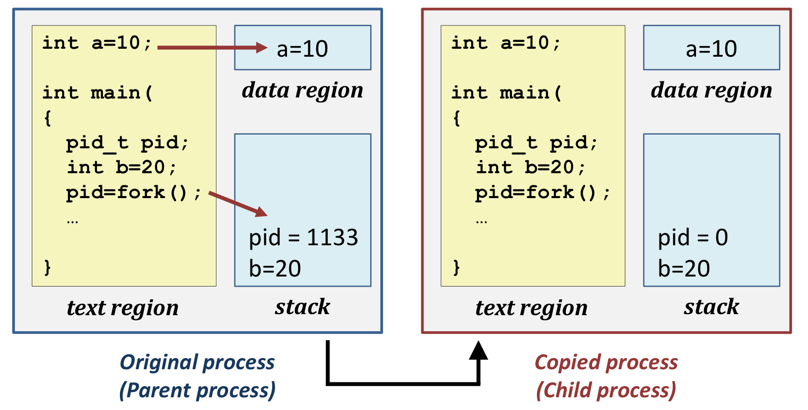

(**Test**)

- interrupt type을 구분
  - next_instruction을 수행하는지, current_instruction을 수행하는지
  - intentional 인지, unintentional 인지
  - recoverable 인지, unrecoverable 인지
  - synchronous 인지, asynchronous 인지
- 단계 별 순서에 따라 mode bit / program counter가 어떻게 변화하는지
- DMA를 했을 때와 안했을 때 어느 정도 성능 차이가 나는지
  - CPU는 clock에 맞춰서 동작을 수행한다.
  - 1bit의 data를 I/O 장치로부터 받아서 메모리에 집어넣는데, 2 cycle을 소모한다.
  - 100byte면 몇 백 cycle을 소모하게 된다.
  - DMA를 사용하면, DMA에 명령어를 보낼 때는 cycle은 소모된다. 근데 이건 한 번만 보내면 된다.
  - => 얼마의 cycle을 소모했고, 몇 프로의 성능 gain이 있는지 rough하게 계산
- 프로세스에 대한 개념 (프로그램과 비교)
- 프로세스 state의 종류와, 어떤 일 때문에 바뀌는지
- fork
  - 인터넷에 찾아보면 여러 type들이 나옴

 

CPU virtualization

- user의 실제 cpu는 제한되어 있지만, os의 어떤 동작으로 인해 user에게 무한개의 cpu가 있는 것과 같은 illusion을 제공한다.
- => "time-sharing"을 통해!

 

두 가지 time-sharing 정책

1. context switch
   - time slice가 다 되어서 timer가 interrupt를 주면 해당 프로그램은 멈춘다.
   - 그러나, 해당 프로그램은 언젠가 다시 수행될 수 있다.
   - 사용자는 단 한번도 끊이지 않은 것처럼 illusion을 제공받아야 한다.
   - => 한번도 멈추지 않은 것처럼 멈췄을 때의 상태에 대한 모든 정보를 저장하고, 다시 시작할 때 re-set 해줘야 한다!
   - => **register의 값을 context라 한다. 해당 context를 계속해서 switch 해줄 수 있어야 한다!**
2. scheduling policies
   - **어떤 프로그램을 "먼저" 수행할 지**도 결정할 수 있어야 한다!

 

Process

- 현재 수행(running) 중인 프로그램의 묶음 (**an instance of a running program**)
- Program은 file의 형태로 disk에 존재한다. (**reside in disk** - **just a set of data associated with that code**)
- => disk에 존재했던 data와 code가 메모리에 올라오면, Process가 된다. (**reside in memory**)
- => 즉, CPU가 접근해서 실행될 수 있는 상태의 data와 code를 process라 한다.
- => 다양한 상태(state)를 가짐. 기다리는 상태.... 등 (**process can have different "states"**)

 

Process API (Application Program Interface)

- 사용자가 process를 쉽게 이용할 수 있는 인터페이스를 제공하지만, 실제 수행은 OS에서
- ex) process creation - fork(): disk에 있는 프로그램을 메모리로 가져온다.

 

Process States - (3-State Model)

- Running
  - 수행에 필요한 모든 resource를 가짐 + cpu에 대한 권한을 가짐
- Ready
  - 수행에 필요한 모든 resource를 가짐. 그러나 cpu에 대한 권한은 가지지 못함
  - scheduling policy에 따라 cpu에 대한 권한만 주면, 얼마든지 running 상태로 변할 수 있음
- Blocked(Wait)
  - 수행에 필요한 모든 resource를 가지지 못함 + cpu에 대한 권한도 가지지 못함
  - **I/O를 요청한 상태** (외부 I/O 장치에, 수행에 필요한 resource를 요청) ex) scanf .. page fault ..
  - I/O에 대한 요청이 와서(I/O가 done해서) 모든 resource를 가지더라도, cpu에 대한 권한은 아직 없으므로, ready 상태로 가서 os가 권한을 줄 때까지 기다림
- 이때, descheduled는 **timer interrup**t라 보면 된다. scheduled는 scheduling policy에 의해 권한을 받은 것이라 보면 된다.

 

5-State Model

- New랑 Exit가 추가됨
- New(Creation): **PCB를 메모리에 올리기 전까지의 상태**
- => 이 시스템에 새로운 process가 동작하려면, 메모리에 해당 프로세스를 위한 PCB(구조체 - 서로 다른 형태의 정보를 하나로 묶음)부터 만들어줘야함.
- => New는 PCB를 등록만 한 상태. 메모리에는 올라가 있지 않음.
- => PCB가 메모리에 다 올라가면, Ready 상태인 것이다.
- Exit(Terminated): **메모리에서 disk로 내리는.**
- => 해당 process를 storage로 내보냄

 

7-State Model

- Main memory영역과 별개의 Disk 공간에 해당하는 Blocked/suspend와 Ready/suspend가 추가됨
- 메모리의 공간이 부족하면 일부 또는 전체를 disk의 특정 영역으로 swap out
- => Blocked에서 disk의 Blocked/suspend queue로 보낸다.
- => Blocked에는 아무것도 없고 Ready에만 데이터가 넘쳐난다면, Ready에서 disk의 Ready/suspend queue로 보낸다.
- => Blocked/suspend는 바로 ready로는 못 가고, Ready/suspend queue를 거쳐서 이동 가능
- `<Swapping>`
- 일부 또는 전체를 disk의 특정 영역 (Swap space)로 swap out

 

- Process0이 run하다가 I/O가 발생함
- I/O가 가 끝나고 바로 다시 run 되는 것이 아니라, Process1의 time slice가 끝날 때까지 Ready 상태로 가서 기다린다.

 

PCB (Process Control Block)

- process들의 모든 수행에 필요한 정보를 가지는 data structure
- 개별 process 마다 자신만의 PCB를 가진다.
- n개의 process에 대한 data와 code가 user 영역에 올라와 있을 때, 각 process들의 PCB는 모두 OS가 있는 kernel 영역에 저장된다.
- `<Information>`
- PID: 어떤 프로세스인지 식별자
- Process State: 어떤 상태인지
- Scheduling information: 프로세스 우선순위
- Accounting information: 얼만큼 많이 CPU의 권한을 받았는지
- I/O status information: 할당된 I/O 장치
- !!(중요) "context" : 해당 프로그램 수행을 위해 register에 저장된 정보들
- => 멈췄을 때 register의 정보를 모두 가지고 있다가, 다시 수행될 때 re-setting
- => Program Counter: 다음에 수행해야 할 instruction의 위치
- => CPU registers
- Memory mangement information: 메모리와 관련된 정보들

 

Context-switching

- "정보의 교환"
- Program counter, CPU registers... 등 프로그램이 종료되면 모든 정보를 structure의 형태로 PCB에 저장하고
- 재수행할 때, 모든 정보를 PCB에서 받아와서 re-setting
- => PCB의 교환
- (**Test**) Quiz!
- context-switching을 할 때, time-slice가 적으면 적을수록 response time이 개선될까?
- => time-slice를 줄이면 response time은 줄어든다. 
- => 그러나, context-switching을 할 때마다 정보를 PCB에 저장하고, 새로운 PCB를 세팅해야함 (메모리에 대한 접근)
- => time-slice가 너무 적으면 overhead가 커져서 오히려 성능이 나빠짐
- => 따라서 time-slice와 overhead가 얼마인지 확인해서 적절하게 조절하자!

 

Fork - 무조건 시험 나옴. 교재 예시들 보기.

- Child Process는 Parent Process를 fork한 시점의 address space를 그대로 복사해서 가져감
- 그 이후부터는 달라짐

- pid만 제외하고, 나머지를 그대로 복사한다.

- 그 이후부터는 독립된 방식으로 동작한다.

- (**Test**) fork를 한 후, 연산을 했을 때, parent 변수의 값과 child 변수의 값을 물어본다!

- ex)

  

 

Reaping Child Processes

- "Zombie": child는 out인데 parent가 수행 중
- => Process 자체는 terminate. PCB는 메모리에 남아있는.
- "Orphaned Child": child는 아직 수행 중인데, parent가 없음