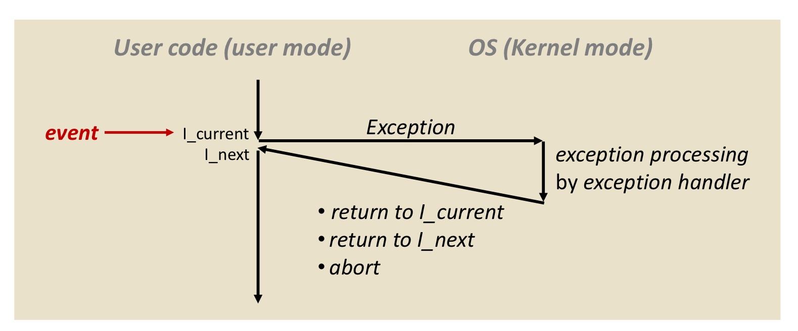

OS: hardware와 software 모두를 최적화!

=> 효율적인 최적화를 위해!

 

Instruction Set Architecture(ISA)

- The attributes of a computing system as seen by the programmer
- **State**(conceptual structure): register(CPU 안의 임시 저장소) / memory
- **Operations**(functional behavior): 명령어(instructions)
- => 명령어가 state를 바꿈!

- **PC(Program Counter)**: 다음 수행해야 할 명령어의 메모리 주소
- => 순서대로 저장되어 있으므로
- (깜짝 Quiz!)
- 해당 메모리는 몇 bit 일지?
- 주소가 63개 이므로, **2^n byte = 64 byte**
- n = 6 => **6bit**
- (다시 돌아와서)
- **lw r1, 1, (r0)**
- lw: word 단위로 load하라(메모리로부터 가져와라).
- => (register에서 r0에 있는 값 +1) = offset이다. 해당 메모리 주소로 가서, 있는 값을 register r1에 load해라!
- => register의 state가 21로 바뀜! 해당 PC1로 간다.

- PC 21 -> 메모리 21로 갔더니, **lw r2, 2 (r0)**
- => (register r0의 값 + 2) 의 메모리 주소 값을 register r2에 load하라.
- => Program Couter 값(State)가 22로 바뀜

- PC 22 -> 메모리 22로 갔더니, **add r3, r1, r2**
- => register r1의 값과 register r2의 값을 더해서 register r3에 저장.
- => Program Counter의 값이 23으로 바뀜. (메모리에 연속적으로 할당되어 있기 때문에, PC는 무조건 1씩 증가한다.)

- PC가 23 -> 메모리 23으로 갔더니, **sw r3, 0 (r0)**
- => **sw: store** (연산의 결과를 메모리에 저장해줘!)
- => (r0의 값에 0만큼 더한 memory의 주소에 있는 값)을 (r3의 값)으로 수정.
- => 이전까지는 register의 state가 바꼈지만, **이번에는 memory의 state가 바뀜**!
- => PC도 1이 증가되어 24가 됨.

- PC 24 -> 메모리 24로 갔더니, **j 15**
- j: jump
- => **program counter의 값만 바뀜**!

 

Instruction Set Architecture(ISA) 정리

=> Processing Unit(CPU)는 메모리에 접근해서 instruction과 data를 가져와서 처리하고, 그 결과를 다시 메모리에 update한다!

=> **register와 memory의 state가 instructions(operation)에 의해 계속 바뀐다.**

 

Computer System(1): Mode Bit

- 특정한 목적을 가지고 있는 레지스터
- => 컴퓨터가 어떤 모드로 동작할 지 결정
- Dual Mode
  - mode bit 0 -> **kernel mode**: 운영체제가 cpu에 대한 권한을 갖는다.
  - => The OS gains control of the processor(computer)
  - => PC(Program Counter)의 값이 OS가 올라와있는 영역으로 바뀜.
  - => CPU는 memory에서 OS 올라와있는 주소로 가서, OS용 instruction과 code를 수행한다.
  - mode bit 1 -> **user mode**: user 프로그램이 cpu에 대한 권한을 갖는다.
  - => The user application is running
  - (결론)
  - => Processing Unit이 Mode Bit의 값에 의해, user 프로그램의 명령어와 데이터를 수행하는지, OS의 명령어와 데이터를 수행하는지 결정
  - => (안전장치) 실제 pc값과 mode bit을 비교해서 valid한 접근인지 파악
  - => Program Counter을 통해 둘을 구분

- Why dual mode? 왜 필요하지?
  - **Protect OS itself and other system components**
  - => Protect 하기 위해 두 개의 모드로 나눔!
  - user와 user program은 하드웨어에 절대 직접 접근할 수 없다.
  - OS의 system call을 통해서만 접근할 수 있다.
  - printf()는 명령이 아니다. OS에게 보내는 정중한 부탁이다. OS가 이를 system call로 바꿔서 실제 데이터에 접근.
  - => user모드에서 OS의 커널모드로!
  - 하드웨어에 대한 접근이 필요하거나 예상치 못한 문제를 해결하고자 할 때(OS의 도움을 필요로 할 때) => 커널모드로 => 유저 프로그램(응용 프로그램)이 cpu에 대한 권한을 갖는다.

 

Computer System(2): Timer

- Time-Sharing System 구현을 위해!

- => timer라는 외부의 하드웨어를 사용

- => **interrupt the CPU after a specific period of time**

  

  - program1이 실행되며 user mode (Program1이 CPU에 대한 권한을 가짐)
  - 지정된 time이 끝나면 timer interrupt가 발생해서 kernel mode로 (OS가 CPU에 대한 권한을 가짐) => 멈췄을 때의 모든 상태를 OS가 저장, 관리
  - 다음 실행 프로그램에 CPU에 대한 권한을 넘겨주며 program2가 실행되는 user mode로 (Program2가 CPU에 대한 권한을 가짐)

 

Computer System(3): I/O Device

- I/O device controller
  - Hardware unit attached to the I/O bus 
  - => **interface between the computer and I/O devices**
  - => 복잡한 I/O 장치를 CPU가 심플하게 약속한 형태의 명령어만 단져주면 동작하도록
  - another type of small CPU (local buffer like memory)
  - after finishing I/O processing, the device controller sends an interrupt signal to the CPU

 

Computer System(4): Exception (Interrupt)

- 예외가 발생해서, 사용자 프로그램에서 처리가 불가한 상황 (timer interrupt, system call ..)

- => OS에게 도움을 요청함 (user mode -> kernel mode로 바꿔서 OS가 처리한다.)

  

  - OS는 특정 예외에 대한 Solution을 가지고 있음(exception handler)
  - 예외 처리 후,
    - current로 돌아가거나
    - next로 가거나
    - abort 하는 경우 (예외를 처리할 수 없는 경우)

 

Exception의 종류

- Asynchronous Exceptoin : Interrupt
  
  - Caused by events **"external" to the processor**. (I/O device, timer ..)
  
  - 반복하면 매번 동일한 시간에 exception 발생을 보장하지 못한다. (**Unpredictable**) 외부 장치에 의해 발생하므로.

  - => 명령어가 끝날 때마다 interrupt line을 체크함
  
  - interrupt를 처리후 next instruction 처리 (always returns to **"next" instruction**)
  
  - (Interrupt Handler)
  
  - **IRQ(Interrupt Request: by hardware)**
  
  - IRQ0 ~ 15 : internal line을 계속 체크하면서, IRQ의 특정 번호를 통해, 특정 device로부터 interrupt가 발생한 것을 확인할 수 있다. => mode 변경(user mode -> kernel mode)
  
  - 현재 수행중인 프로그램을 멈추고, **save the current status(register, program counter ..) in PCB**
  
  - looks up the **interrupt vector table** (ISR - Interrupt Service Routine 0 ~ 255 : special kernel function)
  
    
  
    - Program Counter 값을, exception table의 pointer가 지정하는 메모리 주소로 설정.
  
  - IRET instruction을 받으면, ISR이 끝났다는 뜻이므로, **Restore the value of registers**

- Synchrounous Exception : software interrupt / internal interrupt

  - 프로그램을 돌리면 항상 같은 line에서 exception 발생. 내부에서 발생하므로. (**triggered by CPU itself**)

    1. Traps: **"intentional"** (사용자가 의도함. 내가 필요한 데이터를 받고 싶어서.. 할당하고 싶어서.. malloc ...)

       => **Potentially recoverable error**
    
       => ex) system calls => always **"next" instruction**으로 넘어감
    
    2. Faults: **"Unintentional"** (사용자가 의도하지 않음.) 
    
       => ex) divide by 0, page fault(메모리에 원하는 데이터/명령어가 없음)
    
       => might return to **"current" instruction**
    
    3. Aborts
    
       => **never returns**

- (**TEST**)

  

  - Instruction이 수행 완료될 때마다, interrupt line을 체크하고, interrupt가 발생하면 kernel mode로 바뀐다.
  - 에러에 해당 하는 메모리 주소값으로 PC 값을 바꾸고, 해당 주소로 가서 interrupt handler을 통해 해당 interrupt를 처리한다.
  - 처리완료 후, 다시 user mode로 전환 후, 다음 메모리 주소로 PC 값을 바꾸고 next instruction을 수행한다.
  - => (Fault의 경우라면, 다시 current 주소로 돌아간다.)

 

Computer System(5): DMA (Direct Memory Access)

- CPU의 도움 없이 직접적으로 메모리에 접근할 수 있도록 도와주는 하드웨어

  

  - (DMA가 없으면, 모든 것을 cpu가 다 함.)
  - I/O device로 필요한 모든 것을 담아 요청을 보내고, 해당 데이터가 모두 완성되면, 이름 RAM(메모리)에 저장한다.
  - => 외부 device를 통제하는 데도 clock cycle을 사용하게 되어서, cpu는 time slice의 대부분을 명령어 처리가 아니라 I/O device 처리에 사용하게 된다.
  - (DMA가 있으면, cpu utilization이 증가한다.)
  - CPU는 DMA에 요청만 보내면, DMA는 I/O를 통해 처리하고 이를 직접 RAM에 저장한다. 모든 작업이 끝나면 CPU에 이를 알리는 interrupt만 발생시키면 된다.
  - CPU는 요청만 보내고, DMA가 처리하는 동안 다른 프로그램의 코드를 수행하면 된다.
  - => DMA allows the device to **trasfer data directly to/from memory without CPU involvement**.
  - => **Reduce frequent interrupts from external hardware**. (I/O로 인한 overhead를 줄여줌)

  

  - I/O가 작업을 끝내고, DMA의 도움을 받아서 Memory에 직접 data를 넣고 싶음

  - data를 넣으려면 bus를 사용해야함. 그러나 CPU가 해당 bus를 사용하고 있을 때는 사용할 수 없음.

    1. I/O device -> DMA :  (**DRQ**) bus를 사용해도 되는지 요청을 보냄
    2. DMA -> CPU : (**HLQ**) bus를 사용해도 되는지 CPU에게 물어봄
    3. CPU -> DMA : (**HLDA - Bus grant**) bus를 사용해도 된다는 허락 시그널을 보냄
    4. DMA -> I/O device : (**DMA Ack**) 최종 Acknowledgement

    - => I/O devicer가 bus를 사용해서 data를 메모리로 옮김!
    - => 다 옮기고 나면, DMA가 CPU로 interrupt를 보냄

  

  - `Control Logic`: DMA 동작을 결정
  - `Start Address`: 메모리의 시작주소
  - `Word Count`: 얼마 만큼의 data를 보내고 받아야하는지 
  - `Data Register`: I/O device의 주소. 어떤 I/O device에서 신호를 보내고 받는지
  - `Operation Mode`: bus를 어떻게 사용할 지
    - `Transparent`: CPU가 bus를 사용하지 않고 있음
    - `Cycle Steal`: CPU와 DMA가 번갈아가면서 bus를 사용함
    - `Burst`: I/O device의 data를 메모리에 넣는 것이 더 시급함

- 결국, DMA의 장점

  - Transfer data without the involvement of the processor will speed up the read-write task
  - reduce the clock cycle required to read or write a block of data

- DMA의 단점

  - Hardware -> cost to implement a DMA controller in the system.
  - Cache coherence problem -> update 되기 전의 data를 참조하는 문제

 

Computer System(6): Bus

- 빠른 속도를 지원해야 하는 memory, graphic card (고속 지원) -> Northbridge
- 빠른 속도가 필요없는 것들 (저속 지원) -> Southbridge
- => 고속만 사용하면 가격이 비싸지고, 저속만 사용하면 성능이 떨어지므로, 둘로 나눔