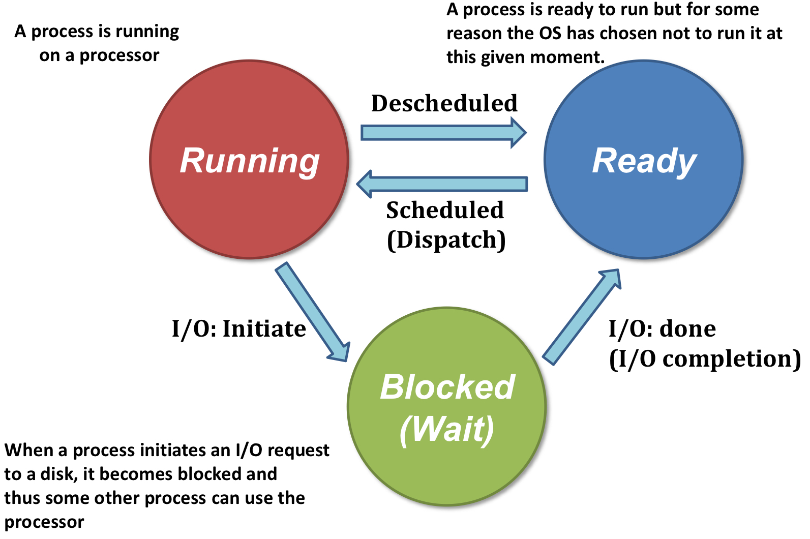
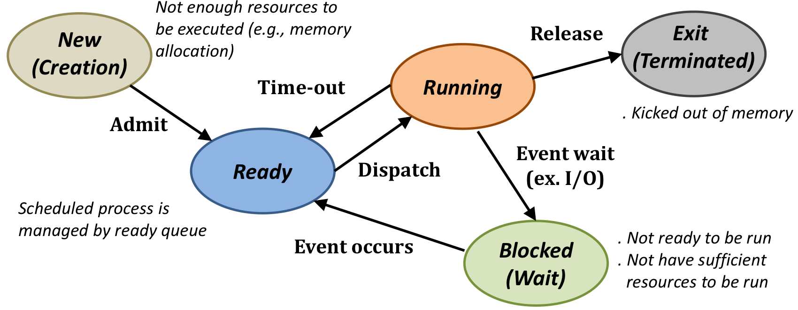
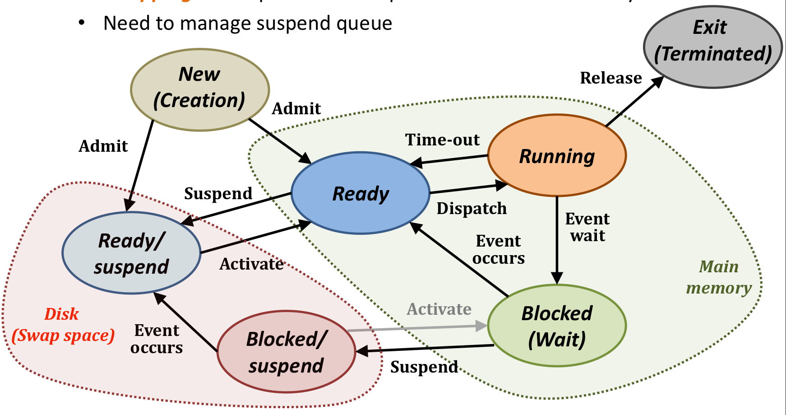
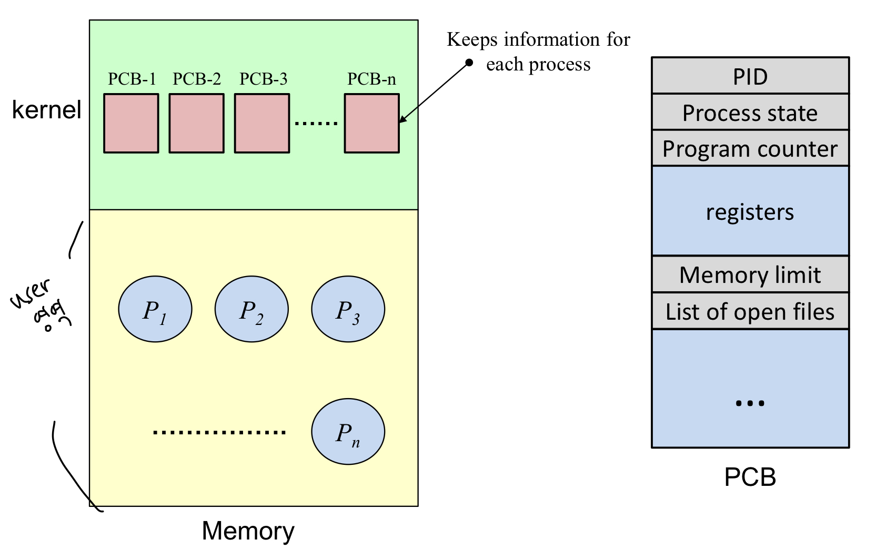
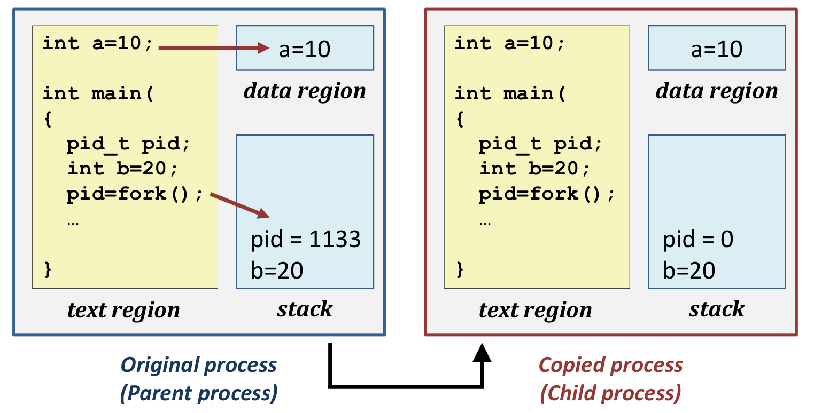

Process

- 현재 실행 중인 프로그램
- 시간에 따라 서로 다른 state를 갖는다.

 

3-State Model

1. Running: 실행하기 위한 모든 resource를 가지고 + cpu에 대한 권한을 가짐

   timer interrupt !

2. Ready: 실행하기 위한 모든 resource를 가지지만, cpu에 대한 권한은 가지지 못함

   I/O !

3. Blocked(Wiat): 실행하기 위한 모든 resource도 가지지 못하고 + cpu에 대한 권한도 가지지 못함

 

5-State Model

- New랑 Exit가 추가됨

 

7-State Model

- Main memory영역과 별개의 Disk 공간에 해당하는 Blocked/suspend와 Ready/suspend가 추가됨
- 메모리의 공간이 부족하면 일부 또는 전체를 disk의 특정 영역으로 swap out
- => Blocked에서 disk의 Blocked/suspend queue로 보낸다.
- => Blocked에는 아무것도 없고 Ready에만 데이터가 넘쳐난다면, Ready에서 disk의 Ready/suspend queue로 보낸다.
- => Blocked/suspend는 바로 ready로는 못 가고, Ready/suspend queue를 거쳐서 이동 가능

 

PCB

- process들의 모든 수행에 필요한 정보를 가지는 data structure

 

Context-switching

- "정보의 교환"
- Program counter, CPU registers... 등 프로그램이 종료되면 모든 정보를 structure의 형태로 PCB에 저장하고
- 새로운 프로그램의 모든 정보를 PCB에서 받아와서 re-setting
- => PCB의 교환

 

Fork - 무조건 시험 나옴. 교재 예시들 보기.

- 그대로 복사 (pid 제외)