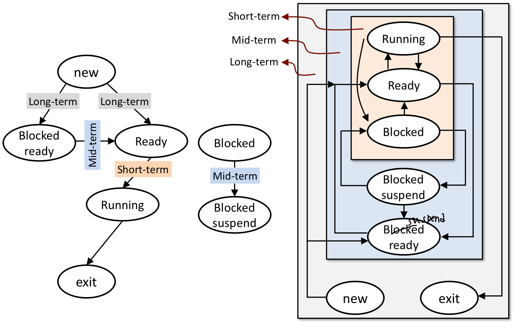

**CPU virtualization**

1. Context-Switching

   - Register, PID 등의 정보
   - PCB형태의 data structure의 특정 영역에 프로세스 별로 정리
   - 프로세스를 종료하고 새로운 프로세스를 실행할 때 PCB에서 가져와 re-setting

2. Scheduling

   - 그 다음 수행해야 할 놈을 찾아야 함

   - Ready Queue에 있는 놈들을 대상으로 => Short-term scheduling

     

   - scheduling 기준은 다양하다!

 

**Scheduling Criteria**

1. CPU utilization
   - 크면 클수록 좋다!
2. Throughput
   - 시간 당 처리하는 개수
   - 서비스를 제공하는 입장에서는 시간당 몇 그릇을 파는지가 중요!
3. Turnaround Time
   - 사용자의 입장에서 주문을 하고(서비스에 대한 요청을 하고) 모든 주문이 테이블에 올라오는(모든 작업이 왼료되는) 시간
   - 서비스 요청이 끝까지 수행되는 데 걸리는 시간
4. Waiting Time
   - Ready Queue에서 기다리는 시간
5. Response Time
   - 서비스를 요청했을 때, "처리가 되고 있다는 것"을 알 수 있는 시간
   - 5개를 주문하고 짜짱면(제일 첫 응답)이 오면, 처리가 되고 있구나를 알 수 있다!
6. Fairness
   - 특정 프로세스가 긴 시간 동안 cpu utilization을 얻지 못하는 starvation 상태에 있지 않도록

 

**Terminology**

- suspend: 메모리에 있던 프로세스를 디스크로

- preemptive: 현재 수행 중인 것을 강제로 멈출 수 O

  => running state의 프로세스를 ready state로

- non-preemptive: 현재 수행 중인 것을 강제로 멈출 수 

- CPU burst: I/O 동작 없이 CPU만 계속 동작

  => 복잡한 계산을 하는 프로그램

- I/O burst: I/O가 빈번하게 발생

  => 유저와 interactive한 경우

- I/O bound process: I/O에 의해 결정됨

  => I/O intensive

- CPU bound process: CPU의 성능에 의해 결정됨