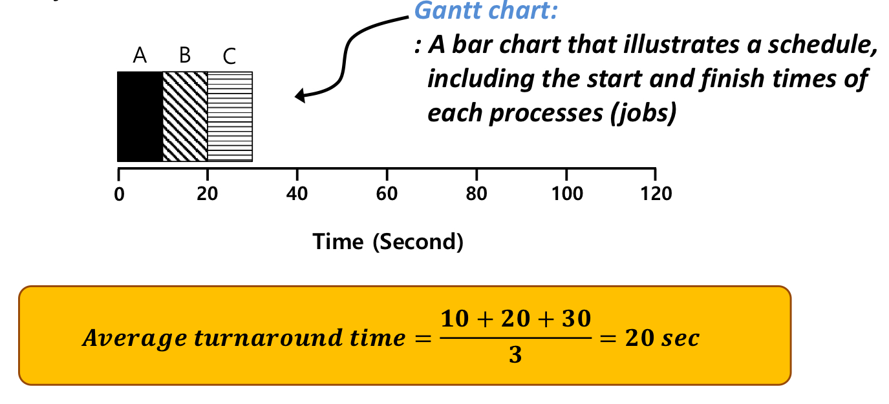
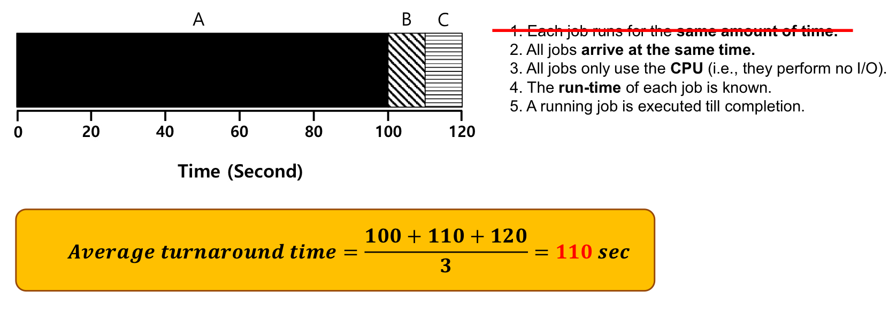
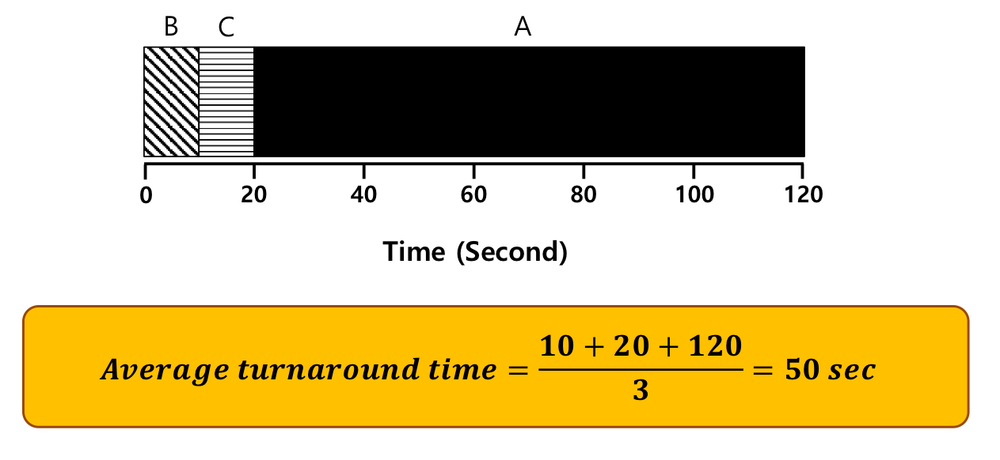
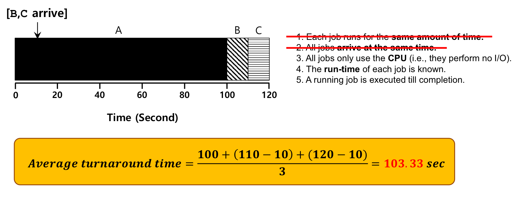
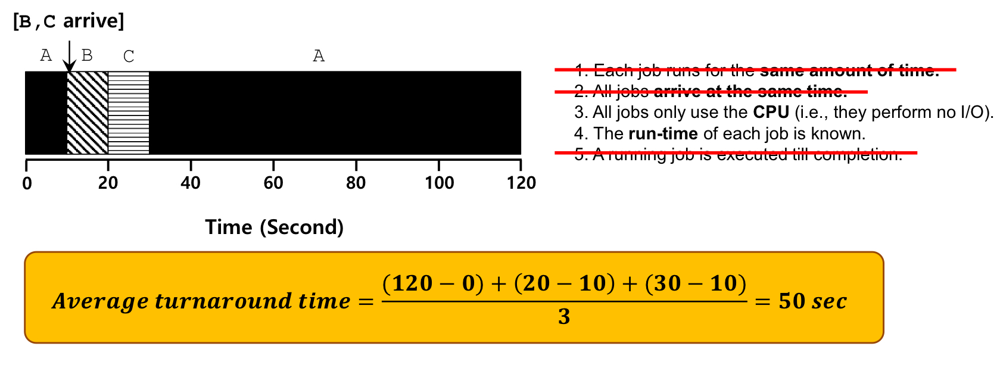
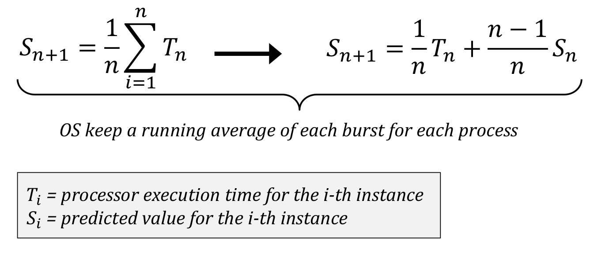
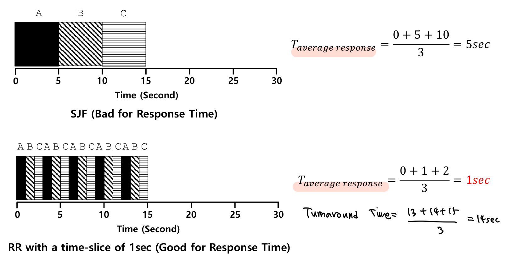
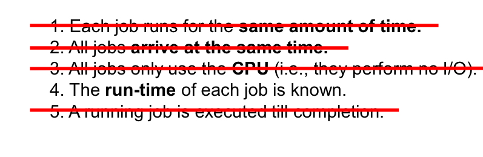
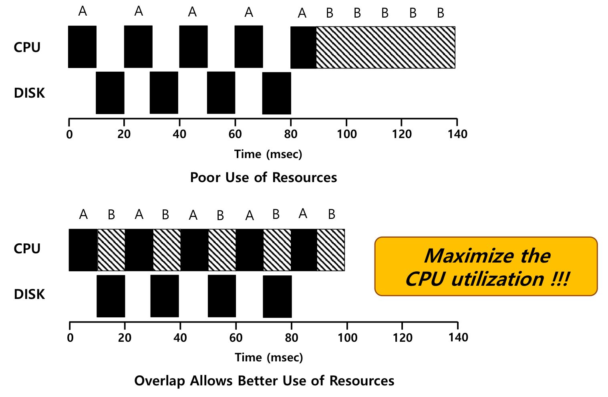

CPU virtualization

1. Context-Switching

   - Register, PID 등의 정보
   - PCB형태의 data structure의 특정 영역에 프로세스 별로 정리
   - 프로세스를 종료하고 새로운 프로세스를 실행할 때 PCB에서 가져와 re-setting

2. Scheduling

   - 그 다음 수행해야 할 놈을 찾아야 함

   - **Ready Queue**에 있는 놈들을 대상으로 => Short-term scheduling

     

   - scheduling 기준은 다양하다!

 

**Scheduling Criteria**

1. CPU utilization (CPU 사용량)
   - 크면 클수록 좋다!

2. Throughput

   - **The number of operations (or jobs) per time unit**

   - 시간 당 처리하는 개수
   - 서비스를 제공하는 입장에서는 시간당 몇 그릇을 파는지가 중요!
   - => **System-oriented**

3. Turnaround Time(TAT)
   - **Time interval from submission (start) to completion**
   - 사용자의 입장에서 주문을 하고(서비스에 대한 요청을 하고) 모든 주문이 테이블에 올라오는(모든 작업이 왼료되는) 시간
   - 서비스 요청이 끝까지 수행되는 데 걸리는 시간
   - => **User-oriented**

4. Waiting Time

   - **The sum of the time spent waiting in the "ready queue"**

   - Ready Queue에서 기다리는 시간

5. Response Time

   - **The time from the submission (start) of a request until the "first response" is produced**

   - 서비스를 요청했을 때, "처리가 되고 있다는 것"을 알 수 있는 시간
   - 5개를 주문하고 짜짱면(제일 첫 응답)이 오면, 처리가 되고 있구나를 알 수 있다!
   - => **User-oriented**

6. Fairness

   - **Share CPU among users in some equitable way**

   - 특정 프로세스가 긴 시간 동안 cpu utilization을 얻지 못하는 starvation 상태에 있지 않도록

- => **Aim is to assign processes to be executed by the processor in a way that meets system objectives**

 

**Terminology**

- suspend: 메모리에 있던 프로세스를 디스크로

- **preemptive**: 현재 수행 중인 것을 강제로 멈출 수 O

  => running state의 프로세스를 ready state로

- **non-preemptive**: 현재 수행 중인 것을 강제로 멈출 수 X

- CPU burst: I/O 동작 없이 CPU만 계속 동작

  => 복잡한 계산을 하는 프로그램

- I/O burst: I/O가 빈번하게 발생

  => 유저와 interactive한 경우

- I/O bound process: I/O에 의해 결정됨

  => I/O intensive

- CPU bound process: CPU의 성능에 의해 결정됨

 

Scheduling - Workload assumptions(실제 사용환경에 대한 가정)

- 굉장히 단순한 상황을 가정하고, 해당 가정들을 지우면서 실제 사용가능한 스케줄링 기법을 만든다.
- 이때, job = process

1. Each job runs for the **same amount of time**.
2. All jobs **arrive at the same time**.
3. All job only use the **CPU** => perform no I/O.
4. The **run-time** of each job is known.
5. A running job is executed till completion. (**non-preemptive**)

 

performance metric: **Turnaround time**

=> **Turnaround time = completion - arrival**

 

FIFO - Fisrt In, First Out

- **평균 turnaround time = ((10 - 0) + (20 - 0) + (30 - 0)) / 3 = 20**

- 그러나 !! 첫 번째 가정, **Each job runs for the same amount of time**이라는 가정을 지우는 순간,
- 수행시간이 긴 작업이 먼저 도착하는 순간, 평균 turnaround time이 늘어난다.
- **평균 turnaround time = ((100 - 0) + (110 - 0) + (120 - 0)) / 3 = 110**
- => 수행시간이 짧은 놈을 앞쪽에 배치하자!

 

SJF - Shortest Job First

- Run the shortest job first!
- **평균 turnaround time = ((10 - 0) + (20 - 0) + (120 - 0)) / 3 = 50**
- => 모든 job들이 동일한 수행 시간을 갖는다는 가정을 지웠을 때는, FIFO는 optimal한 scheduling 기법이라 볼 수 없다.
- => **"Convoy Effect"** : Short process stuck behind long process
- => 그러나 !! SJF는 실행활에서 쓰기 힘들다. job들의 수행시간을 미리 알기 어렵다.

- 그러나!! 2번째 가정, **All job arrives at the same time**이라는 가정을 지우는 순간, 
- 작업 수행시간이 가장 긴 작업이 다른 job들보다 빨리 도착한다면,
- 여전히 Convoy Effect가 발생한다.
- (모든 job들은 non-preemptive라는 가정이 있기 때문)
- **(b, c가 10에 도착) 평균 turnaround time = ((100 - 0) + (110 - 10) + (120 - 10)) / 3 = 103.33**
- => preemption을 추가하자!

 

STCF - Shortest Time-to-Completion First

- new job enters the system
- => determine the remaining jobs and new job
- => 전체 수행시간을 고려하는 것이 아니라, 완료될 때까지 남은 시간을 가지고 비교

- **평균 turnaround time = ((120 - 0) + (20 - 10) + (30 - 10)) / 3 = 50**
- => 근데 이것도 미래를 예측하는 것이다.

- 과거의 사건들을 동일한 가중치로 두고, 미래를 예측한다.
- 또는, 필요한 경우에는, 더 중요한 사건에 더 높은 가중치를 둔다.

 

performance metric: **Response time**

=> **Response time = first run - arrival**

*metric을 달리 했을 때, 어떤 scheduling이 최적인지 판단할 수 있어야 함!

 

RR - Round Robin

- run a job for a time slice

- **SJF의 response time = ((0 - 0) + (5 - 0) + (10 - 0)) / 3 = 5**
- **RR의 response time = ((0 - 0) + (1 - 0) + (2 - 0)) / 3 = 1**
- => Round Robin 방식이 response time을 기준으로 평가했을 때는 최적의 알고리즘이다.
- => 그러나, time-slice를 무작정 줄이면 안된다. context-switching(메모리 접근) 시간이 더 소모될수도 !
- => 그리고, SJF의 TAT가 SJF의 TAT보다 안 좋다.
- => criteria를 먼저 정하기 전까지는, 어떤 스케줄링 기법이 좋다고 할 수 없다!

 

그러나!! 현실에서는 I/O 장치의 사용이 있다.

- 3번 조건, **All jobs only use the CPU**를 없애면,

- I/O 작업을 CPU작업과 overlap 하면 된다!
- DMA에게 I/O작업을 던져놓고, 그 동안 다른 job을 수행한다.

