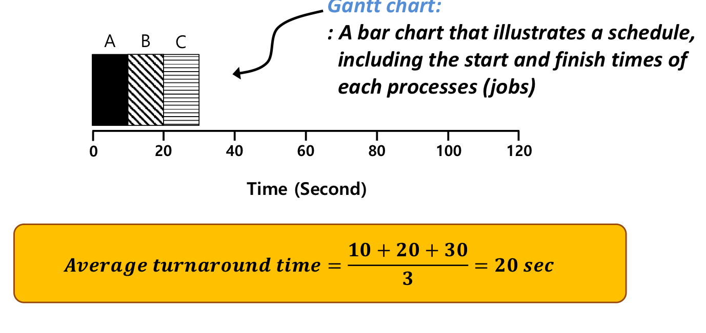
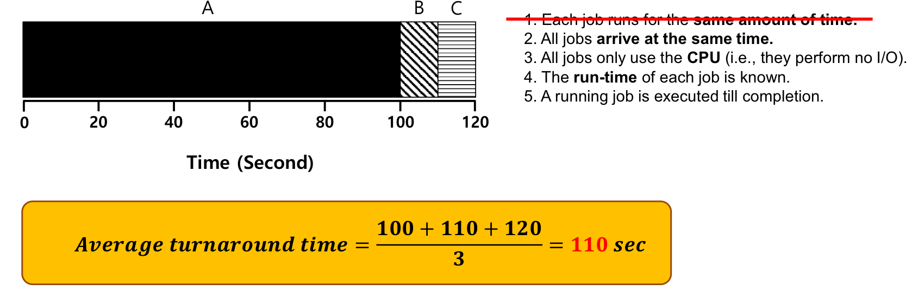
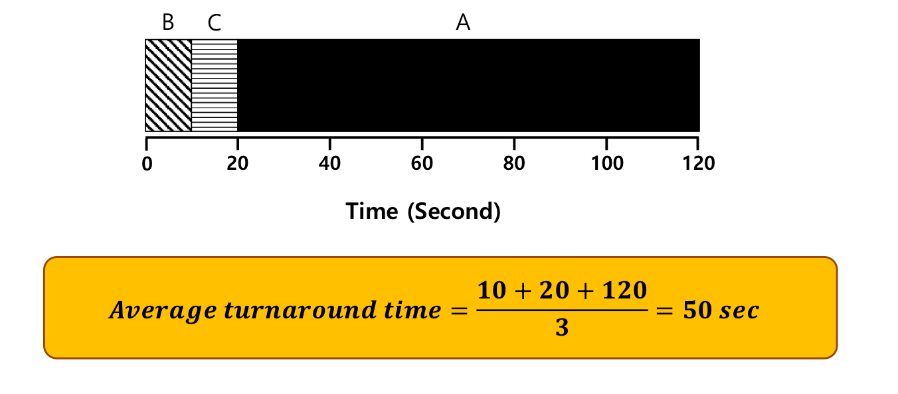
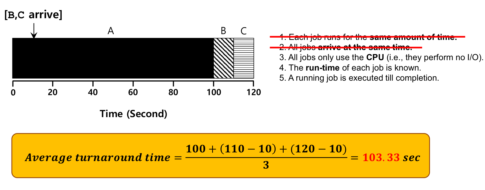
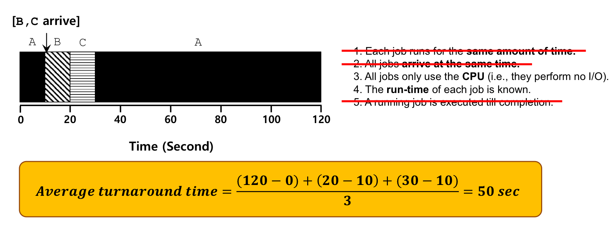
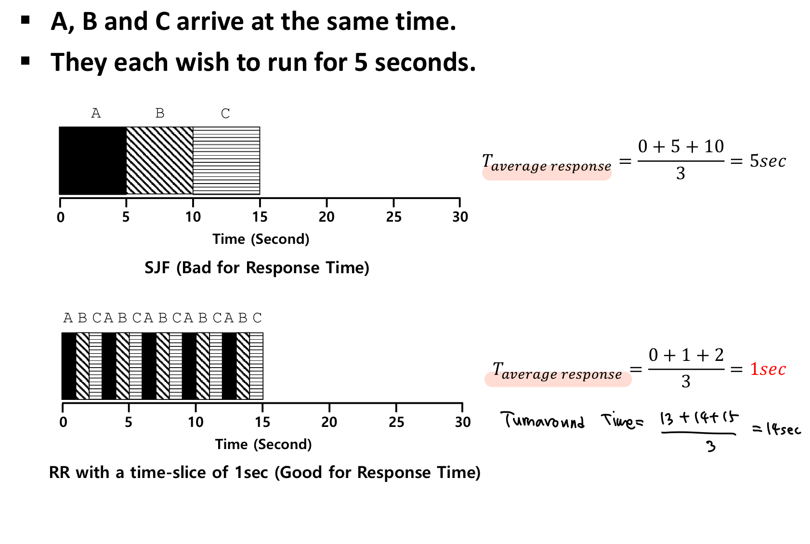
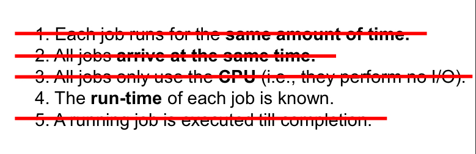
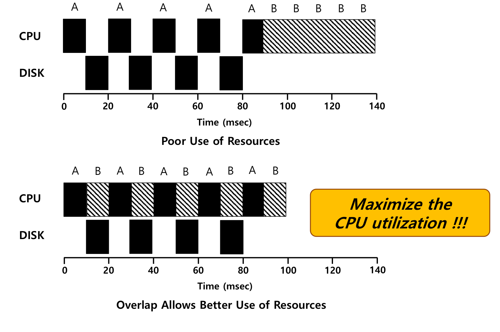

**스케줄링 전제조건**

1. job들의 실행시간은 모두 같다.
2. 모든 job들은 동일한 시간에 시작한다.
3. I/O가 없다.
4. 한 번 시작하면 중간에 끊기지 않는다. (Non-preemptive)
5. 각 job들의 수행시간을 미리 알고 있다.

 

**첫번째 Metric: Turn-around Time**

=> 도착부터 수행 완료까지의 시간을 최소화하는 스케줄링 기법을 최소화할 것이다!

 

**FIFO(FCFS)**

 

=> Convoy Effect (Short process stuck behind long process)

=> 첫번째 가정을 지우면, 하나의 job이 다른 job들보다 시간이 더 긴 경우, FIFO가 최적의 결과를 주지 못한다.

 

**SJF(Shortest Job First)**

=> 수행시간이 짧은 job부터 수행하자!

 

=> 그런데 두번째 가정을 지우면, 짧은 수행시간을 가진 job들이 긴 수행시간을 가진 job보다 늦게 도착하면, convoy effect가 또 발생한다,

 

**STCF(Shortest Time-to-Completion First)**

=> 필요하면 끊겠다.

=> 완료될 때까지 남은 시간이 최소인 놈을 먼저 실행하겠다.

 

**두번째 Metric: Response Time**

=> job이 수행되고 있다는 첫 번째 반응이 올 때까지의 시간

=> 확인해야 할 부분: Turn-around Time에서 효율적이었던 스케줄링 기법이 Response Time에서도 효율적일까?

 

**Round Robin(RR)**

=> 각 job은 time slice에 맞춰 수행된다.

=> 평균 response time을 줄일 수 있다.

=> 그러나 time-slice를 너무 작게 줄이면 오히려 context-switching time(메모리에 대한 access) 때문에 성능이 나빠질 수 있다.

 

=> 3번 가정도 지워서 I/O도 사용된다고 생각한다.

 

=> I/O가 동작하는 동안 CPU가 놀지 않도록(다른 job을 수행하도록) 한다.