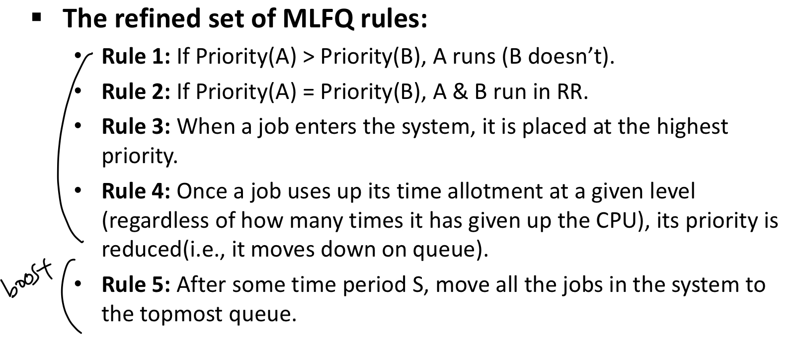

=> 5가지 가정 중에서 각 job의 수행시간을 미리 안다. 라는 조건은 삭제하지 못했다.

Multi-Level Feedback Queue(MLFQ)

- 우선 순위에 따라 다른 Queue를 두고, 우선 순위가 높은 것부터 수행한다.
- 사용자 패턴을 보았을 때, interactive(I/O intensive)한 애들은 CPU 수행시간이 되게 짧더라.
- => 나는 사실 수행시간을 정확히 모른다. 
- => 그래서 가정한다. 이 시스템에 들어온 애들은 모두 interactive한 애들일 것이다. 
- => 가장 먼저 들어온 애들은 가장 우선 순위가 높은 queue에 집어 넣는다.
- => 대신 time-slice를 짧게 준다. interactive하면 짧은 수행시간을 가지므로.

 

MLFQ의 문제점

- Starvation: interactive한 job이 많으면, 수행시간이 긴 job은 계속해서 수행되지 않는다.
- => The Priority Boost(특정 시간마다 낮은 level의 job을 강제로 우선 순위가 높은 queue로 이동한다.)
- Gaming of Scheduler: time slice를 다 쓰기 직전에 I/O 수행을 의도적으로 해서 계속 높은 순위의 queue에 머무른다.
- => 누적 수행 시간을 가지고 낮은 순위 queue로 내릴 지 말 지 판단

 

MLFQ 정리

 

Proportional-share Scheduling (= Fair-share Scheduling)

- Lottery Scheduling
  - Randomized algorithm
  - Ticket이 있어야 일을 수행할 수 있음. 해당 Ticket은 어떤 기준에 의해 랜덤하게 던져 주겠다.
- String Scheduling
  - Deterministic algorithm
  - Ticket의 양에 비례해서 CPU에 대한 권한을 가질 수 있음