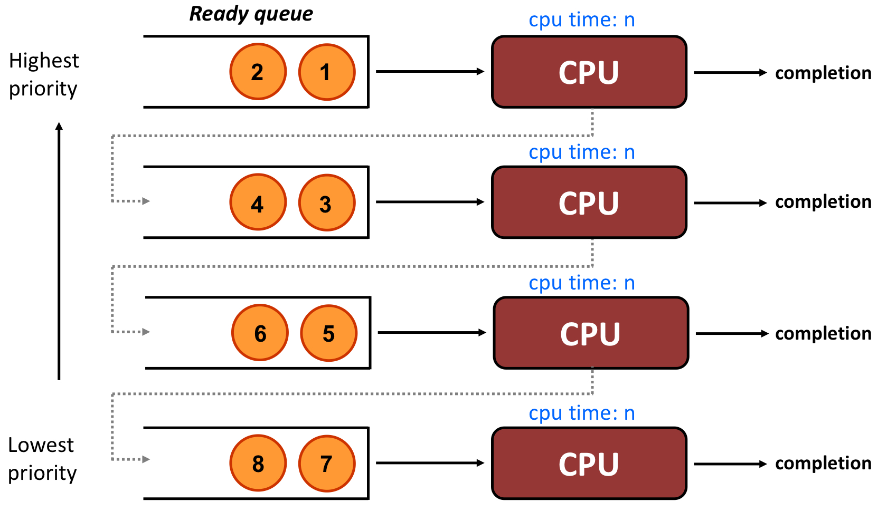

=> 5가지 가정 중에서 **각 job의 수행시간을 미리 안다.** 라는 조건은 삭제하지 못했다.

 

Queue

- First-In-First-Out(FIFO)

 

Multi-Level (Feedback) Queue

- job들은 수행되는 데 있어, 우선순위(Priority)를 가진다.
- 해당 우선순위 별로 서로 다른 queue를 제공한다.

- => 다음 두 규칙이 적용된다.
- Rule1. A의 priority가 B의 priority보다 높다면, A를 먼저 수행한다.
- Rule2. A와 B의 priority가 같아면, Round Robin을 수행한다.
- ex)

- Q8의 A, B를 B-A(들어간 순서대로) Round Robin을 진행
- 그 다음 C -> 그 다음 D 순으로 진행

- 우선 순위에 따라 Ready Queue를 여러 개 둔다.
- 그 후, 우선 순위가 높은 job부터 처리한다.

 

그런데 !! 어떻게 priority를 정하나?

- **Interactive**한 job은 I/O 요청을 빈번하게 받는다.
- => I/O를 빈번하게 요청하므로, **better response time**을 필요로 한다.
- => 따라서, **short time lice**를 주고, **높은 우선 순위**를 부여한다.
- **CPU-intensive**한 job은 I/O에 대한 요청 없이 **cpu execution time**만을 길게 필요로 한다.
- => **better turnaround time**을 필요로 한다.
- => 따라서, **long time slice**를 주고, **낮은 우선 순위**를 부여한다.

 

MLFQ 규칙 추가

- Rule3. When a job enters the system, **it is placed at the highest priority**
- Rule4. If a job uses up an entire time slice while running, **its priority is reduced**
- Rule5. If a job gives up the CPU before the time slice is up, **it stays at the same priority level**
- => **Feedback**: 높은 우선 순위에 배정하고 나서, 그 결과에 따라 내릴지 유지할지 결정하므로.
- => job들의 정확한 수행시간은 알지 못한다. 그러나, 상대적인 수행시간에 따라 서로 다른 우선순위의 queue에 배치된다.

 

- jobA를 먼저 수행한다.
- 그러다가 jobB가 들어오면, 무조건 가장 높은 우선순위로 들어가므로, jobB를 먼저 수행한다.
- jobB의 time slice가 끝났지만, 여전히 job이 남았고, 낮은 우선순위로 내려간다.
- 여전히 jobB의 우선순위가 jobA보다 높으므로 jobB를 수행한다.
- 마지막으로 남은 jobA를 마저 수행한다.
- => 해당 방식은 SJF와 비슷하게 동작한다.

- interactive한(우선순위가 높은) job을 high priority로 두고, 
- 해당 job이 I/O 요청을 받으러 갔을 때(blocked queue로 갔을 때),
- 우선순위가 낮은 job을 실행한다.

 

MLFQ의 문제점

1. **Starvation**

   - => interactive한 job이 많으면, 수행시간이 긴 job은 계속해서 수행되지 않는다.

   - (**Solution**)

     

   - => The Priority Boost

   - => 특정 시간마다 가장 낮은 level의 job을 강제로 우선 순위가 가장 높은 queue로 이동한다.

2. **Game the scheduler by a malicious attack**

   - => time slice를 다 쓰기 직전에 I/O 수행을 의도적으로 해서 계속 높은 순위의 queue에 머무른다.

   - => 혼자 CPU 권한을 독점해서 다른 job들의 수행을 막는다.

   - (**Solution**)

     

   - => 누적 수행 시간을 가지고 낮은 순위 queue로 내릴 지 말 지 판단

3. **A program may change its behavior over time**

   - => 해당 job의 수행 특성이 들어왔을 때부터 나갔을 때까지 같지 않을 수도 있다.

   - => cpu-intensive한 job이 나중에 interactive로 바뀌는 경우

   - (**Solution**)

     

   - => The Priority Boost가 해결책이 된다!

4. 이외에 여러 문제들

   - queue를 몇 개 둬야 하는지
   - 각 queue의 time slice는 몇으로 줄 지
   - 등

 

MLFQ 정리

=> 각 job의 수행시간을 정확하게는 알지 못하지만, 상대적인 시간 비교를 통해 우선순위를 부여할 수 있다!