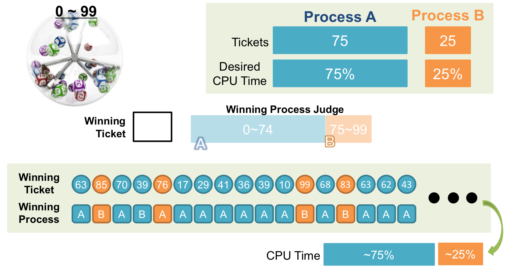
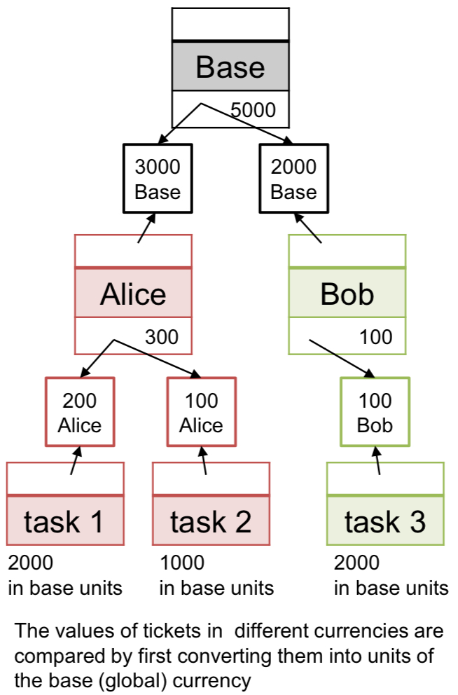
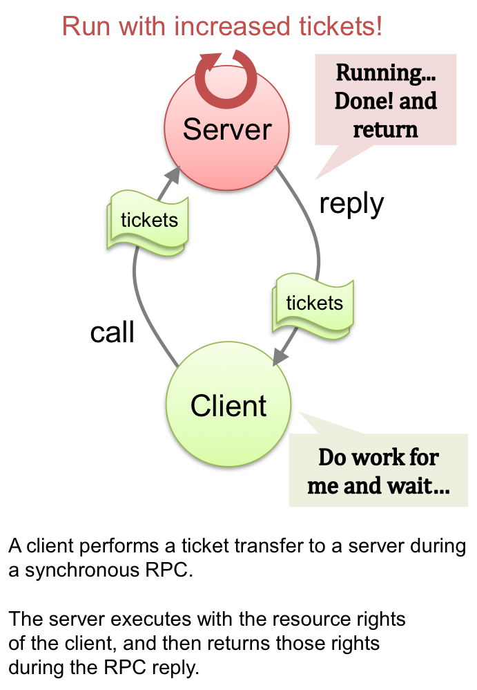
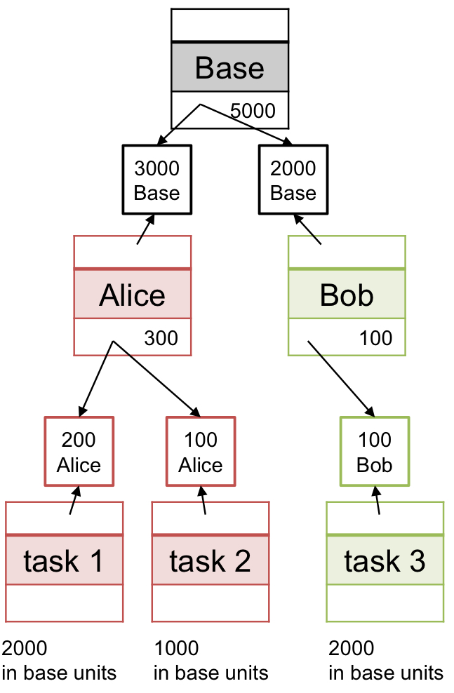
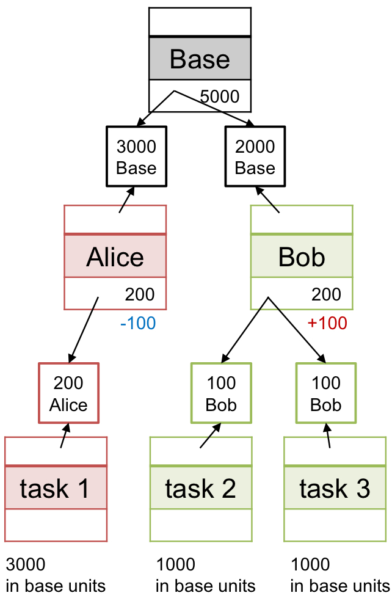

Proportional-share Scheduling (= **Fair-share Scheduling**)

- Lottery Scheduling
  
  
  
  - 각 process에게 ticket을 할당
  - 해당 ticket이 winning을 하면, process가 실행된다.
  - => 확률적으로, 각 process는 가진 ticket의 비율에 비례해서, cpu에 대한 권한을 가지게 된다.
  - => **The more tickets, the more chances to win.** (proportional to the number of tickets that they hold.)
  - => **probabilistically fair** (확률적으로 starvation을 막을 수 있다.)
  - => deterministic 하게 보장하는 것은 아니다. 확률적으로만 보장.
  - => **"Randomized Algorithm"** : Random Selection

 

Ticket Mechanism(1): Ticket Currency

- 가지고 있는 ticket을 child process들한테 나눠주거나, 재할당 할 수 있다.

 

Ticket Mechanism(2): Ticket Transfer

- Client가 필요에 의해, 자신이 수행해야 할 일을 Server에게 요청한다.
- 그 때 동안, Client는 Server로부터 결과가 오기 전까지는 job이 수행될 수 없다.
- => (interrupt가 걸림)
- 그래서 job을 줄 때 자신의 ticket도 같이 줌.
- => 우선 순위를 높이기 위해서 (더 많은 확률로 CPU에 대한 권한을 받을 확률이 높아짐)
- Server는 서비스에 대한 결과를 돌려줄 때, ticket도 함께 돌려준다.

 

Ticket Mechanism(3): Ticket Inflation / Deflation

- 필요에 따라, 일시적으로 나의 ticket의 값을 올리거나 내릴 수 있다.
- **It makes sense when a group of processes trust one another**.
- => 시스템 안의 모든 process를 신뢰할 수 있을 때, 사용할 수 있다.