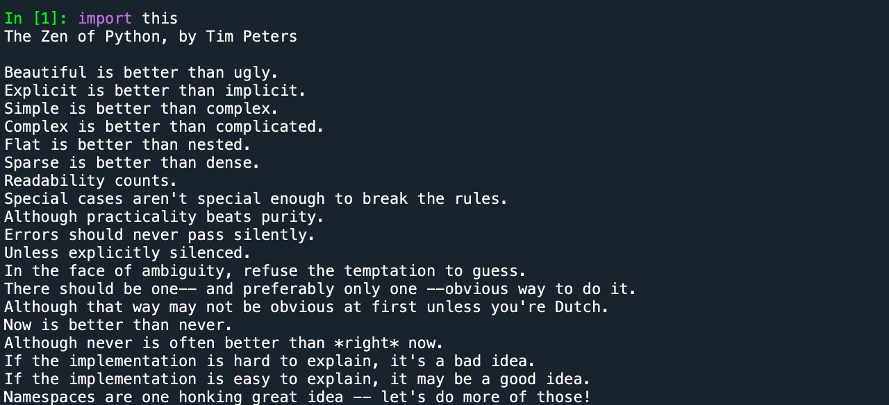
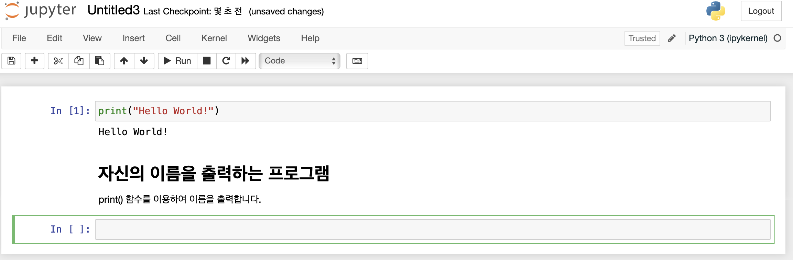

Anaconda - Spider



- Readability counts.: 파이썬은 가독성이 중요하다.

<br>

컴퓨팅 사고 (Computational Thinking)

- 인간이 문제를 분석하고 컴퓨터로 문제를 해결하기 위한 절차를 만드는 것
- 분해, 추상화, 패턴 인식, 알고리즘

<br>

수많은 사이트의 비밀번호를 기억하고 관리하는 방법은?

- 공통비밀번호 + 도메인 이름
- ...

<br>

컴퓨터가 많이 사용되는 이유

- 소프트웨어만 바꾸면 뭐든지 할 수 있다.

<br>

RPA(Robotic Process Automation)가 무엇일까?

- 말 그대로 ‘로봇 프로세스 자동화’의 약어로, 컴퓨터 소프트웨어를 사용하여 반복적이고 규칙적인 업무 프로세스를 자동화하는 기술을 말한다.

<br>

컴파일러(인터프리터)

- 인간이 프로그래밍 언어를 배워서 프로그램을 작성하면 컴파일러(인터프리터)라고 하는 통역 소프트웨어가 프로그램을 기계어로 바꾸어준다.
- 컴파일러 vs 인터프리터 (시험에는 안 나옴)
- 파이썬은 인터프리터 언어이다.
- 인터프리터는 한 줄 한 줄 해석함

<br>

파이썬의 모든 정보는 `python.org`에 올라옴

<br>

파이썬의 특징

- 라이브러리가 풍부
- 라이브러리 설치가 쉽다.

<br>

제곱

```python
print(3.14 * 10 * 10)
print(3.14 * 10 ** 2)
#314.0
```

<br>

삼각함수, 로그함수 사용하기

```python
import math

print(math.sin(math.radians(30))) #30도 일 때, sin 값
print(math.sqrt(9.0)) #제곱근
print(math.log(1.0)) #로그함수
```

<br>

문자열 출력하기

```python
print("나의 " + "고양이") #나의 고양이
print("고양이" * 10) #고양이고양이고양이...
```

<br>

문자열

- 큰 따옴표("...")나 작은 따옴표('...') 안에 들어 있는 텍스트 데이터

- 반드시 따옴표가 있어야 한다.

- ```python
  print(Hello World!) #SyntaxError: Invalid Syntax
  ```

<br>

중간점검

- 한글도 출력될까? "안녕하세요?"를 화면에 출력해보자.

- "programming에 입문하신 것을 축하드립니다."를 출력해보자.

- "생일축하!!"를 10번 출력하는 명령문을 만들어보자. 문자열 반복을 사용한다.

- 다음과 같은 명령문을 실행하면 오류가 발생한다. 원인을 알아보자. print("Hello)

- ```python
  print("안녕하세요?")
  print("programming에 입문하신 것을 축하드립니다.")
  print("생일축하!!" * 10)
  print("Hello) #SyntaxError: unterminated string literal
  ```

<br>

대화형 모드와 스크립트 모드 (시험에서 대화형 꺽쇠를 주면 어떤 결과가 나오는지 적을 수 있어야 함)

- 대화형 모드

  - 콘솔에서 문장을 한 줄씩 입력하여 실행

  - ```python
    >>> print("Hello World!")
    #Hello World!
    >>> print(1)
    #1
    ```

- 스크립트 모드(.py)

  - 파일을 만들어서 저장한 후에 파이썬 인터프리트가 이 파일을 읽어서 한 번에 전부 실행

  - ```python
    print("Hello World!")
    print(1)
    #Hello World!
    #1
    ```

<br>

중간점검

- 스파이더는 두 가지 모드로 사용할 수 있다. 두 가지 모드에 대하여 설명해보자.

- 파이썬으로 프로그램을 작성할 때 대문자와 소문자를 구분할까?

- 파이썬 소스 파일의 확장자는 무엇인가?

- ```python
  #1.
  #대화형 모드
  #콘솔에서 문장을 한 줄씩 입력하여 실행
  #스크립트 모드
  #파일을 만들어서 저장한 후에 파이썬 인터프리트가 이 파일을 읽어서 한 번에 전부 실행
  
  #2.
  #구분한다.
  
  #3.
  #.py
  ```

<br>

print 함수

- 여러 개의 값들을 화면에 차례대로 출력할 수 있다.

- ```python
  print("결과값은", 10, "입니다.")
  #결과값은 10 입니다.
  ```

<br>

중간점검

- 다음과 같이 3단 구구단의 일부를 출력하는 프로그램을 작성해보자. 3 * 1, 3 * 2, 3 * 3의 수식을 계산하여서 결과를 출력한다.

- ```python
  print("3 * 1 =", 3 * 1) #3 * 1 = 3
  print("3 * 2 =", 3 * 2) #3 * 2 = 6
  print("3 * 3 =", 3 * 3) #3 * 3 = 9
  ```

<br>

실습

```python
print("파이썬에 오신 것을 환영합니다.")
print("파이썬은 쉽습니다.")
print("파이썬으로 빅데이터, 인공지능 프로그램을 작성할 수 있습니다.")
```

<br>

주피터 노트북



- Python Code와 Markdown을 출력

<br>

구글 Colab

- https://colab.research.google.com