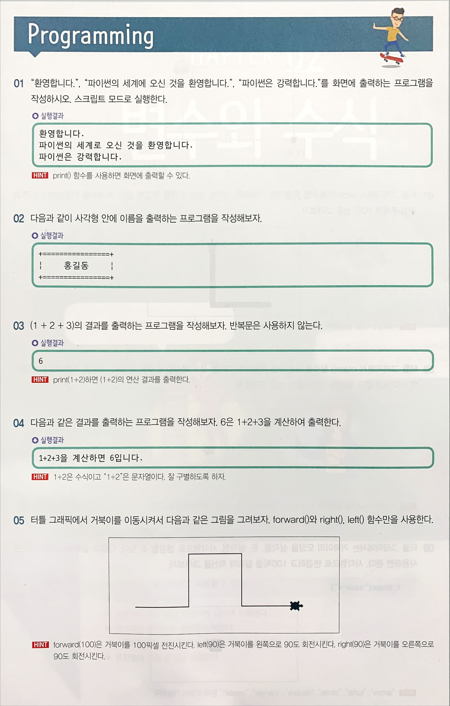
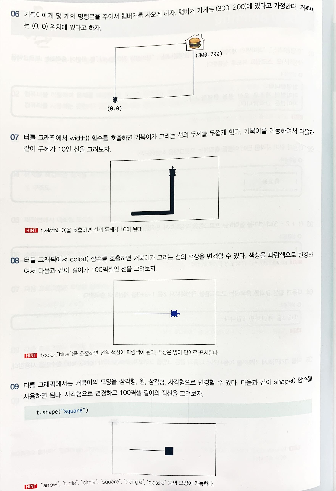

터틀 그래픽 시작

```python
import turtle # (1)

t = turtle.Turtle() # (2)
t.shape("turtle") # (3)

t.forward(100) # (4)
t.left(90) # (5)
t.forward(50)

turtle.mainloop() # (6)
turtle.bye()
```

<br>

모비딕

```python
from collections import Counter

f = open("/Users/yodayeong/Desktop/mobydick.txt", encoding="utf-8")
count = Counter(f.read().split())
print("단어 출현 횟수:", count)
```

<br>

실습1





```python
#01)
print("환영합니다.")
print("파이썬의 세계로 오신 것을 환영합니다.")
print("파이썬은 강력합니다.")

#02)
print("+================+")
print("|      홍길동      |")
print("+================+")

#03)
print(1 + 2 + 3)
```

<br>

변수

- 다른 언어에서 변수는 상자와 같고, 상자 안에 값이 저장된다.
- 파이썬에서는 변수에 값을 저장하면 변수가 자동으로 생성된다.

```python
x = 100
print(id(x))

y = 200
print(id(y))

```

<br>

두 수의 합 계산하기

```python
x = 100
y = 200
sum = x + y
print("합은", sum)
```

<br>

이런 것도 가능하다!

```python
score = 10
score = score + 1

print(score)
```

<br>

원의 면적 계산하기

```python
#변수 radius에 값을 저장한다.
radius = 10

#공식을 적용하여 면적을 계산한다.
area = 3.14 * radius * radius

#면적을 화면에 출력한다.
print("반지름", radius, "인 원의 면적=", area)
```

<br>

원기둥의 부피 계산하기

```python
#반지름, 높이
r = 10 
h = 10

#원 넓이
area = 3.14 * r * r

#원기둥의 부피
answer = area * h

#정답 출력
print(answer)
```

<br>

요일 계산하기

```python
# 오늘은 10일은 수요일
# 열흘 후는 무슨요일?

day = ["월요일", "화요일", "수요일", "목요일", "금요일", "토요일", "일요일"]

# 오늘 
answer = day[10 % 7 - 1]
print(answer)

# 열흘 후
answer = day[20 % 7 - 1]
print(answer)
```

<br>

변수의 data type

```python
x = 100
print(type(x)) #<class 'int'>

x = 100.0
print(type(x)) #<class 'float'>

x = "unknown"
print(type(x)) #<class 'str'>
```

<br>

중간점검

1. 파이썬에는 어떤 자료형이 있는가? 3가지만 말해보자.
2. 파이썬 변수에 정수를 저장하였다가 실수를 저장하는 것도 가능한가? 그 이유는 무엇인가?
   - 가능. 동적할당 할 수 있음. id를 통해 확인 가능

<br>

별까지 도달하는 시간

```python
distance = 40 * 10 ** 12
speed = 3000000

print(distance / speed)
```

<br>

산술 연산

- 정수 나눗셈: //      (7//4 = 1)
- 실수 나눗셈: /       (7/4 = 1.75)

<br>

할당 연산

```python
#셋의 id값이 같게 나옴
x = y = z = 0

#한 번에 여러 개의 변수 초기화
x, y, z = 10, 20, 30

#x와 y의 값을 서로 교환한다.
x, y = y, x
```

<br>

지수(power) 계산

```python
print(2 ** 7)
#128
```

<br>

복리 이자 계산

```python
a = 1000 #원금
r = 0.05 #이자율
n = 10 #기간

result = a * (1 + r) * n
print(result)
```

<br>

연산자 우선순위

```python
print(10 + 20 / 2) #20.0
print((10 + 20) / 2) #15.0
```

<br>

중간점검 (시험문제 출제!)

1. 복합 대입 연산자 x *= y의 의미를 설명하라.
   - x = x * y
2. 10 % 6의 값은 무엇인가?
   - 4 => 나머지 연산
3. 나눗셈 연산인 10//6의 값은 무엇인가?
   - 1 => 몫
4. 다음의 할당문에서 무엇이 잘못되었는가?
   - 3 = x => 변수가 왼쪽으로 가야함
5. a = b = c = 100일 때 a, b, c의 값
   - 셋 다 100
6. 24달러를 은행의 정기예금에 입금해두었을 때 382년이 지난 후 복리로 6% 계산해봐라.

<br>

타입 변환

```python
x = 3.14
y = int(x)
print(y)

#3
```

<br>

반올림

- 물건 값의 7.5%가 부가세라고 하자. 물건값이 12345원일 때, 부가세를 소수점 2번째 자리까지 계산하는 프로그램

- ```python
  price = 12345
  tax = price * 0.075
  tax = round(tax, 2)
  print(tax)
  
  #925.88
  ```

<br>

따옴표

```python
print("철수가 "안녕"이라고 말했습니다.")
#SyntaxError: invalid syntax.

print("철수가 '안녕'이라고 말했습니다.")
#철수가 '안녕'이라고 말했습니다.

print("철수가 \"안녕\"이라고 말했습니다.")
#철수가 "안녕"이라고 말했습니다.
```

<br>

숫자와 문자열의 구분

```python
print(100 + 200)
#300

print("100" + "200")
#100200
```

```python
print("Terminator" + 3)
#TypeError: can only concatenate str (not "int") to str

print("Terminator" + str(3))
#Terminator3

print(int("100"))
#100

print(float("3.14"))
#3.14
```

<br>

줄바꿈

```python
print("말 한마디로\n천냥빚을 갚는다")

#말 한마디로
#천냥빚을 갚는다
```

<br>

문자와 문자열

```python
s = "Hello World"
print(s[0]) #H
print(s[-1]) #d
```

<br>

문자열의 함수

```python
name = "Harry Parter"
lower_name = name.lower()
print(lower_name) #harry parter

name = "Harry Parter"
new_name = name.replace("Parter", "Porter")
print(new_name) #Harry Porter
```

<br>

사용자 입력

```python
#사용자의 대답을 변수에 저장한다.
stadium = input("경기장은 어디입니까?")

#답변을 포함하여 출력한다.
print(f"오늘 {stadium}에서 야구 경기가 열렸습니다.")
```

<br>

자기소개

```python
name = input("당신의 이름은 무엇입니까?")
print(f"저의 이름은 {name}입니다.")

age = input("당신의 나이는 몇 살입니까?")
print(f"저의 나이는 {age}입니다.")

gender = input("당신의 성별은 무엇입니까?")
print(f"저의 성별은 {gender}입니다.")

university = input("당신의 대학교는 어디입니까?")
print(f"저의 대학교는 {university}입니다.")

celebrity = input("당신이 좋아하는 연예인은 누구입니까?")
print(f"제가 좋아하는 연예인은 {celebrity}입니다.")
```

